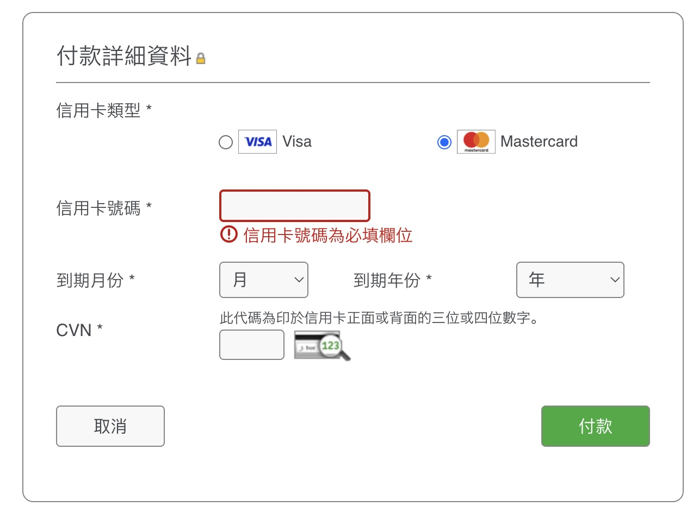

# 银行及信用卡羊毛攻略

## 1. 信用卡类别

### 网购卡

网购特指在网页端输入卡号、到期日、CVV校验码等信息进行的“Card-not-present”类型消费
<figure><figcaption></figcaption></figure>

常用的网购卡包括：
- [中银（香港）Chill Card](https://www.bochk.com/dam/boccreditcard/chillcard/chi/index.html) 每笔网上签账返现5%（基础0.4%+网签额外4.6%），无低消，每月额外返现上限HKD150（对应HKD3260签账）
- [恒生银行 MMPower](https://www.hangseng.com/zh-hk/personal/cards/products/mmpower-card) 每笔网上签账返现5%（基础0.4%+网签额外4.6%），**注意有HKD5000低消**，每月总返现上限HKD500
- [汇丰银行 Red](https://www.hsbc.com.hk/zh-hk/credit-cards/products/red) 每笔网上签账返现4.4%（基础0.4%+网签额外4%），无低消，每月网签额外返现上限HKD400（对应HKD10000签账）

### 外币卡

外币卡特指通过银行结算系统进行的除HKD以外的其他货币签账，例如网上支付美元账单（会议注册费）、Apple Pay支付人民币账单（京东、拼多多）、线下刷Pos机支付外币、...

重要提示 1: 所有香港发行的信用卡默认使用者支付外币手续费（通常为1.9%）即银行会在结算汇率的基础上额外从用户端收取1.9%的手续费。例如，小张在美国开会期间刷卡支付128.19USD，按照当日汇率换算为1000HKD，经银行结算后账单金额会显示为1019HKD。

重要提示 2: 通过微信、支付宝、Alipayhk、WeChatpayhk进行的消费不经过银行结算系统，不属于外币消费

常用的外币卡包括：
- [中银（香港）Chill Card](https://www.bochk.com/dam/boccreditcard/chillcard/chi/index.html) 每笔外币签账返现5%（基础0.4%+外币额外4.6%），无低消，每月额外返现上限HKD150，与网上签账共享返现额度（对应HKD3260签账）
- [恒生银行 MMPower](https://www.hangseng.com/zh-hk/personal/cards/products/mmpower-card) 每笔外币签账返现6%（基础0.4%+外币额外5.6%），**注意有HKD5000低消**，每月总返现上限HKD500
- [中银（香港）淘宝卡](https://www.bochk.com/tc/creditcard/details/cobrand/cobrand/taobao.html) 该卡免除1.9%货币转换手续费，NPC级别
- [汇丰银行 Pulse](https://www.hsbc.com.hk/zh-hk/credit-cards/products/unionpay-dual-currency-diamond) 该卡免除人民币、澳门葡币两类外币的1.9%货币转换手续费。每笔人民币签账返现13.4%（基础2%+自选类别点满外币2.4%+Travel Guru会员4%+内地餐饮5%），每年返现额度对应消费上限为80000RMB。其中前三项返现无低消，最后一项内地餐饮低消1200RMB，每月返现上限100RMB（美团ApplePay均记作餐饮消费，包括订机票酒店门票等），夯！

## 2. 常用消费场景

### 交房租 
推荐使用[RentSmart平台](https://www.rentsmart.com.hk)，可在App Store搜索下载。该平台可以上传租房合同，客户通过网上签账交租，支付1.9%手续费，平台给房东转账。平台支持多卡支付。例如，小李本月需要缴纳15000HKD房租，在RentSmart需支付15285HKD账单。小李将账单拆分成3份任意金额，使用不同的信用卡支付，以最大化每张网购卡的返现额度。支付成功三个工作日后房东会收到平台发送的，注明来源的15000HKD房租到账。

特别注意：仅有部分网购卡支持RentSmart平台的网上签账，具体列表请参考[RentSmart返现计算器](https://www.rentsmart.com.hk/calculator)

### 会议注册费
注册费通常是美元网上签账，学生注册金额通常在750USD左右，网购卡都可以使用，去除手续费后返现约为2%～3%。

### 机票酒店
建议购票前多平台比价，价格差不多的前提下可以考虑以下平台赚返现：
- [Trip.com](https://hk.trip.com)，签账算港币网购，无额外手续费，所有网购卡都能用。
- 《携程》、《去哪儿》可以刷Apple Pay，用Pulse刷人民币签账，赚普通返现8.4%（基础2%+自选类别点满外币2.4%+Travel Guru会员4%）
- 《美团》刷Pulse卡人民币消费（计入内地餐饮，最大化返现），赚最大返现13.4%（基础2%+自选类别点满外币2.4%+Travel Guru会员4%+内地餐饮5%）