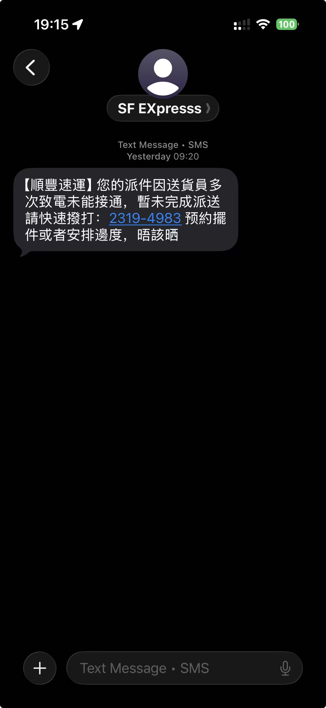
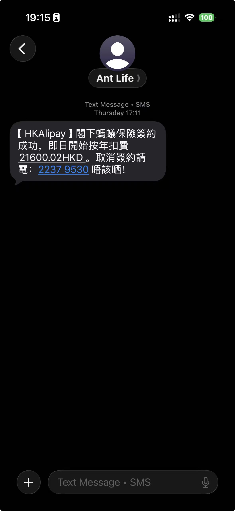
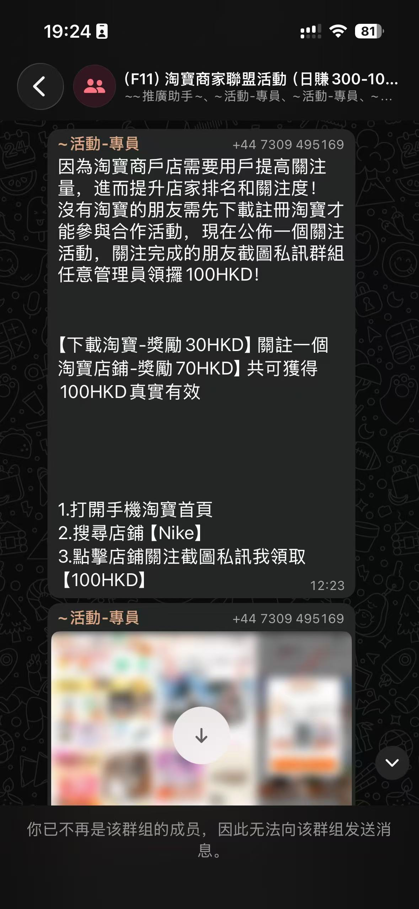

# 防诈骗！防诈骗！防诈骗！

在香港，诈骗手段层出不穷，尤其是针对留学生的诈骗案件频发。为了保护自己和家人的财产安全，大家一定要提高警惕，了解常见的诈骗类型和防范措施。以下是一些常见的诈骗类型：

## 1. 电话诈骗
最常见的电话诈骗手段包括冒充**银行工作人员、警察、税务局、入境事务处、甚至网购平台或物流工作人员**等机构，要求受害人提供个人信息或转账。现在的骗子科技非常发达，甚至知道你的**身份证号码、银行卡余额、以及你在网购平台购买了什么东西**。骗子会通过电话恐吓你，声称你涉及洗钱、诈骗、欠税等问题，要求你立即转账或提供验证码。


# 数字3开头的大部分香港号码都是诈骗，基本可以直接挂断。牢记：如果真的有事情，别人一定会反复拨打，或者通过其他渠道甚至线下联系你。如果实在无法判断，一定要联系你最信任的人（如父母、老师、好朋友）帮你判断，或者直接报警。


<!-- ### 真实案例1
小王有一天突然收到一通电话，电话里面的人自称是**将军澳入境处**的工作人员，并且直接报出了小王的身份证号码，声称该身份证号码绑定的香港手机号参与了内地xxxx的洗钱案件，需要你接受调查。小王一听对方甚至知道自己的身份证号码，吓得不轻，按照对方所谓的“法律流程”，转账了一笔巨额款项作为保障金。后来小王才发现自己被骗了，赶紧报警，但已经晚了。

骗子漏洞：
- 骗子自称是入境处工作人员，但实际上入境处不会通过电话联系市民，更不会要求市民转账。
- 内地案件不会通过香港的入境处来处理，骗子利用了小王对法律流程的不了解。**内地公安或警察一定不会通过电话联系香港市民，更不会要求转**账。 -->

### 真实案例1
小王在拼多多上买了一个咖啡机，突然有点接到一个电话，对方自称是集运仓物流客服，问小王是不是最近买了一个咖啡机，声称小王的包裹出现了破损，需要给小沈理赔，让小沈通过WhatsApp联系某个号码，进行理赔流程。该WhatsApp账号随后联系了小王，问小王是通过微信还是支付宝付的款，小王说是Apple Pay，骗子资历尚浅，不知道Apple Pay，又问了一遍是微信还是支付宝，小王又说Apple Pay。随后骗子无奈了，让小王通过微信访问某个**第三方网址**进行理赔手续，后续小王发觉是诈骗，并没有理会骗子。

骗子漏洞：
- 骗子自称是物流客服，但实际上物流公司不会通过电话联系客户，更不会要求客户通过第三方网址进行理赔。
- 骗子利用了小王对物流理赔流程的不了解，试图通过第三方网址获取小王的个人信息或资金。
- 第三方网址是一串乱七八糟的数字和字母，并不是正规的物流公司网站，应该提高警惕。

### 真实案例2（转述）
小王听到有位女士报警，报警的人说她收到一则电话，电话里面的人问她是否在淘宝或者拼多多上购买了xxx商品（她确实购买了），需要她补交一笔费用。并且，电话里的人甚至知道该女士的银行卡（汇丰和中银）余额，并通过技术手段封锁了改女士的微信。好在该女士警觉性较高，立刻报警并联系微信客服解锁了。

## 2. 短信诈骗
骗子会通过短信发送虚假的中奖信息、银行账户异常通知、快递包裹问题等，诱导受害人点击链接或拨打电话，从而获取个人信息或进行诈骗。
以下是常见的诈骗短信：
<figure><figcaption></figcaption></figure>
<figure><figcaption></figcaption></figure>

## 3. 聊天软件诈骗
骗子会通过WhatsApp、Telegram等聊天软件发送虚假的“发钱”信息，通过一些蝇头小利（如下载某常用软件就给20港币，给某常用软件中的某个商品、视频、酒店等点赞就给20港币等等）诱导受害人以为自己可以轻松赚钱。实则，当受害人尝到一点甜头后，骗子会逐渐以充值后可以赚更多钱的名义，诱骗受害人继续充值，最终导致受害人损失惨重。
以下是真实例子：
<figure><figcaption></figcaption></figure>