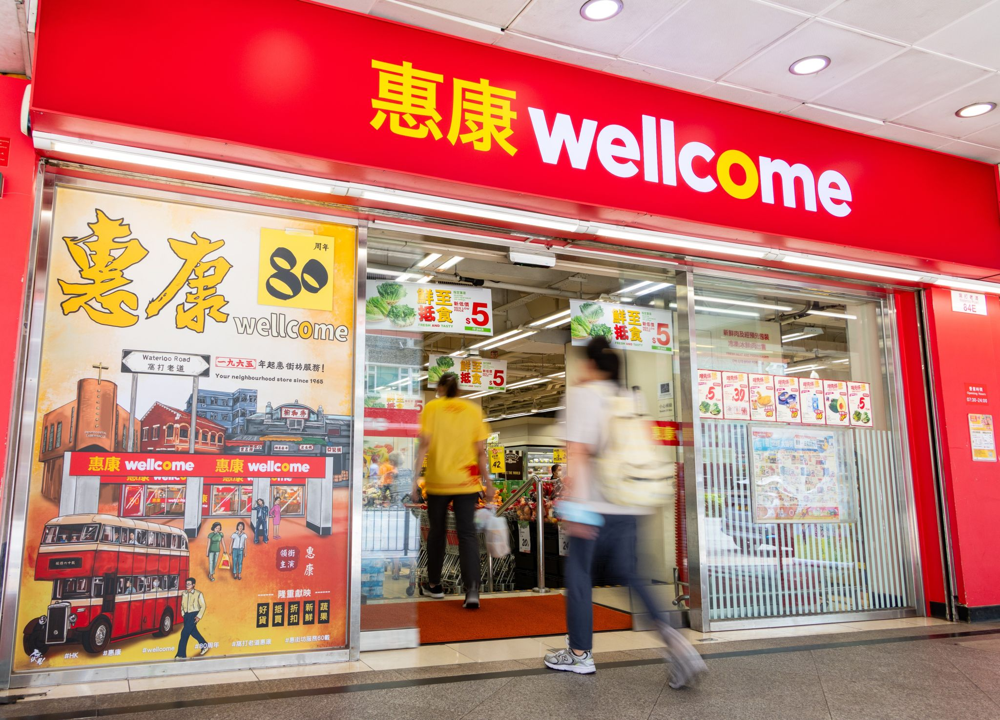
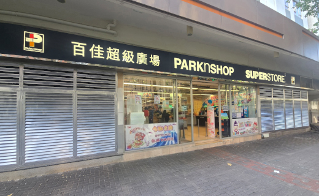
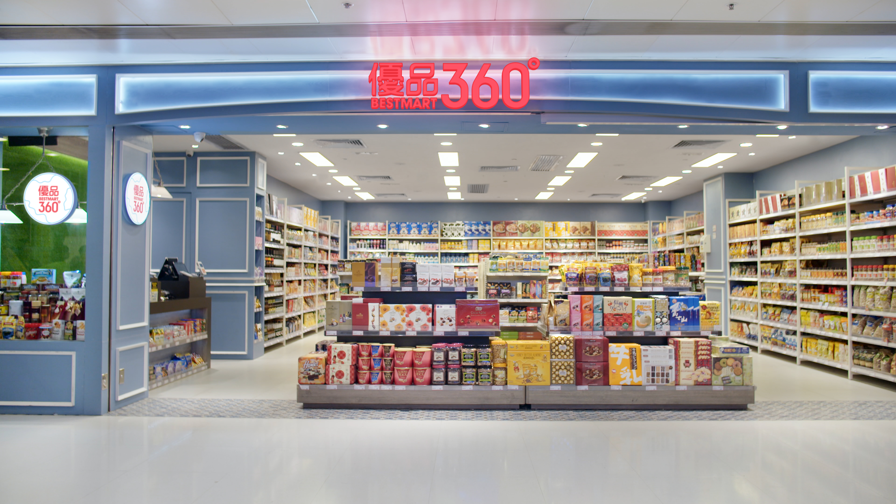
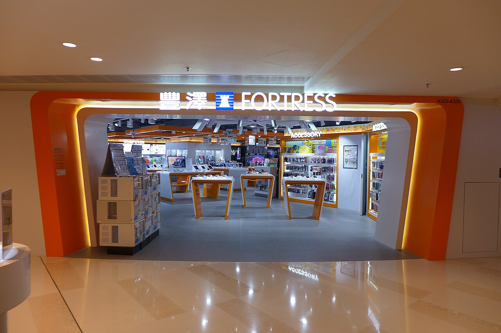
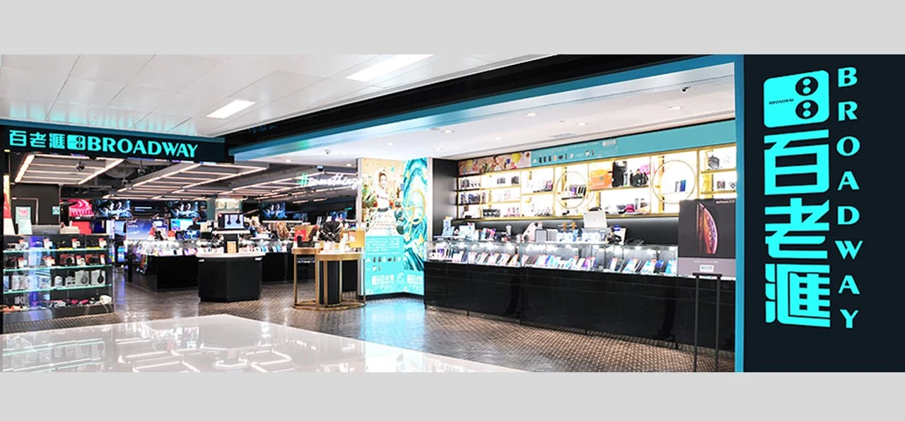
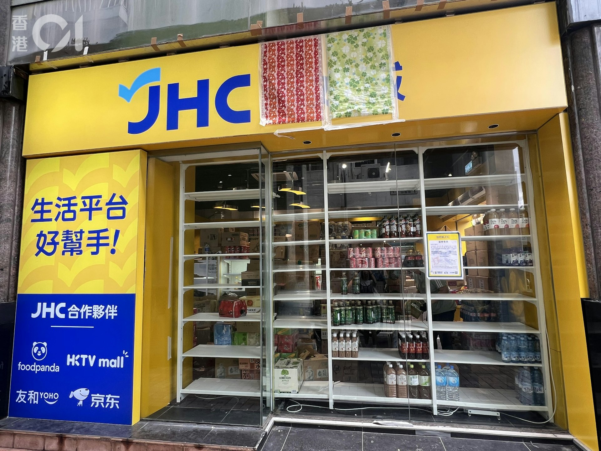

# Shopping

Hong Kong is renowned as a shopping paradise, offering a vast array of options from luxury brands to local markets. For new students, knowing where to go for daily necessities, electronics, and other goods can make settling in much easier. This guide provides an overview of the main shopping destinations.

## Supermarkets

For groceries and daily household items, these are the most common supermarket chains.

*   **Wellcome (惠康)**: One of the two largest supermarket chains in Hong Kong, with stores all over the city. They offer a wide range of products at competitive prices.

<figure><figcaption></figcaption></figure>

*   **ParknShop (百佳)**: The other major supermarket chain, often located near Wellcome. They also have sub-brands like **Fusion**, **Taste**, and **International** which cater to different market segments.

<figure><figcaption></figcaption></figure>

*   **Market Place**: A more upscale supermarket brand under the same group as Wellcome, offering a wider selection of imported goods.
*   **City'super**: A high-end supermarket located in major shopping malls, specializing in premium and imported foods and goods. It's a great place for finding international products.
*   **U-Select (優品360)**: A chain store that offers a variety of snacks, drinks, and groceries, often at lower prices.
<figure><figcaption></figcaption></figure>

*   **Wet Markets (街市)**: For the freshest produce, meat, and seafood, nothing beats the local wet markets. They are an essential part of Hong Kong life and offer great value.

## Electronics

Whether you need a new laptop, phone, or any other gadget, these are your go-to places.

*   **Fortress (豐澤)**: A major electronics retail chain with stores across Hong Kong, offering a wide range of products from computers to home appliances.

<figure><figcaption></figcaption></figure>

*   **Broadway (百老匯)**: Another leading electronics chain, similar to Fortress, where you can find all major brands of electronics.

<figure><figcaption></figcaption></figure>

*   **Computer Centres**: For more specialized computer parts, accessories, or better deals, you can visit computer centres like the **Golden Computer Arcade** in Sham Shui Po or the **Wan Chai Computer Centre**.
*   **Apple Store**: For all Apple products, the official Apple Stores offer the best experience and support.

## Furniture and Home Goods

To furnish your new apartment or dorm room, these stores are very popular among students.

*   **IKEA (宜家家居)**: The go-to place for affordable and stylish furniture and home accessories. They have several large stores and pickup points in Hong Kong.


*   **Pricerite (實惠)**: A local chain that offers a wide range of furniture, home goods, and appliances, often catering to smaller apartment sizes.


*   **Japan Home Centre (日本城) & Living PLAZA by AEON**: These stores are perfect for finding all kinds of household items, from kitchenware to storage solutions, at very affordable prices.
<figure><figcaption></figcaption></figure>

## Online Shopping

Online shopping is becoming increasingly popular and convenient.

*   **HKTVmall**: The largest local online shopping platform in Hong Kong, offering everything from groceries and electronics to beauty products. They offer fast delivery services.


*   **Taobao (淘寶)**: Many students use Taobao for a vast selection of affordable goods. You can have items shipped directly to Hong Kong or use a consolidation service to save on shipping fees.
*   **Amazon**: While there isn't a dedicated Amazon HK site, you can order from Amazon US, UK, or Japan, though be mindful of shipping costs and times.

## Shopping Malls & Department Stores

Hong Kong is famous for its numerous shopping malls, which are great for clothing, entertainment, and dining.

*   **Harbour City (海港城)**: Located in Tsim Sha Tsui, it's one of the largest malls in Hong Kong.
*   **Festival Walk (又一城)**: Conveniently located in Kowloon Tong, it's very popular among students from nearby universities.
*   **Times Square (時代廣場)**: A major shopping mall and landmark in Causeway Bay.
*   **SOGO**: A Japanese-style department store in Causeway Bay known for its bi-annual "Thankful Week" sales, which attract huge crowds.


**Bring Your Own Bag (BYOB)**

Hong Kong implements a plastic bag levy. Retailers are required to charge a fee for each plastic bag provided, so it's a good habit to bring your own reusable shopping bags.

