# Tourism & Sightseeing

Hong Kong, a vibrant city where East meets West, offers a plethora of attractions for every traveler. From stunning natural landscapes and iconic skylines to rich cultural heritage and world-class theme parks, there's always something to explore. This guide will help you discover the best of what Hong Kong has to offer.



## Iconic Landmarks

These are the must-visit spots that define Hong Kong's global image.

*   **Victoria Peak (The Peak, 太平山頂)**: Offering breathtaking panoramic views of Victoria Harbour and the city skyline, The Peak is Hong Kong's most popular attraction. Take the historic Peak Tram to the top for a memorable experience. The best time to visit is late afternoon to see the city transition from day to night.

<figure>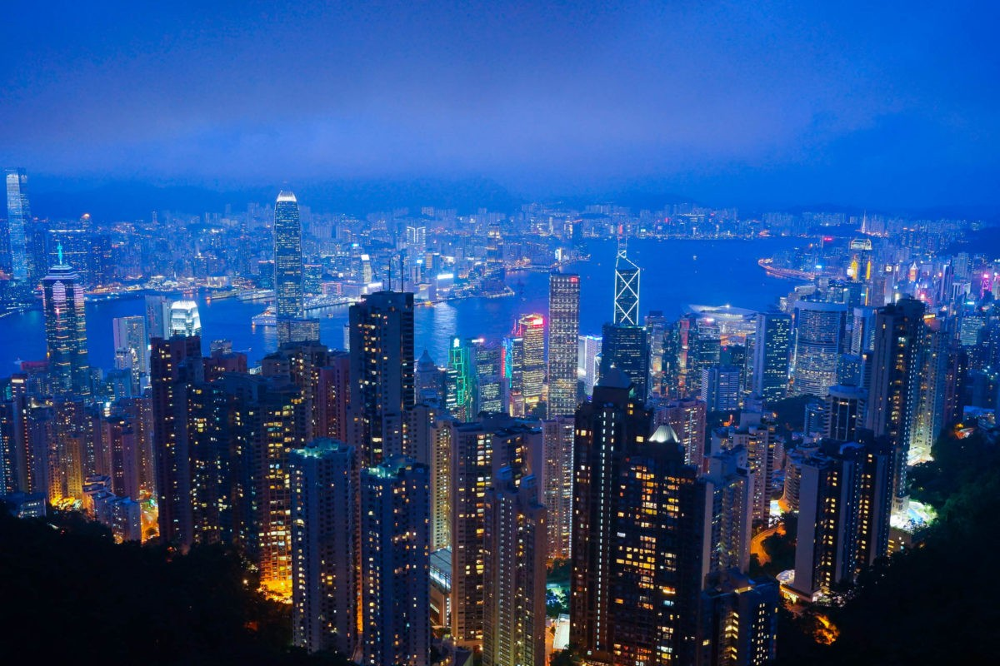<figcaption></figcaption></figure>

*   **Victoria Harbour & A Symphony of Lights (維多利亞港 & 星光大道)**: The harbour is the heart of the city. A stroll along the Tsim Sha Tsui waterfront offers spectacular views of the Hong Kong Island skyline. Don't miss "A Symphony of Lights," a dazzling multimedia show every night at 8:00 PM, featuring lights and lasers from 43 buildings on both sides of the harbour.
<figure>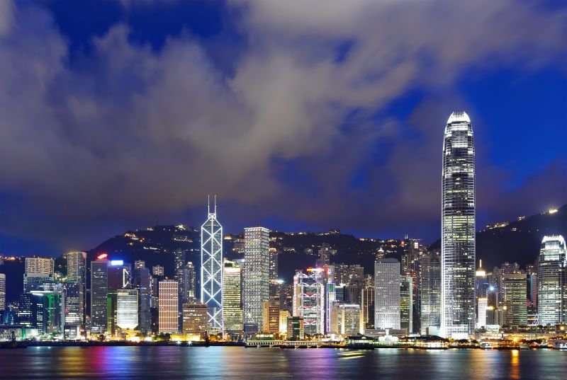<figcaption></figcaption></figure>

*   **The Big Buddha and Po Lin Monastery (天壇大佛 & 寶蓮禪寺)**: Located on Lantau Island, the giant bronze Tian Tan Buddha sits majestically next to the Po Lin Monastery. You can reach it via the scenic Ngong Ping 360 cable car, which offers stunning views of the island. The monastery also serves delicious vegetarian meals.
<figure>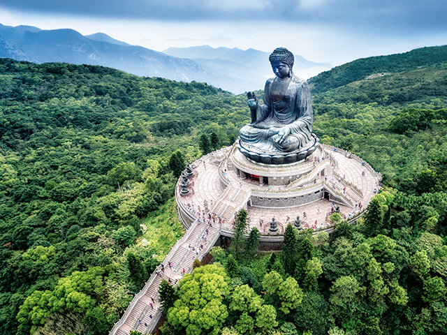<figcaption></figcaption></figure>

## Cultural & Historical Sites

Immerse yourself in the city's rich history and spiritual traditions.

*   **Wong Tai Sin Temple (黃大仙祠)**: Famous for "making every wish come true upon request," this bustling Taoist temple is a popular spot for both worshippers and tourists. Its colorful architecture and fortune-telling stalls make for a unique cultural experience.
<figure>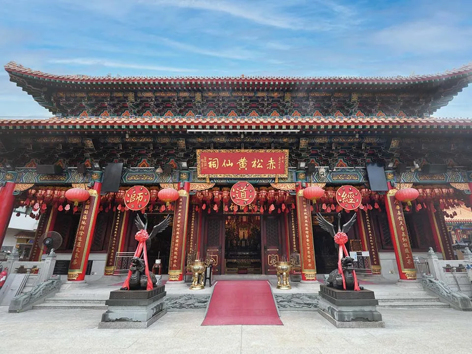<figcaption></figcaption></figure>

*   **Man Mo Temple (文武廟)**: A tranquil oasis amidst the hustle of Sheung Wan, this temple is dedicated to the gods of literature (Man) and war (Mo). It's one of the oldest and most revered temples in Hong Kong.
<figure>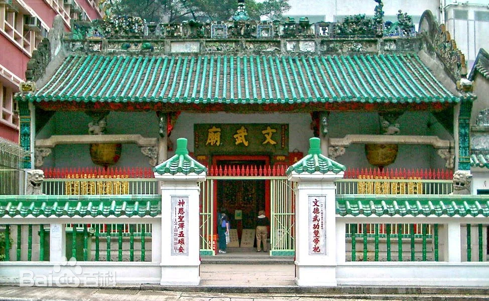<figcaption></figcaption></figure>

*   **Hong Kong Museum of History (香港歷史博物館)**: Journey through Hong Kong's fascinating past, from its prehistoric origins to the 1997 handover. The "Hong Kong Story" permanent exhibition is a must-see for anyone interested in the city's development.
<figure>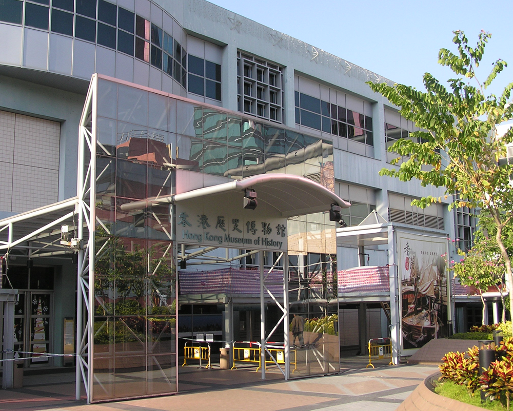<figcaption></figcaption></figure>

* **GHong Kong Palace Museum（香港故宮文化博物館）**: A museum that showcases Chinese art and cultural relics, offering a glimpse into the rich history of China. The museum features a variety of exhibitions and educational programs.
<figure>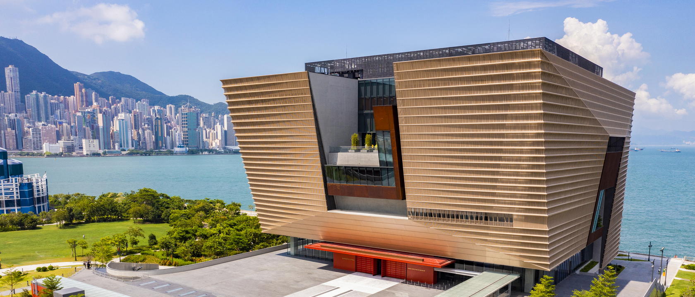<figcaption></figcaption></figure>

## Outlying Islands & Nature

Escape the urban jungle and explore Hong Kong's greener side.

*   **Lamma Island (南丫島)**: A car-free island known for its bohemian vibe, seafood restaurants, and scenic hiking trails connecting the main villages of Yung Shue Wan and Sok Kwu Wan. Ferries are available from Central.

<figure>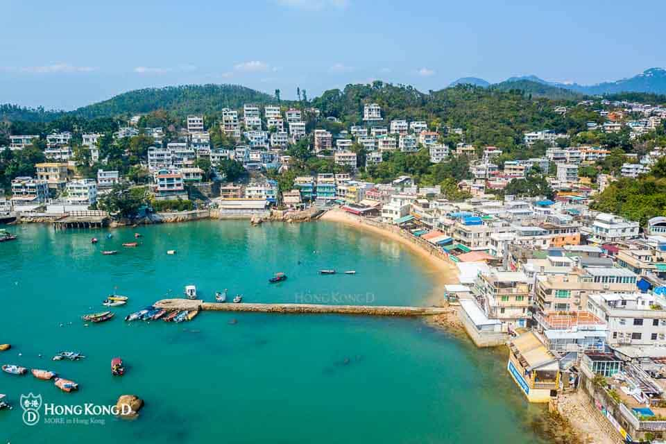<figcaption></figcaption></figure>

*   **Cheung Chau (長洲)**: This dumbbell-shaped island is packed with character. Rent a bike, visit the Cheung Po Tsai Cave (a pirate's hideout), and enjoy the fresh seafood along the waterfront. Ferries run regularly from Central.
<figure>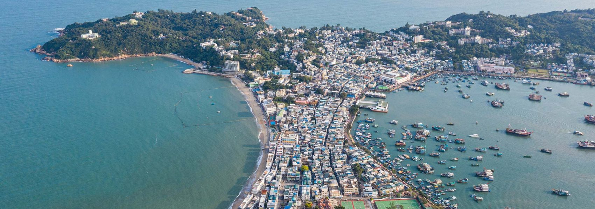<figcaption></figcaption></figure>

*   **Dragon's Back Trail (龍脊徑)**: Voted one of the best urban hikes in Asia, this trail offers stunning coastal views of Shek O and Big Wave Bay. It's an accessible hike for most fitness levels and a great way to experience Hong Kong's natural beauty.
<figure>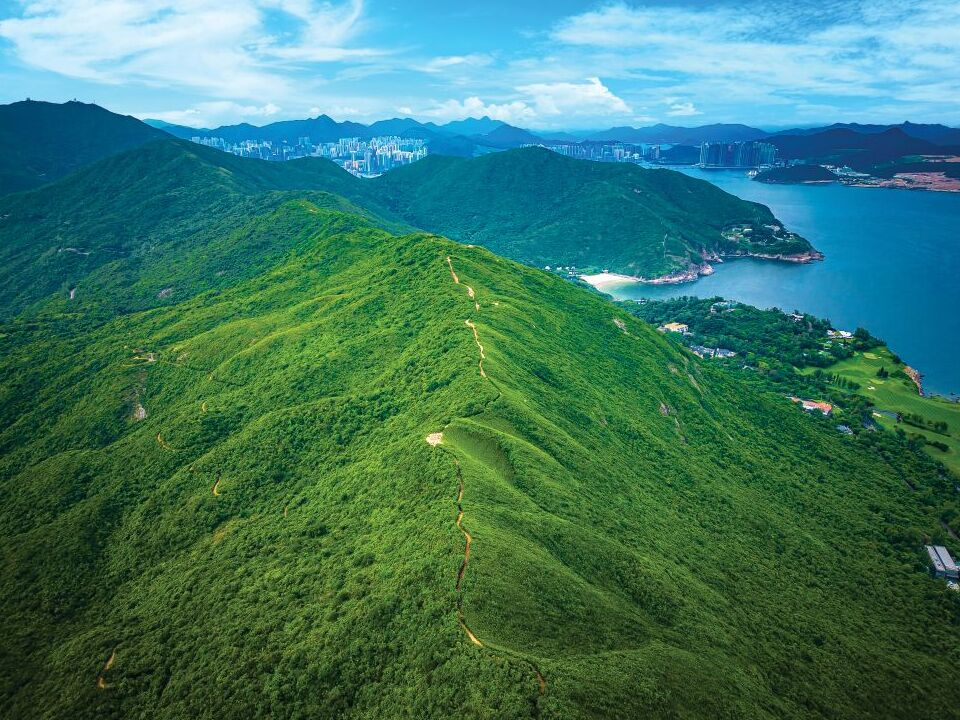<figcaption></figcaption></figure>

* **Tai Mei Tuk Tsuen（大美督）**: A scenic area in the New Territories, known for its reservoir and outdoor activities. Visitors can enjoy cycling, picnicking, and water sports in a tranquil setting away from the city hustle. Extremely famous for its sunsets and the surrounding natural beauty, Tai Mei Tuk is a popular spot for both locals and tourists seeking a peaceful retreat.
<figure>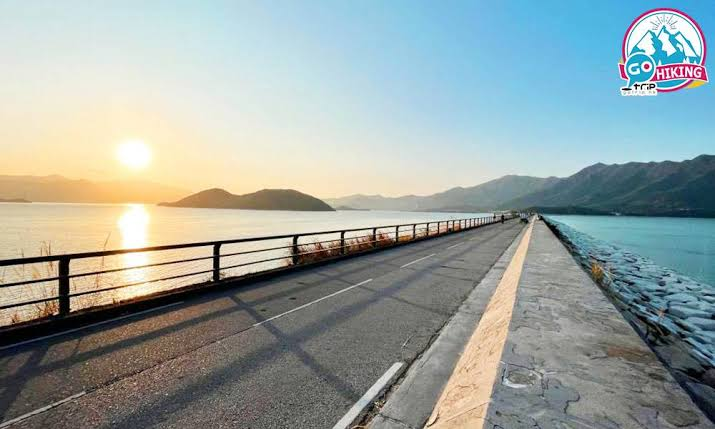<figcaption></figcaption></figure>

## Theme Parks

For a day of fun and excitement, visit one of Hong Kong's world-class theme parks.

*   **Hong Kong Disneyland（香港迪士尼樂園）**: The magical kingdom of Disney brings fairy tales to life with its classic attractions, shows, and beloved characters. The park is constantly expanding with new experiences.

<figure>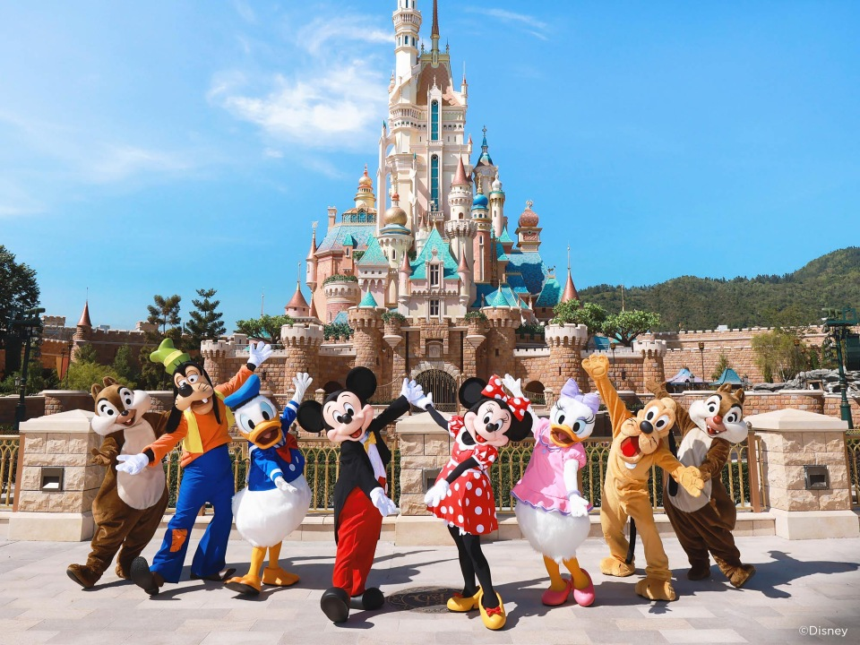<figcaption></figcaption></figure>

*   **Ocean Park Hong Kong（香港海洋公園）**: A marine-life theme park featuring animal exhibits, thrilling rides, and entertaining shows. It's a perfect destination for families and animal lovers.

<figure>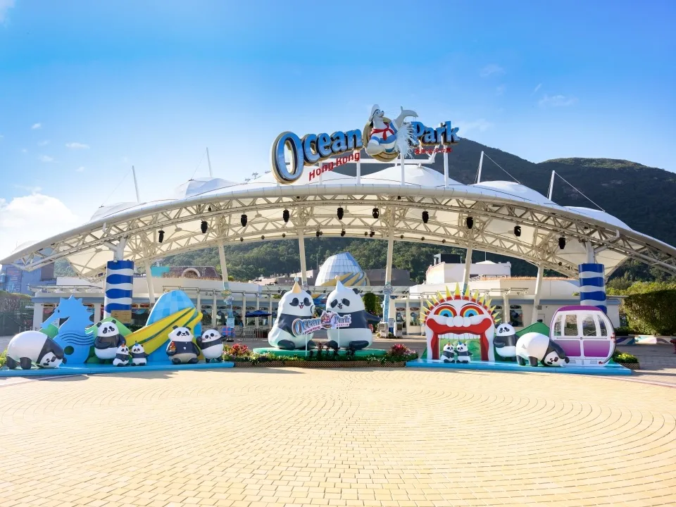<figcaption></figcaption></figure>

## Shopping & Entertainment Districts

Experience the energy of Hong Kong's famous shopping areas.

*   **Tsim Sha Tsui（尖沙咀）**: A bustling district with a mix of luxury malls, street-level shops, museums, and the Avenue of Stars along the waterfront.
<figure>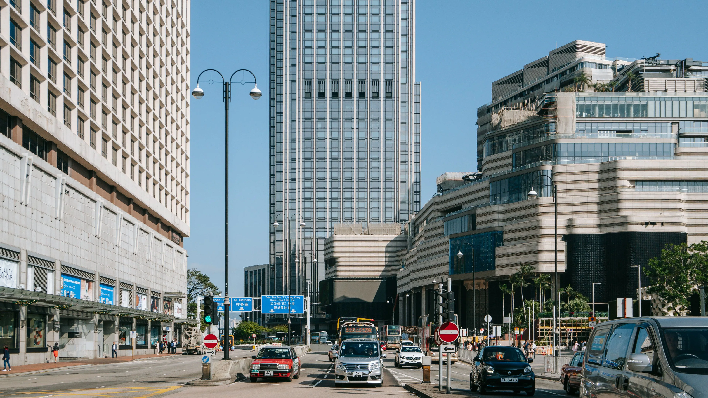<figcaption></figcaption></figure>

*   **Causeway Bay（銅鑼灣）**: One of the world's most expensive retail areas, packed with department stores, boutiques, and the massive Times Square shopping mall.
<figure>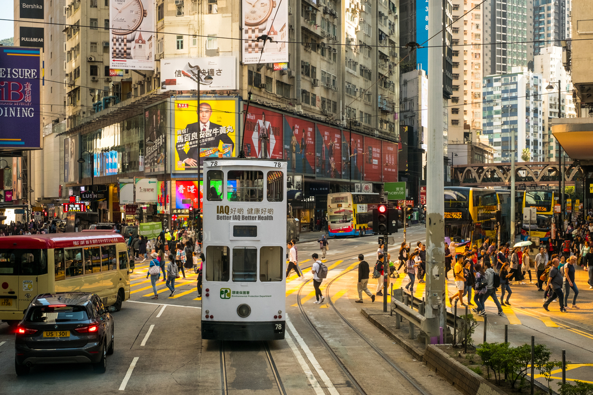<figcaption></figcaption></figure>

*   **Mong Kok（旺角）**: Known for its vibrant street markets like the Ladies' Market (for clothes and souvenirs) and the Goldfish Market. It's a great place to experience local street culture.
<figure>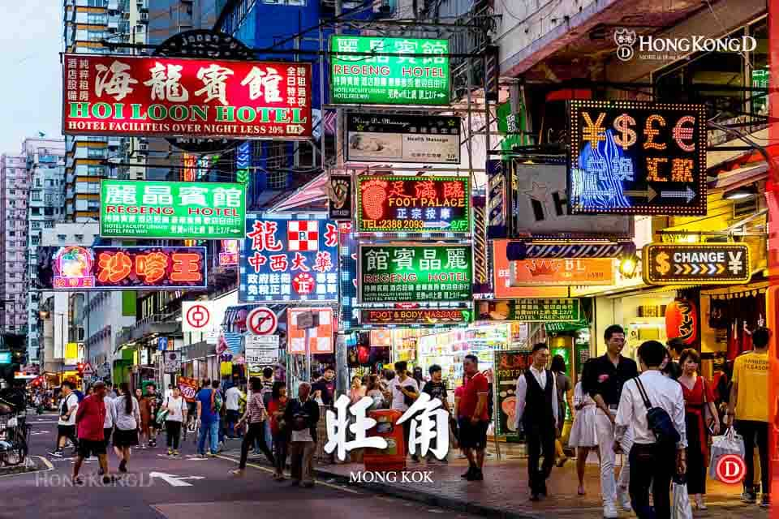<figcaption></figcaption></figure>


**Travel Tip: Octopus Card（八達通）**

The Octopus Card is an essential tool for getting around Hong Kong. It's a rechargeable smart card that can be used for all public transport, including the MTR, buses, ferries, and trams, as well as for purchases at convenience stores and many other retail outlets.


<figure><figcaption></figcaption></figure>
