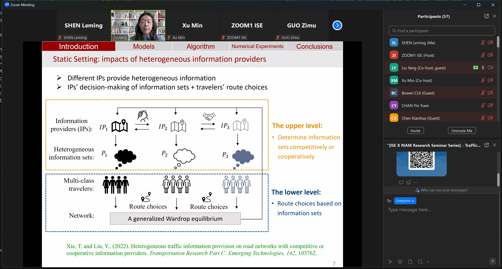
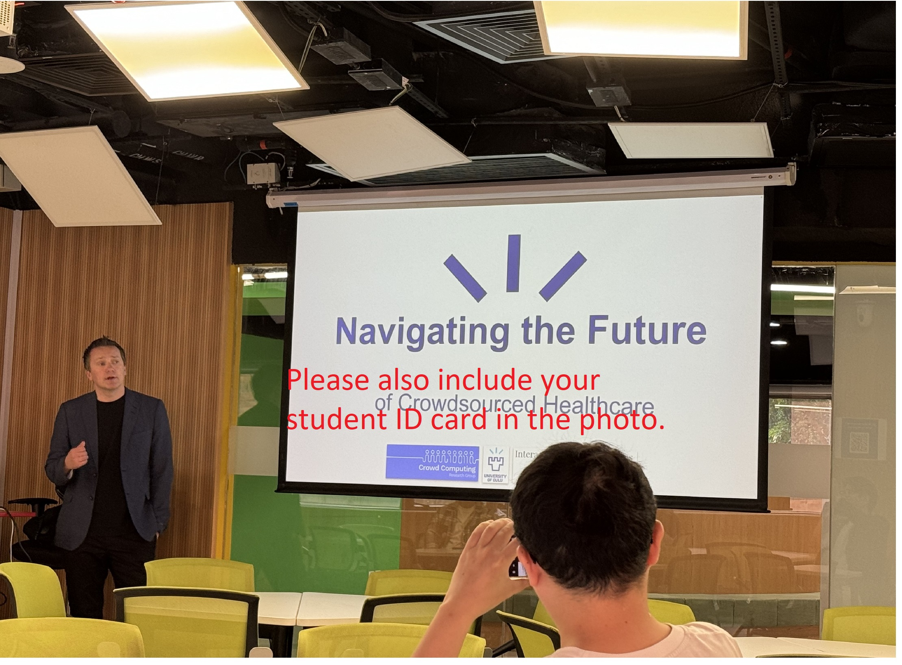

# Attending Seminars and Write Reports

## 1. What can be regarded as a seminar?

There are three types of seminars/lectures that can be counted:

* COMP research seminars. For example,
<figure><figcaption></figcaption></figure>

* Research seminars from other departments. For example,
<figure><figcaption></figcaption></figure>

* Any lectures/talks that last for at least 1 hour. For example,
<figure><figcaption></figcaption></figure>


For each seminar course, you need to attend at least 10 seminars/lectures. Only seminars/lectures attended after the semester commencement date can be counted. In addition, if you fail to attend 10 seminars/lectures, you cannot register new seminar courses in the next semester and those attended seminars/lectures can still be counted in the next semester.

   

## 2. How to record the attendance?

For COMP seminars, you just need to physically bring your student card to sign in before the seminar starts. You also need to tap your card to sign out after the seminar ends. The attendance record will be automatically recorded in the system.

For other seminars/lectures, you need to prepare the following materials to prove your attendance:

* The poster of the seminar/lecture. The above figures can be used as examples.
* The document that can prove your attendance, including any one of the following:
  * The e-certificate issued by the organizer.
  * The email from the organizer that confirms your successful registration (not recommended).
  * The screenshot of the Zoom meeting that shows your profile and the speaker. For example,
  <figure><figcaption></figcaption></figure>

  * The photo take during the seminar/lecture that shows your student ID card and the speaker. For example,
  <figure><figcaption></figcaption></figure>

## 3. Write seminar report

Here is the template of the seminar report:



Please bear in mind that you need ask one question during any seminar/lecture you attend. You must write down the question and the response from the presenter in the report.

   

## 4. Submit the report to the system and wait for approval

* Visit the Research Seminar Attendance System: `https://rsas.comp.polyu.edu.hk/my_subject.php <https://rsas.comp.polyu.edu.hk/my_subject.php>`_.
* Select the current seminar course and click "Create"
* For COMP seminars, you can directly select the seminar you attended from the list.
* For other seminars/lectures, you need to manually "Add non-COMP seminar" and fill in the information along with uploading the proof of attendance.
* Then submit the seminar report in **PDF format**.
* Submit and wait for the approval from the seminar course instructor.

.. note::
   Remember to notify our supervisor after you submit the report. If the report is approved after the deadline of submitting the report, it will be delayed to the next semester and you cannot select new seminar courses in the next semester. 