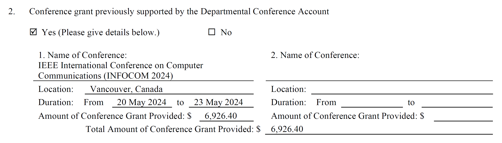

# Reimbursement for Conference Attendance

## 1. Reimbursement Rules

* If you have a paper, poster, demo, or workshop paper accepted, you can apply for **COMP conference grant** to attend the conference. If you do not have any accepted work, you can still apply but using our supervisor's own funding to attend the conference.
* Each student has 25,000 HKD funding for the **COMP conference grant**. You can spend at most 20,000 HKD for one reimbursement application.
* Only after you spend all the **COMP conference grant**, can you use **GS additional top conference grant**, which has 20,000 HKD funding for each student. You need to spend the whole 20,000 HKD for one reimbursement application. COMP's top conference list can be found [here](https://intranet.comp.polyu.edu.hk/system/files/journalconference/Depn%20conference_20241231.pdf).
* For one reimbursement application, if your cost estimation exceeds 20,000 HKD, you can try combined reimbursement. For example, if your cost estimation is 30,000 HKD, you can apply for 20,000 HKD from **COMP conference grant** and 10,000 HKD from the supervisor's own funding. ("COMP + GS" is not allowed).
* After you spend all the **COMP conference grant** and **GS additional top conference grant**, you can still apply for reimbursement using the supervisor's own funding.

## 2. Supplementary Material Preparation

Before you start, please make sure you have the following materials ready in **PDF format**:

* The conference information (*e.g.*, the homepage of [MobiCom 2025](https://www.sigmobile.org/mobicom/2025/)).
* The acceptance email if you have a paper, poster, demo, or workshop paper. For example:
  <figure><figcaption></figcaption></figure>

* Itinerary of your planned trip, including departure and return dates. Example:
  

* Registration fee information (*e.g.*, [MobiCom 2025 Registration](https://www.sigmobile.org/mobicom/2025/registration.html)).
* Other relevant documents
  * VISA application fee, plane tickets, and accommodation information (estimated). 
  

  * MRS Form (if applicable). **Make sure that the highlighted part is filled**
  


Make sure that all Supplementary documents are in **PDF format**. For estimated plane tickets and accommodation information, I suggest pick an expensive one to avoid under-budgeting, as the reimbursement will be based on the actual expense you incur during the trip but will not exceed what you claimed.


## 3. Fill the GSB Form

* If you have a paper
  * If you are applying for **COMP conference grant**, please fill the [GSB/4 form](https://www.polyu.edu.hk/gs/docdrive/forms/FormGSB4.doc).
  * If you are applying for **GS additional top conference grant**, please fill the [GSB/4A form](https://www.polyu.edu.hk/gs/docdrive/forms/FormGSB4A.doc).
* If you do not have a paper, please fill the [GSB/5 form](https://www.polyu.edu.hk/gs/docdrive/forms/FormGSB54.doc)

Now, I will provide a step-by-step guide on how to fill the form. Here, I take the **GSB/4 form** as an example. The other two forms are similar.



* Applicant basic information
<figure><figcaption></figcaption></figure>


The ``Current Project Title`` in the form refers to your thesis title (*i.e.*, your proposal title).




* Conference grant previously supported by the Departmental Conference Account
<figure><figcaption></figcaption></figure>


Please list all the previously attended conferences that were supported by the **COMP conference grant**. If none, please select "No". Make sure that the amount completely equals to what you have received before.




* Conference & reimbursement information
<figure><figcaption></figcaption></figure>


You can select an expensive airline for reimbursement application. In addition, for each day, you can claim up to 800 HKD for subsistence allowance, including accommodation, meals, and local transportation. Besides, the accommodation day should not exceed the number of conference days plus one. Make sure that the city printed on the receipts are the same as the city where the conference is held.



If you have receipts in foreign currency, please convert them to HKD using the exchange rate on the date of the transaction. You **MUST** use [this table](https://www.polyu.edu.hk/fo/docdrive/Students/Claim/ExchangeRate_Student_2025.pdf) for real-time exchange rate when you fill the form.
      



* Funding information
<figure><figcaption></figcaption></figure>


If you are applying for **COMP conference grant**, fill ``Account to be charged`` with ``Student Conference Grant``. If the amount claimed exceeds the balance of your **COMP conference grant**, the exceeded part should only be the supervisor's own funding (*e.g.*, MRS). Please ask the supervisor to negotiate which funding to be charged. After all the information is filled and endorsed by the supervisor, you can stick the supervisor's electronic signature in the form.




* Finally, convert the ``doc`` file to **PDF**.

Before you proceed to the next step, please make sure that the supervisor has endorsed the GSB form (in PDF format).
  



## 4. Fill the Online Application Form

* After you have prepared all the supplementary materials and the filled GSB form, you can start the online application:


* Submit relevant materials based on the guidance. For item 14 (Others), you need to upload the VISA application fee information, plane ticket information, accommodation information, and the MRS form (if applicable)

## 5. Wait for Approval

* The online application system will send your applications to COMP's general office (GO) and the supervisor for approval.
* After 2 to 4 weeks, you will receive an approval email, which either informs you that your application is approved or asks you to provide more information.
* Once approved, **please save the endorsed GSB form sent by GO** (in PDF format) and complete the **Leave Management System** as guided in the email. The approved GSB form in attached in the email:
   .. figure:: ../../assets/reimbursement/approved.png
      :width: 100%
      :align: center
      :alt: Funding information example

      Approved GSB form example

## 6. Attend the Conference -- Enjoy Yourself!

.. warning::
   Keep the **hard copies** of all the original receipts and invoices, including registration fee, plane tickets (*i.e.*, the boarding pass), accommodation, VISA application fee, taxi receipts (*e.g.*, the e-receipt from Uber), and meal receipts.

## 7. Fill the Reimbursement Form and Submit it to FO with Receipts (After the Conference)

* After you return from the conference, you can fill the :download:`Reimbursement form <https://www.polyu.edu.hk/fo/docdrive/Students/Claim/Guideline-ReimDetails-ResearchStudentClaim_Individual.xlsx?t=0>` to apply for reimbursement. This form provides detailed instructions on how to fill it. An example can be found :download:`here <../../assets/reimbursement/Reimbursement.xlsx>`.
* After filling the reimbursement form, please print all the materials (including the approved GSB form) and physically submit to FO office (11-th floor in Block M) as well as sending an email following the reimbursement form.

.. warning::
   Make sure that only HKD is used in the reimbursement form. If you have receipts in foreign currency, please convert them to HKD using the exchange rate on the date of the transaction. You **MUST** use `this table <https://www.polyu.edu.hk/fo/docdrive/Students/Claim/ExchangeRate_Student_2025.pdf>`_ for real-time exchange rate when you fill the form. Make sure that the city printed on the meal receipts are the same as the city where the conference is held.
