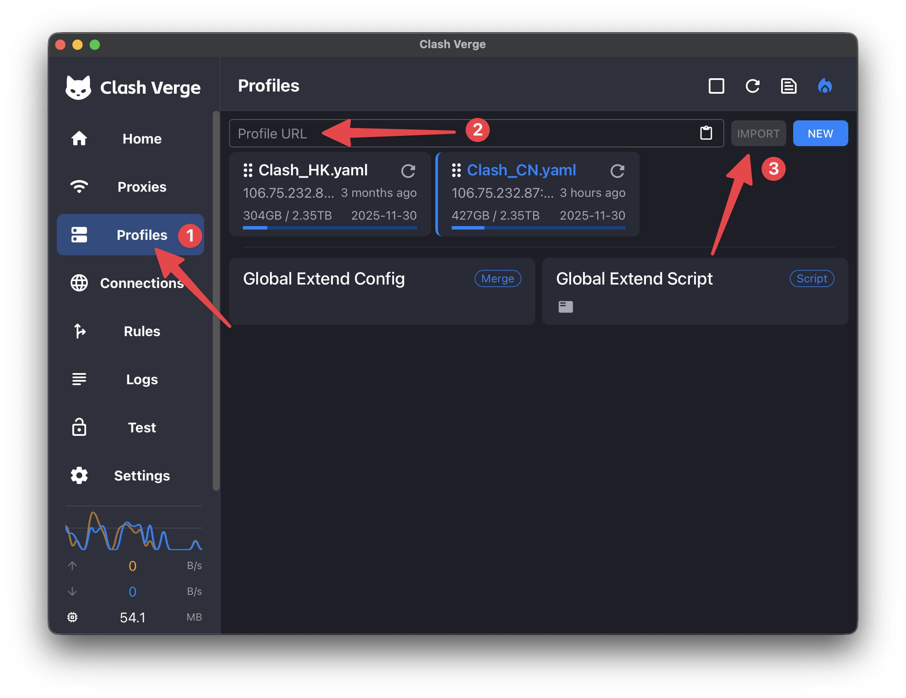
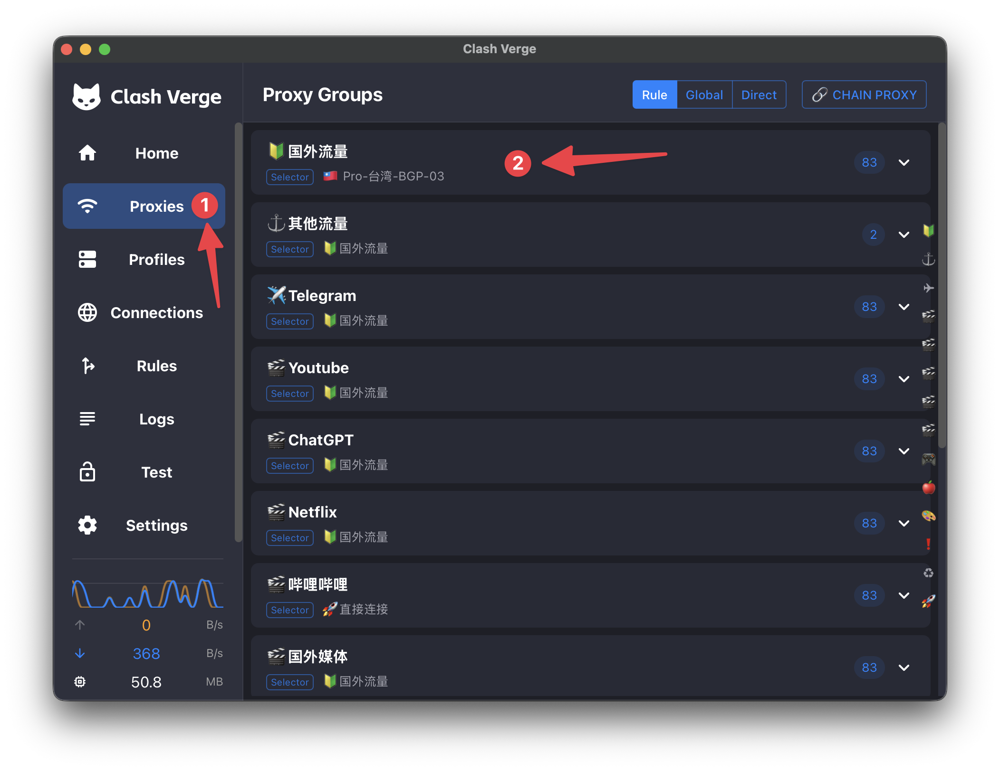
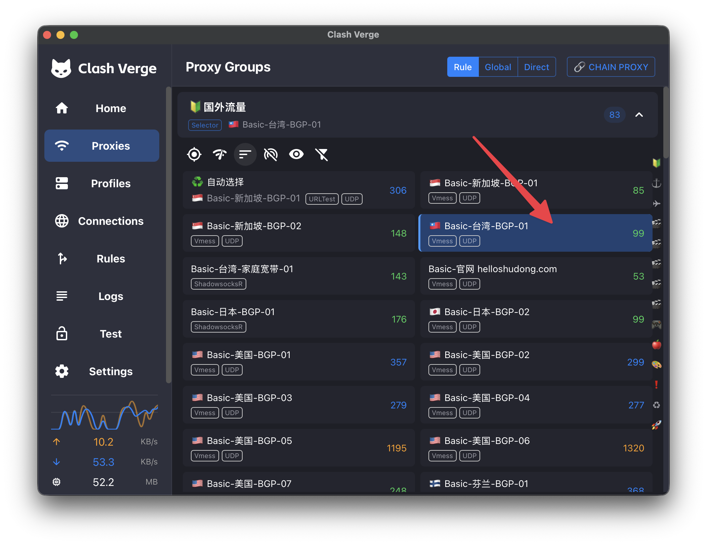
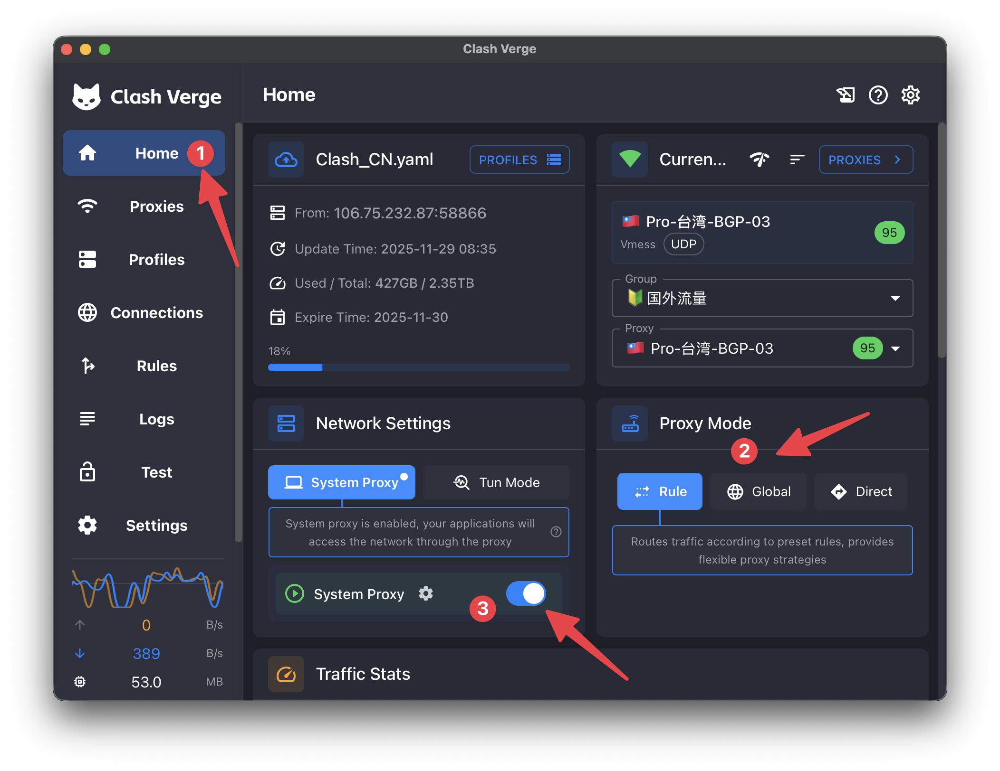

Clash Verge
=============================

Clash Verge is a fork of the Clash project that focuses on enhancing the user experience and adding new features to the original Clash proxy tool. It aims to provide a more intuitive interface and improved performance for users who require advanced proxy functionalities.

1. Download & Installation
---------------------------------------------
* Visit `https://www.clashverge.dev/ <https://www.clashverge.dev/>`_ to download the latest version of Clash Verge for your operating system (Windows, macOS, Linux).
* Follow the installation instructions provided on the website to set up Clash Verge on your device.

2. Import Configuration
---------------------------------------------
* Open Clash Verge after installation.
* Click on the "Profiles" tab in the sidebar.
* Paste the URL I provided into the "Import from URL" field and click "Import".

    import configuration example

3. Select Preferred Nodes
---------------------------------------------
* Click on the "Proxies" tab to view the list of available proxy nodes.
* Browse through the list and select your preferred nodes by clicking on them based on different rules.

    select node example

    select node example

4. Start System Proxy
---------------------------------------------
* Click on the "Home" tab.
* Select a proxy mode on the right panel
    * Rule Mode: Routes traffic based on predefined rules.
    * Global Mode: Routes all traffic through the selected proxy.
    * Direct Mode: Direct use your own network.
* Toggle the "System Proxy" switch to enable system-wide proxying.

    start system proxy example

5. Additional Settings (Strongly Recommended)
---------------------------------------------
* **Motivation**: In Hong Kong, we only need proxies for specific services (e.g., OpenAI, Gemini, Claude). Therefore, I recommend configuring Clash Verge to only route traffic for these services through the proxy, while allowing other traffic to use your own network (our university's network provides 1000 MB bandwidth!!!). This approach optimizes performance and reduces unnecessary load on the proxy servers. Also, the traffic flow consumption (2400 GB per year) can be saved.
* How to customize your configurations:
    * Click on the "Profiles" tab.
    * Right click on the previously imported profile and select "Edit Info"
    * Input "Clash_CN.yaml" in the "Name" field to rename the previously imported profile.
    .. figure:: ../../assets/research/clash/rename_config.png
        :width: 100%
        :align: center
        :alt: Rename configuration example

        Rename configuration example
    * Then, re-import the same configuration URL again and rename it to "Clash_HK.yaml".
    * Next, right click on "Clash_HK.yaml" and select "Edit File".
    * Scroll down and find the "rules:" section.
    .. figure:: ../../assets/research/clash/replace_rules.png
        :width: 100%
        :align: center
        :alt: The "rules" section

        The "rules" section
    * Replace all the existing rules with the following rules (dynamically updated): ::

        rules:
 
 
            - DOMAIN-SUFFIX,smtp,DIRECT
            - DOMAIN-KEYWORD,aria2,DIRECT
            
            
            - DOMAIN,browser-intake-datadoghq.com,🎬ChatGPT
            - DOMAIN,static.cloudflareinsights.com,🎬ChatGPT
            - DOMAIN-SUFFIX,ai.com,🎬ChatGPT
            - DOMAIN-SUFFIX,t-mobile.com,🎬ChatGPT
            - DOMAIN-SUFFIX,algolia.net,🎬ChatGPT
            - DOMAIN-SUFFIX,meta.ai,🎬ChatGPT
            - DOMAIN-SUFFIX,api.statsig.com,🎬ChatGPT
            - DOMAIN-SUFFIX,labs.google.com,🎬ChatGPT
            - DOMAIN-SUFFIX,auth0.com,🎬ChatGPT
            - DOMAIN-SUFFIX,chatgpt.com,🎬ChatGPT
            - DOMAIN-SUFFIX,chatgpt.livekit.cloud,🎬ChatGPT
            - DOMAIN-SUFFIX,client-api.arkoselabs.com,🎬ChatGPT
            - DOMAIN-SUFFIX,events.statsigapi.net,🎬ChatGPT
            - DOMAIN-SUFFIX,featuregates.org,🎬ChatGPT
            - DOMAIN-SUFFIX,host.livekit.cloud,🎬ChatGPT
            - DOMAIN-SUFFIX,identrust.com,🎬ChatGPT
            - DOMAIN-SUFFIX,intercom.io,🎬ChatGPT
            - DOMAIN-SUFFIX,intercomcdn.com,🎬ChatGPT
            - DOMAIN-SUFFIX,launchdarkly.com,🎬ChatGPT
            - DOMAIN-SUFFIX,oaistatic.com,🎬ChatGPT
            - DOMAIN-SUFFIX,oaiusercontent.com,🎬ChatGPT
            - DOMAIN-SUFFIX,observeit.net,🎬ChatGPT
            - DOMAIN-SUFFIX,segment.io,🎬ChatGPT
            - DOMAIN-SUFFIX,sentry.io,🎬ChatGPT
            - DOMAIN-SUFFIX,stripe.com,🎬ChatGPT
            - DOMAIN-SUFFIX,turn.livekit.cloud,🎬ChatGPT
            - DOMAIN-KEYWORD,openai,🎬ChatGPT
            - DOMAIN-KEYWORD,gemini,🎬ChatGPT
            - DOMAIN-KEYWORD,sora,🎬ChatGPT
            - DOMAIN-KEYWORD,claude,🎬ChatGPT
            - DOMAIN-KEYWORD,tiktok,🎬ChatGPT
            - DOMAIN-KEYWORD,anthropic,🎬ChatGPT

            - IP-CIDR,119.28.28.28/32,DIRECT,no-resolve
            - GEOIP,CN,DIRECT

            - MATCH,DIRECT

    * Then, right click on the "Clash_CN.yaml" profile and modify the "Update Interval" to a very very very large number. Otherwise, the rules will be overwritten during automatic updates.
    .. figure:: ../../assets/research/clash/update_interval.png
        :width: 100%
        :align: center
        :alt: Modify update interval

        Modify update interval
* As such, in Hong Kong, you can keep the proxy on the moment you start your PC. Only network traffics related to those domians listed in the rules will be routed through the proxy, while all other traffics will use your own network directly.
* You can freely adjust the node you like in the "🎬ChatGPT" section.
* In Hong Kong, you can choose the "Clash_HK.yaml" profile, while in China, you can switch to the "Clash_CN.yaml" profile to enjoy unrestricted internet access.
* Finally, change the system settings to make Clash Verge start automatically when your computer boots up:
.. figure:: ../../assets/research/clash/system_settings.png
        :width: 100%
        :align: center
        :alt: Modify system settings to enable auto start

        Modify system settings to enable auto start

6. Setup on Mobile Devices
---------------------------------------------
* Shadowrocket is recommended for mobile devices.
    * For iOS devices, you can download Shadowrocket from the App Store (non-China region): https://apps.apple.com/ca/app/shadowrocket/id932747118
    * For Android devices, you can download Shadowrocket from Google Play Store: https://play.google.com/store/apps/details?id=com.v2cross.proxy&gl=PT
* Import configurations: https://m.mmomm.io/user/tutorial?os=iOS&client=Shadowrocket

.. note::
    **I strongly recommend using nodes whose names start with "Pro-". To visit Google Scholar, nodes whose names contain "家庭宽带" shoul be selected.**
