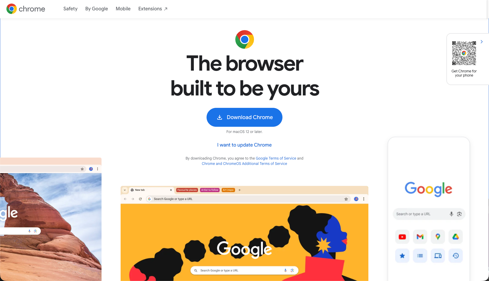
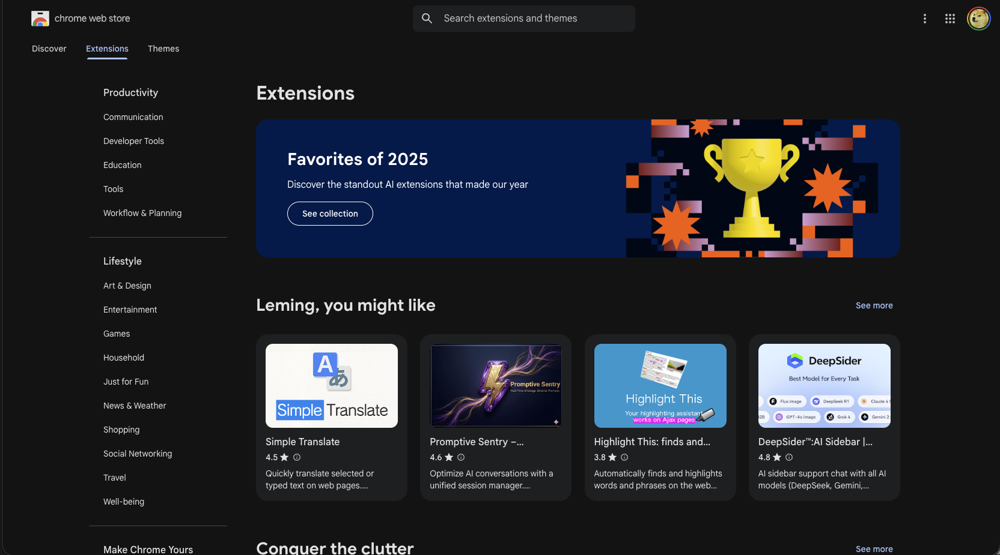

# Browser Extensions (Chrome)

Chrome is a web browser developed by Google. It is a cross-platform browser that is available for Windows, macOS, Linux, Android, and iOS. Chrome is known for its speed, simplicity, and security features. It has a large user base and supports a wide range of extensions and web applications.

<figure><figcaption></figcaption></figure>

Google Chrome extensions are small software programs that can modify and enhance the functionality of the Chrome browser. They are built using web technologies such as HTML, CSS, and JavaScript. Extensions can add new features to the browser, change its behavior, or integrate with other services.

Google Chrome extensions can be found and installed from the [Chrome Web Store](https://chromewebstore.google.com/category/extensions). Users can browse through various categories, read reviews, and install extensions with just a few clicks. Once installed, extensions can be managed through the Chrome settings menu.

<figure><figcaption></figcaption></figure>

In the following sections, I will introduce some popular Chrome extensions that can enhance your browsing experience, improve productivity, and provide additional functionality. Each extension will be described in detail, including its features, benefits, and how to use it effectively.


[AdBlock Plus](adblock.md)



[Bilibili Downloader](bilibili-downloader.md)



[Gemini Chat Folders](gemini-folder.md)



[Google Scholar Button](google-scholar.md)



[Google Scholar PDF Reader](google-scholar-pdf.md)



[Grammarly](grammarly.md)



[HARPA AI](harpaai.md)



[Immersive-translate](immersive-translate.md)



[Zotero Connector](zotero-connector.md)
