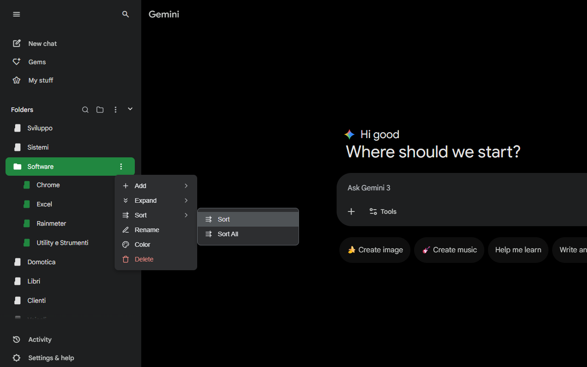

# Gemini Chat Folders

Gemini Chat Folders is a browser extension that allows you to organize your Gemini Chat conversations into folders for better management and accessibility. With this extension, you can create custom folders, move conversations into them, and easily navigate through your chats.

<figure><figcaption></figcaption></figure>

It also provides features like search, filtering, and sorting of conversations within folders, making it easier to find specific chats. This extension is compatible with popular browsers like Chrome, Firefox, and Edge.

You can install Gemini Chat Folders from:
