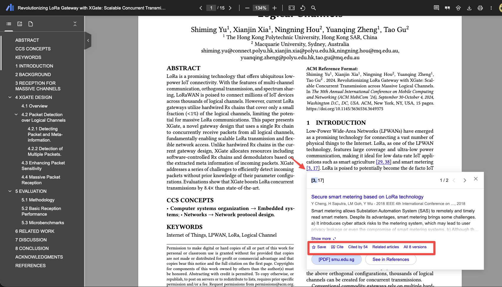
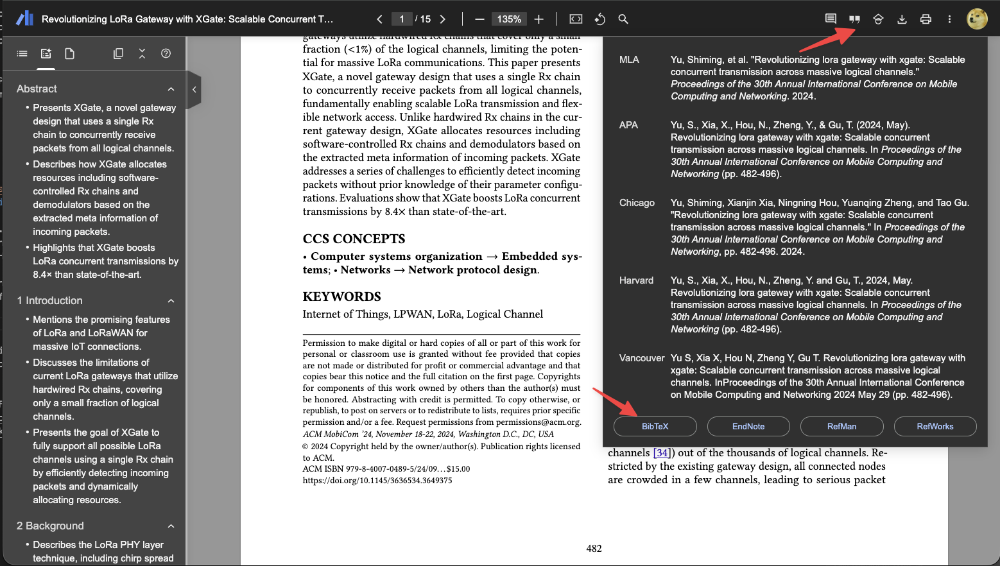

# Google Scholar PDF Reader

Google Scholar PDF Reader is a browser extension that allows you to easily access and read PDF files from Google Scholar. With this extension, you can quickly open PDF files in your browser without having to download them first.

When you install Scholar Reader, PDFs on all sites will have a new look in Chrome. To make this happen, Chrome will ask for permissions to read and change data on all sites. Scholar Reader makes no changes other than the presentation of PDFs.

* Preview references as you read. Click the in-text citation to see a summary and find the PDF.

<figure><figcaption></figcaption></figure>

* Read faster with the AI outline. Get a quick overview and click on interesting bullets to jump within the paper.
* Highlight and comment on PDFs. Highlights are saved to your Scholar library.
* Make it right for your eyes with light, dark, and night modes.
* Copy and paste common citation formats without leaving the paper.

<figure><figcaption></figcaption></figure>

* Save articles to your Scholar Library to read or cite later.
* Click in-text figure mentions to see the figure and the back button to keep reading.

You can install Google Scholar PDF Reader from:
