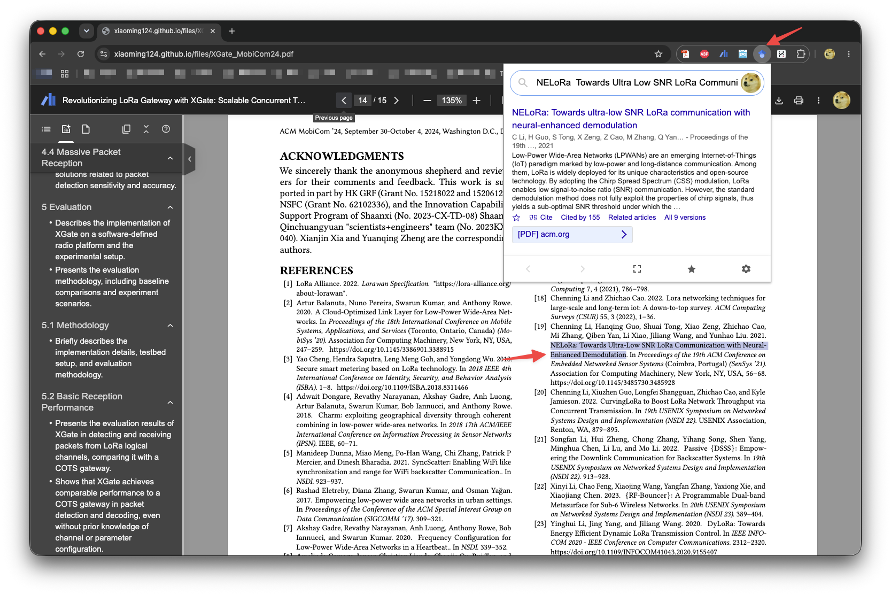

# Google Scholar Buttion

Google Scholar Button is a browser extension that allows you to easily access Google Scholar from your web browser. With this extension, you can quickly search for scholarly articles, access full-text PDFs, and save articles to your library.

This extension adds a browser button for easy access to Google Scholar from any web page. Click the Scholar button to:

- Find full text on the web or in your university library. Select the title of the paper on the page you're reading, and click the Scholar button to find it.

<figure><figcaption></figcaption></figure>

- Transfer your query from web search to Scholar. Press the Scholar button to see top three results; click "full screen" at the bottom of the popup to see them all.

- Format references in widely used citation styles. Press the quote button below the result to see a formatted reference and copy it into the paper you're writing.

- Save the article to your Scholar library, so you can read it or cite it later.  Press the blue star below the result to save it, or the gray star at the bottom to see all saved articles.

You can install Google Scholar Button from:
