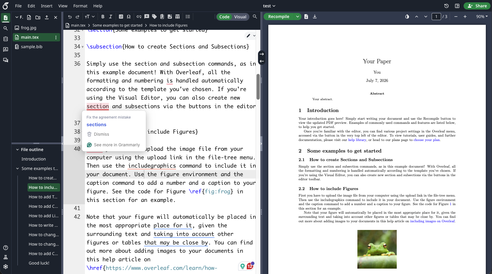

# Grammarly Browser Extension

Grammarly is a browser extension that helps you write clear, mistake-free content across the web. It checks your writing for grammar, spelling, punctuation, and style errors in real-time, providing suggestions to improve your writing.

For example, when you write a paper on Overleaf, Grammarly will automatically check your writing and highlight any errors or suggestions for improvement. You can click on the highlighted text to see the suggested corrections and explanations.

<figure><figcaption></figcaption></figure>


You can use PolyU email to register a Grammarly Pro account for free.


You can install the Grammarly browser extension from:
