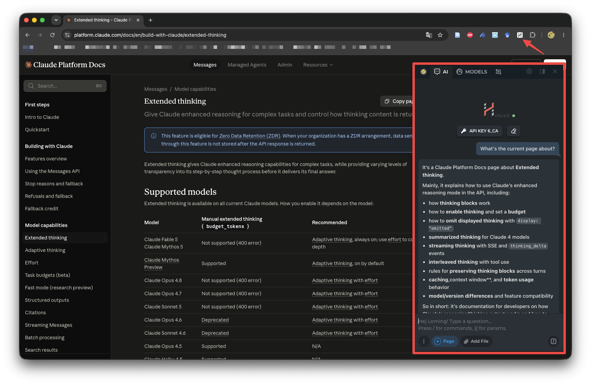

# HARPA AI

HARPA AI is a browser extension that allows you to chat with any website using LLMs. With this extension, you can easily access the power of LLMs while browsing the web.

<figure><figcaption></figcaption></figure>

It also supports adding your own API key for OpenAI, Anthropic, and Google PaLM. You can also use the built-in free API key provided by HARPA AI.

🌟  CALL HARPA WITH [Alt+A]

* 🎬  Summarize hours long YouTube videos into easy-to-read actionable summaries
* 🧠  Assist your research, work, study or language learning with deep web search features
* 📎  Extract data from images, summarize files and PDFs
* 💌  Write and polish Emails in your tone of voice
* 👍  Help with Social Media Marketing on X/Twitter, Instagram, Reddit, Medium and Facebook, writing post captions, hashtags, direct message replies
* ✍️  Spellcheck and translate text information
•  🚀  Run over 100+ predefined page-aware commands to save time
•  💰  Saves you money by monitoring prices so you could buy when they are low

You can install Google Scholar PDF Reader from:
