# Clash Verge

[Clash Verge](https://www.clashverge.dev/) is a fork of the Clash project that focuses on enhancing the user experience and adding new features to the original Clash proxy tool. It aims to provide a more intuitive interface and improved performance for users who require advanced proxy functionalities.

## 1. Download & Installation

- Visit the [installation page](https://www.clashverge.dev/install.html) to download the latest version of Clash Verge for your operating system (Windows, macOS, Linux).
- Follow the installation instructions provided on the website to set up Clash Verge on your device.

## 2. Import Configuration

- Open Clash Verge after installation.
- Click on the "Profiles" tab in the sidebar.
- Paste the URL I provided into the "Import from URL" field and click "Import".
<figure>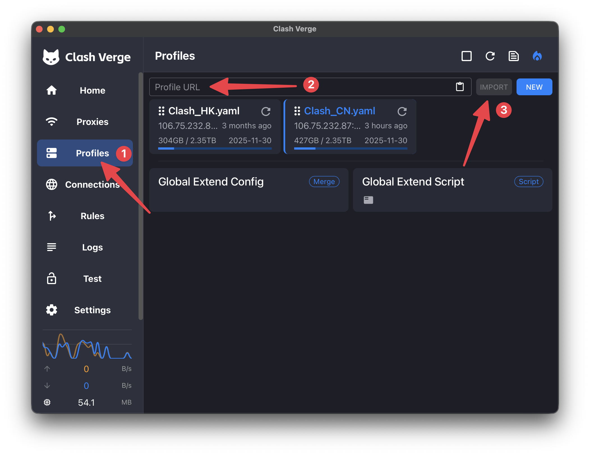<figcaption></figcaption></figure>

## 3. Select Preferred Nodes

- Click on the "Proxies" tab to view the list of available proxy nodes.
- Browse through the list and select your preferred nodes by clicking on them based on different rules.
<figure>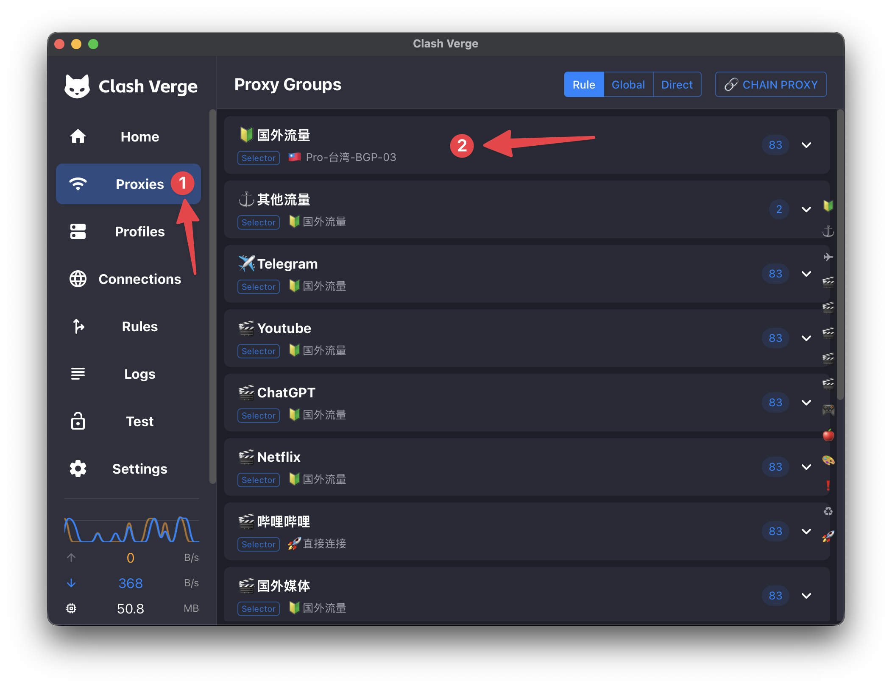<figcaption></figcaption></figure>
<figure>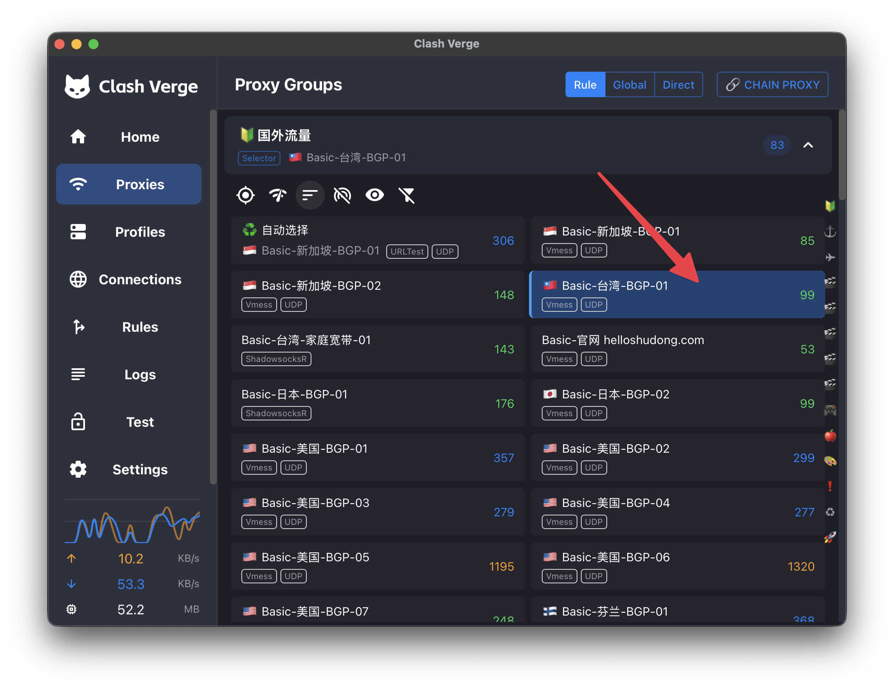<figcaption></figcaption></figure>

## 4. Start System Proxy

- Click on the "Home" tab.
- Select a proxy mode on the right panel
  - Rule Mode: Routes traffic based on predefined rules.
  - Global Mode: Routes all traffic through the selected proxy.
  - Direct Mode: Direct use your own network.
- Toggle the "System Proxy" switch to enable system-wide proxying.
<figure>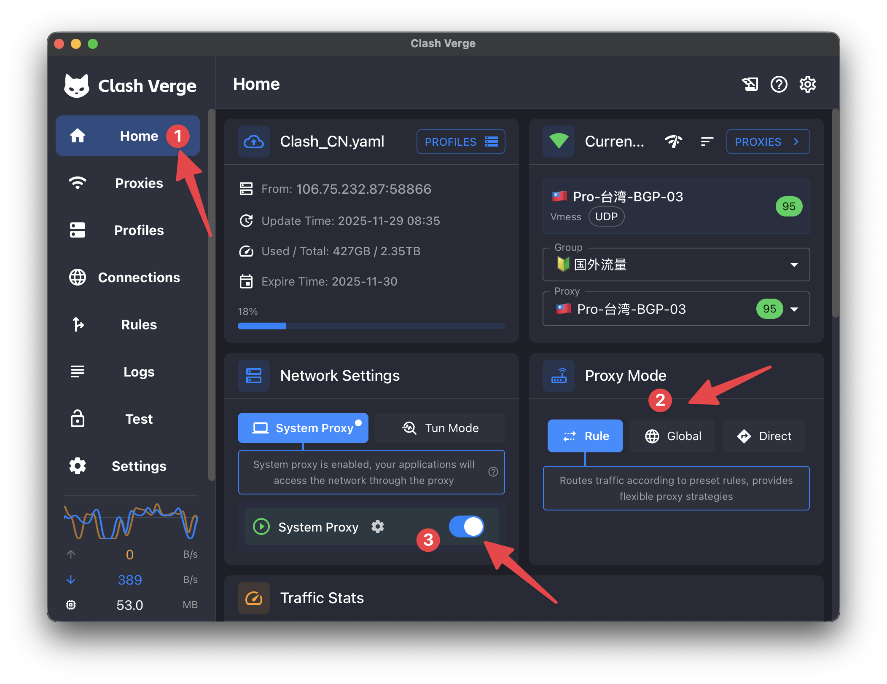<figcaption></figcaption></figure>

## 5. Additional Settings (Strongly Recommended)

- **Motivation**: In Hong Kong, we only need proxies for specific services (e.g., OpenAI, Claude). Therefore, I recommend configuring Clash Verge to only route traffic for these services through the proxy, while allowing other traffic to use your own network (our university's network provides 1000 MB bandwidth!!!). This approach optimizes performance and reduces unnecessary load on the proxy servers. Also, the traffic flow consumption (2400 GB per year) can be saved.
- How to customize your configurations:
  - Click on the "Profiles" tab.
  - Right click on the previously imported profile and select "Edit Info"
  - Input "Clash_CN.yaml" in the "Name" field to rename the previously imported profile.
  <figure>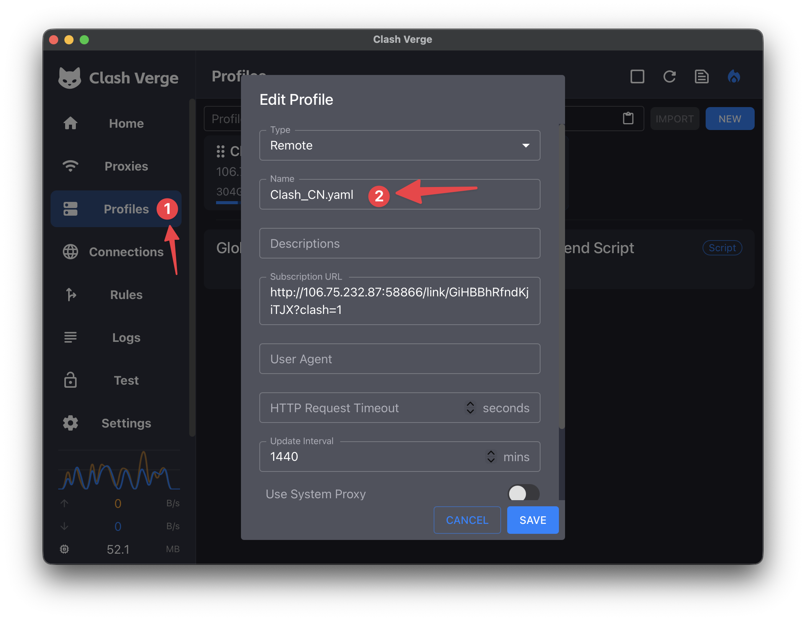<figcaption></figcaption></figure>

  - Then, re-import the same configuration URL again and rename it to "Clash_HK.yaml".
  - Next, right click on "Clash_HK.yaml" and select "Edit File".
  - Scroll down and find the `proxy-groups` section.
  <figure>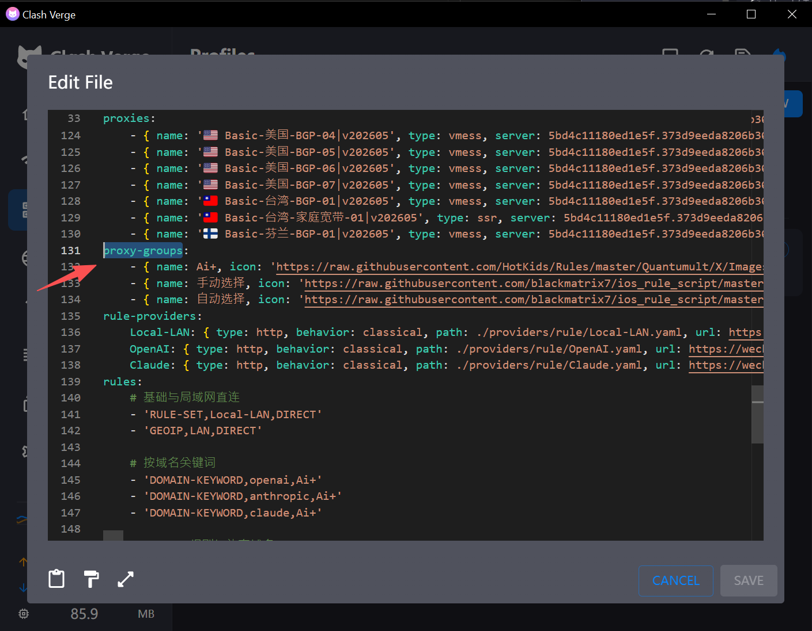<figcaption></figcaption></figure>

  - Replace all the following part with the following content (last update: Sept 1, 2026):

  ```
  proxy-groups:
    - { name: Ai+, icon: 'https://raw.githubusercontent.com/HotKids/Rules/master/Quantumult/X/Images/Color/ChatGPT.png', type: select, proxies: [手动选择, 自动选择, '🇺🇳 官网 helloshudong.com|v202605', '🇩🇪 德国-BGP-01【优化】', '🇩🇪 德国-BGP-02【优化】', '🇺🇸 美国-BGP-05【优化】', '🇺🇸 美国-BGP-06【优化】', '🇺🇸 美国-BGP-07【优化】', '🇺🇸 美国-BGP-08【优化】', '🇺🇸 美国-BGP-09【优化】', '🇺🇸 美国-BGP-03【优化】', '🇺🇸 美国-BGP-04【优化】', '🇺🇸 美国-BGP-01【优化】', '🇺🇸 美国-BGP-02【优化】', '🇭🇰 Pro-香港-BGP-04|v202605', '🇭🇰 Pro-香港-BGP-05|v202605', '🇭🇰 Pro-香港-BGP-06|v202605', '🇭🇰 Pro-香港-BGP-07|v202605', '🇭🇰 Pro-香港-BGP-08|v202605', '🇭🇰 Pro-香港-BGP-09|v202605', '🇭🇰 Pro-香港-BGP-10|v202605', '🇭🇰 Pro-香港-BGP-11|v202605', '🇭🇰 Pro-香港-BGP-SSR-01|v202605', '🇭🇰 Pro-香港-BGP-SSR-02|v202605', '🇭🇰 Pro-香港-BGP-SSR-03|v202605', '🇭🇰 Pro-香港-家庭宽带-01|v202605', '🇭🇰 Pro-香港-家庭宽带-02|v202605', '🇭🇰 Pro-香港-家庭宽带-04|v202605', '🇯🇵 Pro-日本-BGP-01|v202605', '🇯🇵 Pro-日本-BGP-02|v202605', '🇯🇵 Pro-日本-BGP-03|v202605', '🇯🇵 Pro-日本-BGP-04|v202605', '🇯🇵 Pro-日本-BGP-05|v202605', '🇯🇵 Pro-日本-BGP-06|v202605', '🇸🇬 Pro-新加坡-BGP-01|v202605', '🇸🇬 Pro-新加坡-BGP-02|v202605', '🇸🇬 Pro-新加坡-BGP-03|v202605', '🇸🇬 Pro-新加坡-BGP-04|v202605', '🇺🇸 Pro-美国-BGP-01|v202605', '🇺🇸 Pro-美国-BGP-02|v202605', '🇺🇸 Pro-美国-BGP-03|v202605', '🇺🇸 Pro-美国-BGP-04|v202605', '🇺🇸 Pro-美国-BGP-05|v202605', '🇺🇸 Pro-美国-家宽-01(5倍率）|v202605', '🇹🇼 Pro-台湾-BGP-01|v202605', '🇹🇼 Pro-台湾-BGP-02|v202605', '🇹🇼 Pro-台湾-BGP-03|v202605', '🇹🇼 Pro-台湾-家庭宽带-01|v202605', '🇰🇷 Pro-韩国-01|v202605', '🇰🇷 Pro-韩国-02|v202605', '🇰🇷 Pro-韩国-03|v202605', '🇲🇾 马来西亚-Pro-01|v202605', '🇲🇾 马来西亚-Pro-02|v202605', '🇹🇭 泰国-Pro-01|v202605', '🇻🇳 越南-Pro-01|v202605', '🇮🇳 印度-Pro-01|v202605', '🇵🇰 巴基斯坦-Pro-01|v202605', '🇦🇪 迪拜-Pro-01|v202605', '🇹🇷 土耳其-Pro-01|v202605', '🇬🇧 英国-Pro-01|v202605', '🇩🇪 德国-Pro-01|v202605', '🇫🇷 法国-Pro-01|v202605', '🇮🇹 意大利-Pro-01|v202605', '🇨🇭 瑞士-Pro-01|v202605', '🇨🇦 加拿大-Pro-01|v202605', '🇧🇷 巴西-Pro-01|v202605', '🇦🇺 澳大利亚-Pro-01|v202605', '🇭🇰 Basic-香港-BGP-01|v202605', '🇭🇰 Basic-香港-BGP-02|v202605', '🇭🇰 Basic-香港-BGP-03|v202605', '🇭🇰 Basic-香港-BGP-04|v202605', '🇭🇰 Basic-香港-BGP-05|v202605', '🇭🇰 Basic-香港-BGP-06|v202605', '🇭🇰 Basic-香港-BGP-07|v202605', '🇭🇰 Basic-香港-BGP-08|v202605', '🇭🇰 Basic-香港-BGP-09|v202605', '🇭🇰 Basic-香港-BGP-SSR-01|v202605', '🇭🇰 Basic-香港-BGP-SSR-02|v202605', '🇭🇰 Basic-香港-BGP-SSR-03|v202605', '🇭🇰 Basic-香港-家庭宽带-01|v202605', '🇭🇰 Basic-香港-家庭宽带-02|v202605', '🇭🇰 Basic-香港-家庭宽带-03|v202605', '🇯🇵 Basic-日本-BGP-01|v202605', '🇯🇵 Basic-日本-BGP-02|v202605', '🇸🇬 Basic-新加坡-BGP-01|v202605', '🇸🇬 Basic-新加坡-BGP-02|v202605', '🇺🇸 Basic-美国-BGP-01|v202605', '🇺🇸 Basic-美国-BGP-02|v202605', '🇺🇸 Basic-美国-BGP-03|v202605', '🇺🇸 Basic-美国-BGP-04|v202605', '🇺🇸 Basic-美国-BGP-05|v202605', '🇺🇸 Basic-美国-BGP-06|v202605', '🇺🇸 Basic-美国-BGP-07|v202605', '🇹🇼 Basic-台湾-BGP-01|v202605', '🇹🇼 Basic-台湾-家庭宽带-01|v202605', '🇫🇮 Basic-芬兰-BGP-01|v202605'] }
    - { name: 手动选择, icon: 'https://raw.githubusercontent.com/blackmatrix7/ios_rule_script/master/icon/qure/color/Proxy.png', type: select, proxies: [自动选择, '🇺🇳 官网 helloshudong.com|v202605', '🇩🇪 德国-BGP-01【优化】', '🇩🇪 德国-BGP-02【优化】', '🇺🇸 美国-BGP-05【优化】', '🇺🇸 美国-BGP-06【优化】', '🇺🇸 美国-BGP-07【优化】', '🇺🇸 美国-BGP-08【优化】', '🇺🇸 美国-BGP-09【优化】', '🇺🇸 美国-BGP-03【优化】', '🇺🇸 美国-BGP-04【优化】', '🇺🇸 美国-BGP-01【优化】', '🇺🇸 美国-BGP-02【优化】', '🇭🇰 Pro-香港-BGP-04|v202605', '🇭🇰 Pro-香港-BGP-05|v202605', '🇭🇰 Pro-香港-BGP-06|v202605', '🇭🇰 Pro-香港-BGP-07|v202605', '🇭🇰 Pro-香港-BGP-08|v202605', '🇭🇰 Pro-香港-BGP-09|v202605', '🇭🇰 Pro-香港-BGP-10|v202605', '🇭🇰 Pro-香港-BGP-11|v202605', '🇭🇰 Pro-香港-BGP-SSR-01|v202605', '🇭🇰 Pro-香港-BGP-SSR-02|v202605', '🇭🇰 Pro-香港-BGP-SSR-03|v202605', '🇭🇰 Pro-香港-家庭宽带-01|v202605', '🇭🇰 Pro-香港-家庭宽带-02|v202605', '🇭🇰 Pro-香港-家庭宽带-04|v202605', '🇯🇵 Pro-日本-BGP-01|v202605', '🇯🇵 Pro-日本-BGP-02|v202605', '🇯🇵 Pro-日本-BGP-03|v202605', '🇯🇵 Pro-日本-BGP-04|v202605', '🇯🇵 Pro-日本-BGP-05|v202605', '🇯🇵 Pro-日本-BGP-06|v202605', '🇸🇬 Pro-新加坡-BGP-01|v202605', '🇸🇬 Pro-新加坡-BGP-02|v202605', '🇸🇬 Pro-新加坡-BGP-03|v202605', '🇸🇬 Pro-新加坡-BGP-04|v202605', '🇺🇸 Pro-美国-BGP-01|v202605', '🇺🇸 Pro-美国-BGP-02|v202605', '🇺🇸 Pro-美国-BGP-03|v202605', '🇺🇸 Pro-美国-BGP-04|v202605', '🇺🇸 Pro-美国-BGP-05|v202605', '🇺🇸 Pro-美国-家宽-01(5倍率）|v202605', '🇹🇼 Pro-台湾-BGP-01|v202605', '🇹🇼 Pro-台湾-BGP-02|v202605', '🇹🇼 Pro-台湾-BGP-03|v202605', '🇹🇼 Pro-台湾-家庭宽带-01|v202605', '🇰🇷 Pro-韩国-01|v202605', '🇰🇷 Pro-韩国-02|v202605', '🇰🇷 Pro-韩国-03|v202605', '🇲🇾 马来西亚-Pro-01|v202605', '🇲🇾 马来西亚-Pro-02|v202605', '🇹🇭 泰国-Pro-01|v202605', '🇻🇳 越南-Pro-01|v202605', '🇮🇳 印度-Pro-01|v202605', '🇵🇰 巴基斯坦-Pro-01|v202605', '🇦🇪 迪拜-Pro-01|v202605', '🇹🇷 土耳其-Pro-01|v202605', '🇬🇧 英国-Pro-01|v202605', '🇩🇪 德国-Pro-01|v202605', '🇫🇷 法国-Pro-01|v202605', '🇮🇹 意大利-Pro-01|v202605', '🇨🇭 瑞士-Pro-01|v202605', '🇨🇦 加拿大-Pro-01|v202605', '🇧🇷 巴西-Pro-01|v202605', '🇦🇺 澳大利亚-Pro-01|v202605', '🇭🇰 Basic-香港-BGP-01|v202605', '🇭🇰 Basic-香港-BGP-02|v202605', '🇭🇰 Basic-香港-BGP-03|v202605', '🇭🇰 Basic-香港-BGP-04|v202605', '🇭🇰 Basic-香港-BGP-05|v202605', '🇭🇰 Basic-香港-BGP-06|v202605', '🇭🇰 Basic-香港-BGP-07|v202605', '🇭🇰 Basic-香港-BGP-08|v202605', '🇭🇰 Basic-香港-BGP-09|v202605', '🇭🇰 Basic-香港-BGP-SSR-01|v202605', '🇭🇰 Basic-香港-BGP-SSR-02|v202605', '🇭🇰 Basic-香港-BGP-SSR-03|v202605', '🇭🇰 Basic-香港-家庭宽带-01|v202605', '🇭🇰 Basic-香港-家庭宽带-02|v202605', '🇭🇰 Basic-香港-家庭宽带-03|v202605', '🇯🇵 Basic-日本-BGP-01|v202605', '🇯🇵 Basic-日本-BGP-02|v202605', '🇸🇬 Basic-新加坡-BGP-01|v202605', '🇸🇬 Basic-新加坡-BGP-02|v202605', '🇺🇸 Basic-美国-BGP-01|v202605', '🇺🇸 Basic-美国-BGP-02|v202605', '🇺🇸 Basic-美国-BGP-03|v202605', '🇺🇸 Basic-美国-BGP-04|v202605', '🇺🇸 Basic-美国-BGP-05|v202605', '🇺🇸 Basic-美国-BGP-06|v202605', '🇺🇸 Basic-美国-BGP-07|v202605', '🇹🇼 Basic-台湾-BGP-01|v202605', '🇹🇼 Basic-台湾-家庭宽带-01|v202605', '🇫🇮 Basic-芬兰-BGP-01|v202605'] }
    - { name: 自动选择, icon: 'https://raw.githubusercontent.com/blackmatrix7/ios_rule_script/master/icon/qure/color/Auto.png', type: url-test, proxies: ['🇺🇳 官网 helloshudong.com|v202605', '🇩🇪 德国-BGP-01【优化】', '🇩🇪 德国-BGP-02【优化】', '🇺🇸 美国-BGP-05【优化】', '🇺🇸 美国-BGP-06【优化】', '🇺🇸 美国-BGP-07【优化】', '🇺🇸 美国-BGP-08【优化】', '🇺🇸 美国-BGP-09【优化】', '🇺🇸 美国-BGP-03【优化】', '🇺🇸 美国-BGP-04【优化】', '🇺🇸 美国-BGP-01【优化】', '🇺🇸 美国-BGP-02【优化】', '🇭🇰 Pro-香港-BGP-04|v202605', '🇭🇰 Pro-香港-BGP-05|v202605', '🇭🇰 Pro-香港-BGP-06|v202605', '🇭🇰 Pro-香港-BGP-07|v202605', '🇭🇰 Pro-香港-BGP-08|v202605', '🇭🇰 Pro-香港-BGP-09|v202605', '🇭🇰 Pro-香港-BGP-10|v202605', '🇭🇰 Pro-香港-BGP-11|v202605', '🇭🇰 Pro-香港-BGP-SSR-01|v202605', '🇭🇰 Pro-香港-BGP-SSR-02|v202605', '🇭🇰 Pro-香港-BGP-SSR-03|v202605', '🇭🇰 Pro-香港-家庭宽带-01|v202605', '🇭🇰 Pro-香港-家庭宽带-02|v202605', '🇭🇰 Pro-香港-家庭宽带-04|v202605', '🇯🇵 Pro-日本-BGP-01|v202605', '🇯🇵 Pro-日本-BGP-02|v202605', '🇯🇵 Pro-日本-BGP-03|v202605', '🇯🇵 Pro-日本-BGP-04|v202605', '🇯🇵 Pro-日本-BGP-05|v202605', '🇯🇵 Pro-日本-BGP-06|v202605', '🇸🇬 Pro-新加坡-BGP-01|v202605', '🇸🇬 Pro-新加坡-BGP-02|v202605', '🇸🇬 Pro-新加坡-BGP-03|v202605', '🇸🇬 Pro-新加坡-BGP-04|v202605', '🇺🇸 Pro-美国-BGP-01|v202605', '🇺🇸 Pro-美国-BGP-02|v202605', '🇺🇸 Pro-美国-BGP-03|v202605', '🇺🇸 Pro-美国-BGP-04|v202605', '🇺🇸 Pro-美国-BGP-05|v202605', '🇺🇸 Pro-美国-家宽-01(5倍率）|v202605', '🇹🇼 Pro-台湾-BGP-01|v202605', '🇹🇼 Pro-台湾-BGP-02|v202605', '🇹🇼 Pro-台湾-BGP-03|v202605', '🇹🇼 Pro-台湾-家庭宽带-01|v202605', '🇰🇷 Pro-韩国-01|v202605', '🇰🇷 Pro-韩国-02|v202605', '🇰🇷 Pro-韩国-03|v202605', '🇲🇾 马来西亚-Pro-01|v202605', '🇲🇾 马来西亚-Pro-02|v202605', '🇹🇭 泰国-Pro-01|v202605', '🇻🇳 越南-Pro-01|v202605', '🇮🇳 印度-Pro-01|v202605', '🇵🇰 巴基斯坦-Pro-01|v202605', '🇦🇪 迪拜-Pro-01|v202605', '🇹🇷 土耳其-Pro-01|v202605', '🇬🇧 英国-Pro-01|v202605', '🇩🇪 德国-Pro-01|v202605', '🇫🇷 法国-Pro-01|v202605', '🇮🇹 意大利-Pro-01|v202605', '🇨🇭 瑞士-Pro-01|v202605', '🇨🇦 加拿大-Pro-01|v202605', '🇧🇷 巴西-Pro-01|v202605', '🇦🇺 澳大利亚-Pro-01|v202605', '🇭🇰 Basic-香港-BGP-01|v202605', '🇭🇰 Basic-香港-BGP-02|v202605', '🇭🇰 Basic-香港-BGP-03|v202605', '🇭🇰 Basic-香港-BGP-04|v202605', '🇭🇰 Basic-香港-BGP-05|v202605', '🇭🇰 Basic-香港-BGP-06|v202605', '🇭🇰 Basic-香港-BGP-07|v202605', '🇭🇰 Basic-香港-BGP-08|v202605', '🇭🇰 Basic-香港-BGP-09|v202605', '🇭🇰 Basic-香港-BGP-SSR-01|v202605', '🇭🇰 Basic-香港-BGP-SSR-02|v202605', '🇭🇰 Basic-香港-BGP-SSR-03|v202605', '🇭🇰 Basic-香港-家庭宽带-01|v202605', '🇭🇰 Basic-香港-家庭宽带-02|v202605', '🇭🇰 Basic-香港-家庭宽带-03|v202605', '🇯🇵 Basic-日本-BGP-01|v202605', '🇯🇵 Basic-日本-BGP-02|v202605', '🇸🇬 Basic-新加坡-BGP-01|v202605', '🇸🇬 Basic-新加坡-BGP-02|v202605', '🇺🇸 Basic-美国-BGP-01|v202605', '🇺🇸 Basic-美国-BGP-02|v202605', '🇺🇸 Basic-美国-BGP-03|v202605', '🇺🇸 Basic-美国-BGP-04|v202605', '🇺🇸 Basic-美国-BGP-05|v202605', '🇺🇸 Basic-美国-BGP-06|v202605', '🇺🇸 Basic-美国-BGP-07|v202605', '🇹🇼 Basic-台湾-BGP-01|v202605', '🇹🇼 Basic-台湾-家庭宽带-01|v202605', '🇫🇮 Basic-芬兰-BGP-01|v202605'], tolerance: 20, lazy: true, url: 'http://www.gstatic.com/generate_204', interval: 300 }
  rule-providers:
    Local-LAN: { type: http, behavior: classical, path: ./providers/rule/Local-LAN.yaml, url: https://wechat.frank-extend-jacques-oss.best/LM-Firefly/Rules/master/Clash-RuleSet-Classical/Special/Local-LAN.yaml, interval: 21600 }
    OpenAI: { type: http, behavior: classical, path: ./providers/rule/OpenAI.yaml, url: https://wechat.frank-extend-jacques-oss.best/LM-Firefly/Rules/master/Clash-RuleSet-Classical/PROXY/OpenAI.yaml, interval: 21600 }
    Claude: { type: http, behavior: classical, path: ./providers/rule/Claude.yaml, url: https://wechat.frank-extend-jacques-oss.best/ACL4SSR/ACL4SSR/master/Clash/Providers/Ruleset/Claude.yaml, interval: 21600 }
  rules:
    # 基础与局域网直连
    - 'RULE-SET,Local-LAN,DIRECT'
    - 'GEOIP,LAN,DIRECT'

    # 按域名关键词
    - 'DOMAIN-KEYWORD,openai,Ai+'
    - 'DOMAIN-KEYWORD,anthropic,Ai+'
    - 'DOMAIN-KEYWORD,claude,Ai+'
    
    # OpenAI 规则与补充域名
    - 'RULE-SET,OpenAI,Ai+'
    - 'DOMAIN-SUFFIX,openai.com,Ai+'
    - 'DOMAIN-SUFFIX,chatgpt.com,Ai+'
    - 'DOMAIN-SUFFIX,oaistatic.com,Ai+'
    - 'DOMAIN-SUFFIX,oaiusercontent.com,Ai+'
    
    # Anthropic / Claude 规则与补充域名
    - 'RULE-SET,Claude,Ai+'
    - 'DOMAIN-SUFFIX,anthropic.com,Ai+'
    - 'DOMAIN-SUFFIX,claude.ai,Ai+'
    
    # 其他常用 AI 服务 (可按需保留)
    # - 'DOMAIN-SUFFIX,poe.com,Ai+'
    # - 'DOMAIN-SUFFIX,perplexity.ai,Ai+'
    # - 'DOMAIN-SUFFIX,jetbrains.ai,Ai+'
    
    # 其余所有网络流量全部直连 (DIRECT)
    - 'MATCH,DIRECT'
  ```

  - Then, right click on the "Clash_HK.yaml" profile and modify the "Update Interval" to a very very very large number. Otherwise, the rules will be overwritten during automatic updates.
  <figure>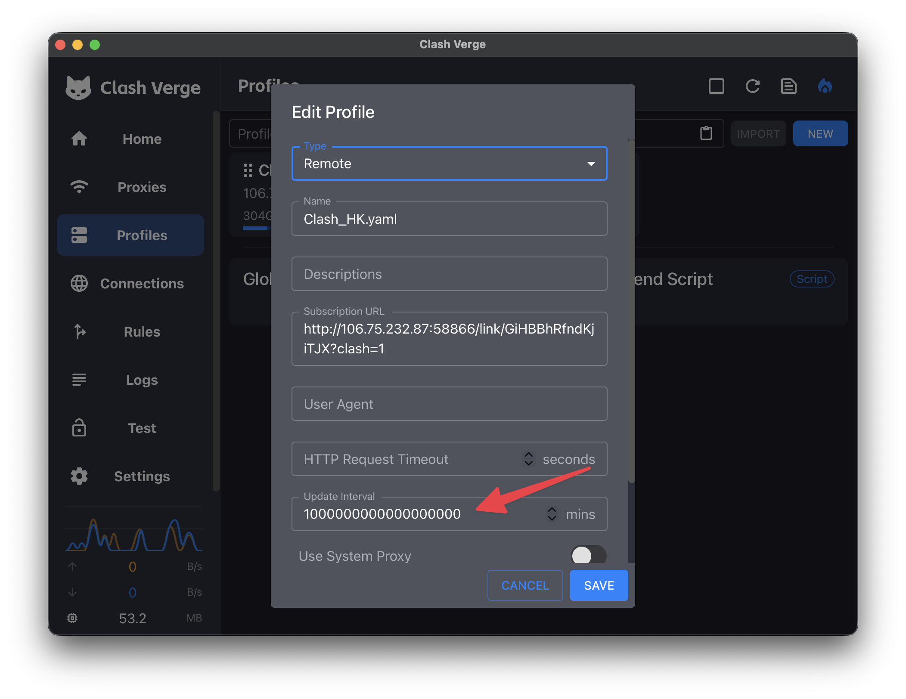<figcaption></figcaption></figure>

- As such, in Hong Kong, you can keep the proxy on the moment you start your PC. Only network traffics related to those domains listed in the rules will be routed through the proxy, while all other traffics will use your own network directly.
- You can freely adjust the node you like in the "🎬ai" section.
- In Hong Kong, you can choose the "Clash_HK.yaml" profile, while in China, you can switch to the "Clash_CN.yaml" profile to enjoy unrestricted internet access.
- Finally, change the system settings to make Clash Verge start automatically when your computer boots up:
<figure>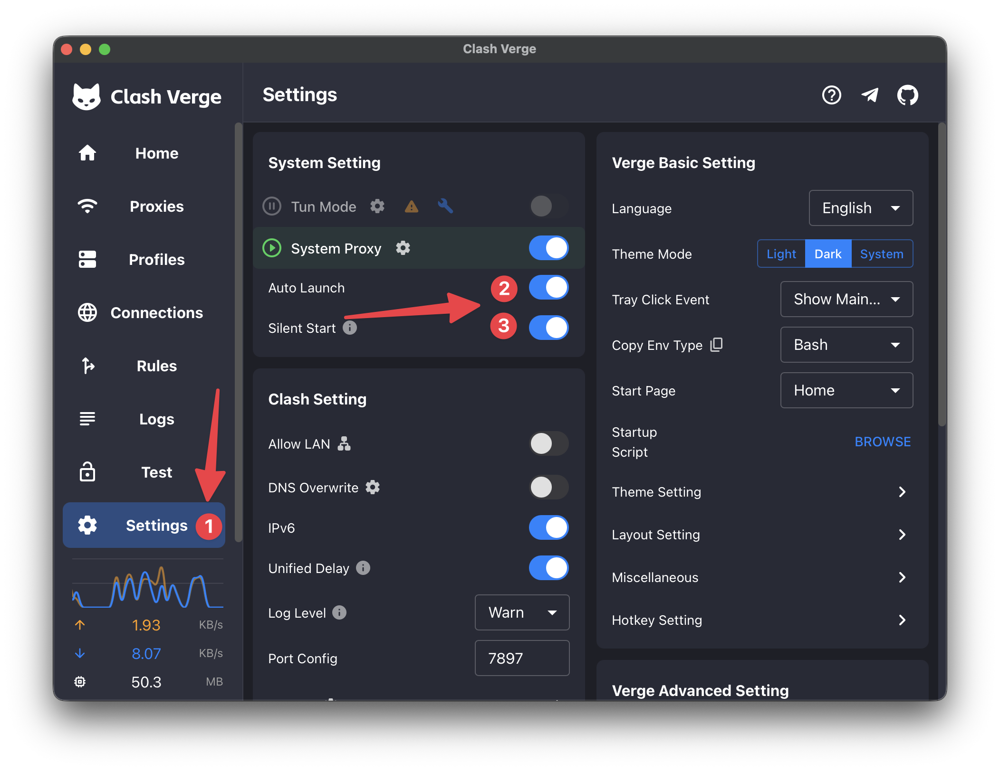<figcaption></figcaption></figure>

- For windows users, please exempt all UWP processes from the proxy. Click on "Settings", scroll down, and find "Open UWP tool". Select all and click "Exempt All" and "Save Changes".
<figure>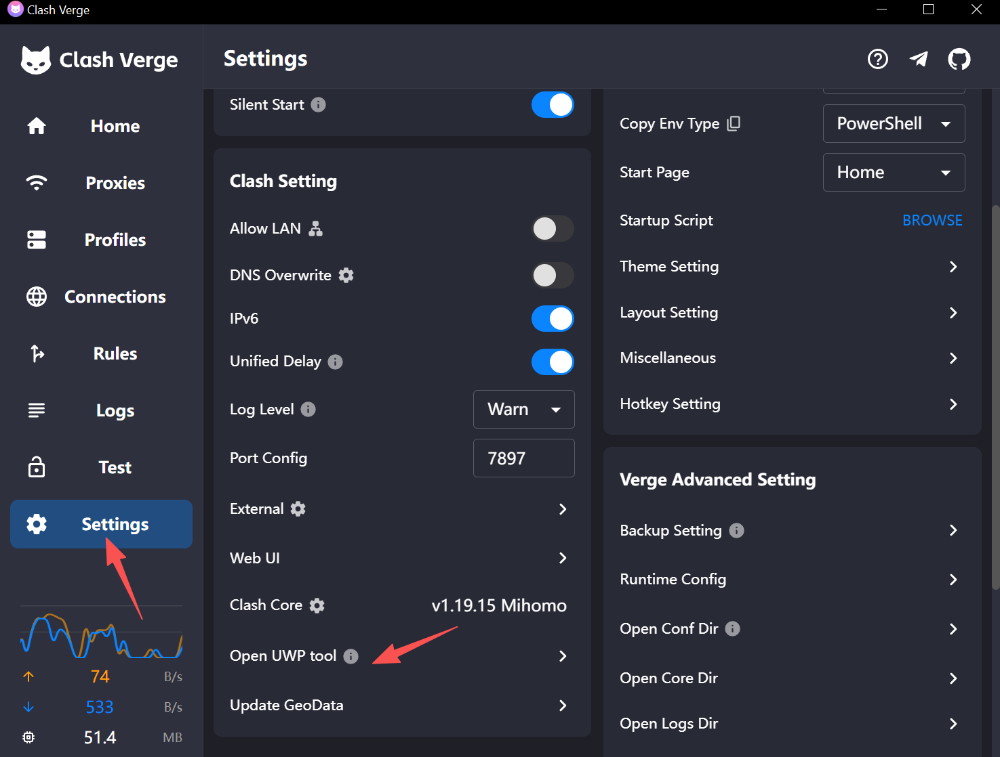<figcaption></figcaption></figure>
<figure>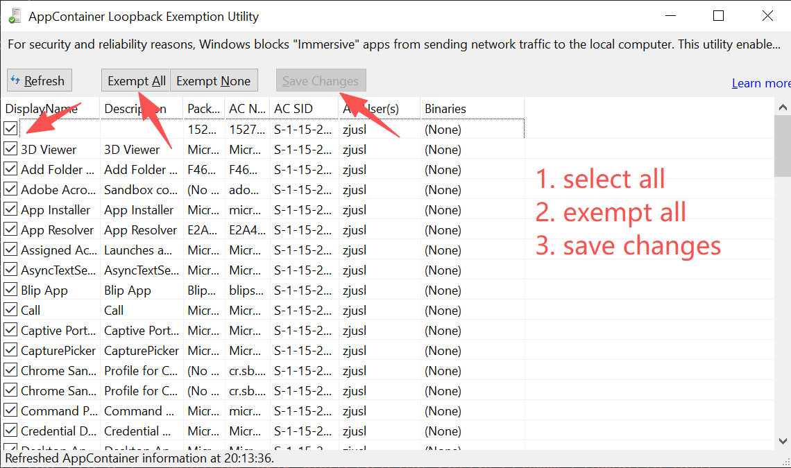<figcaption></figcaption></figure>



# Important

If you may use OpenAI or other AI tools in Windows Terminal, you MUST NOT exempt it. For example,

<figure>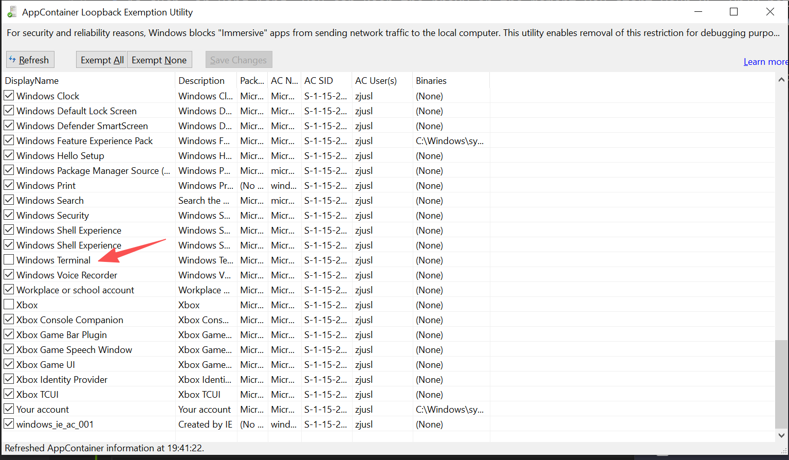<figcaption></figcaption></figure>


## 6. Setup on Mobile Devices

- For IOS devices, Shadowrocket is recommended. You can download Shadowrocket from the App Store (non-China region): [https://apps.apple.com/ca/app/shadowrocket/id932747118](https://apps.apple.com/ca/app/shadowrocket/id932747118)
- For Android devices, Clash for Android is recommended. You can download it from here: [https://en.clashforandroid.org/](https://en.clashforandroid.org/)
- Import configurations (Shadowrocket example):
  - Click "Config".
  - Click the "+" button at the top right corner.
  - Input the configuration URL I provided and click "Download".
  <figure>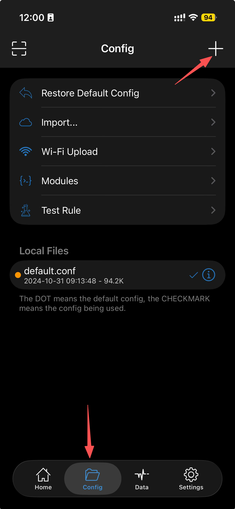<figcaption></figcaption></figure>

- Click "Home", select a node, and toggle the switch (on the top) to start the proxy.


**I strongly recommend using nodes whose names start with "Pro-".**

To visit Google Scholar, nodes whose names contain "家庭宽带" should be selected.

