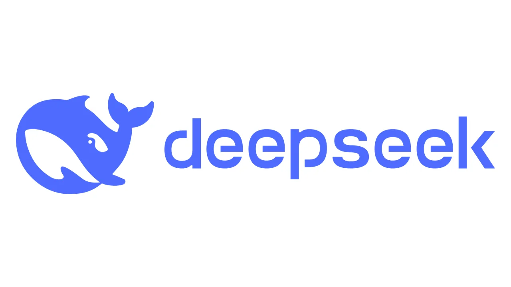

# LLMs

Large Language Models (LLMs) such as ChatGPT are powerful AI systems capable of generating natural language, answering questions, summarizing documents, drafting technical or academic materials, writing code, and more. This document provides a concise introduction on how to use ChatGPT effectively, covering core concepts, basic usage patterns, input prompting strategies, and best practices.

This collection of documentation will provide how to use LLMs (taking ChatGPT as an example), how to use OpenAI API, how to subscribe ChatGPT Plus Plan (three different methods), and some common use cases.


[us-region-apple-account.md](us-region-apple-account.md)



[us-region-google-play-account.md](us-region-google-play-account.md)



[apply-for-a-switzerland-card.md](apply-for-a-switzerland-card.md)



[chatgpt-basic-usage.md](chatgpt-basic-usage.md)



[upgrade-to-chatgpt-plus.md](upgrade-to-chatgpt-plus.md)


<figure><figcaption></figcaption></figure>
<figure><figcaption></figcaption></figure>
<figure><figcaption></figcaption></figure>
<figure><figcaption></figcaption></figure>