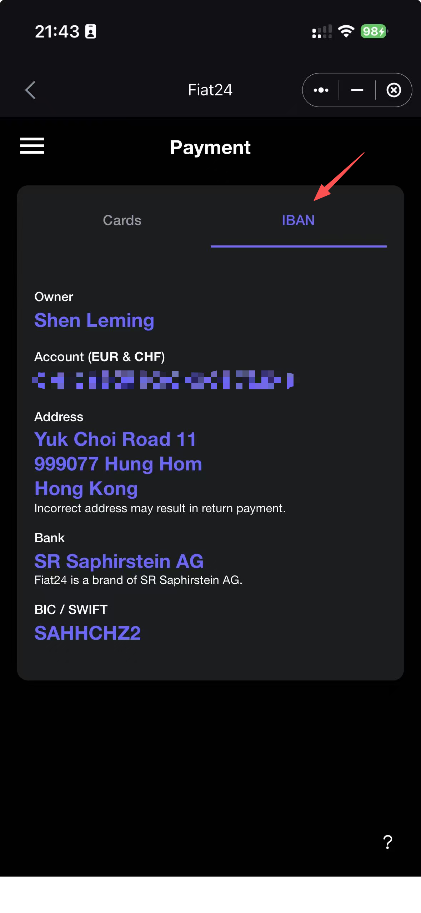
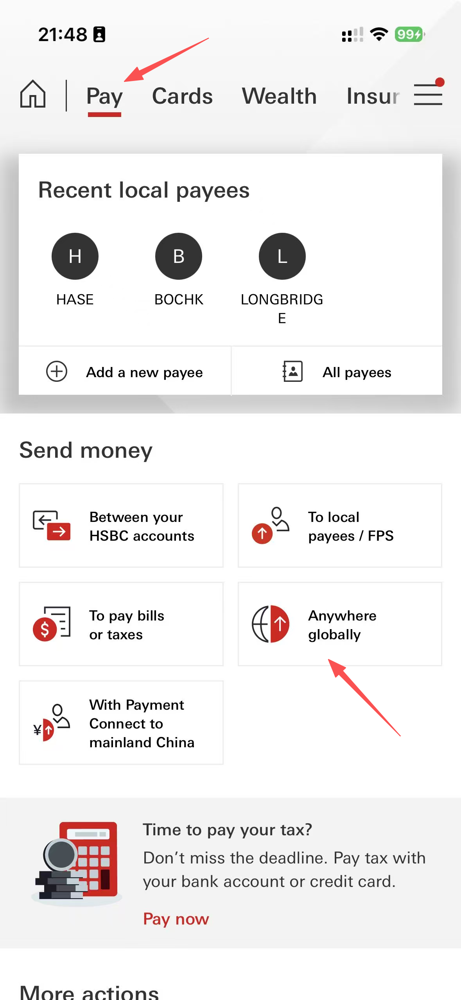
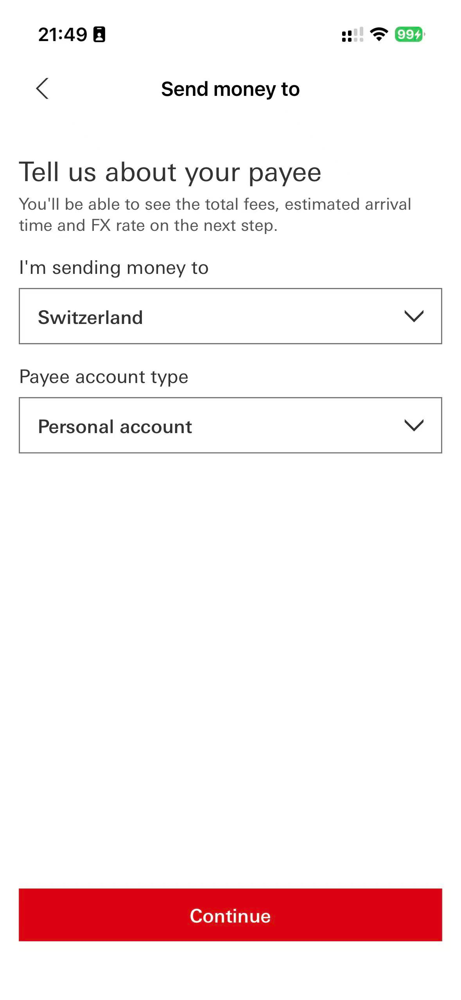
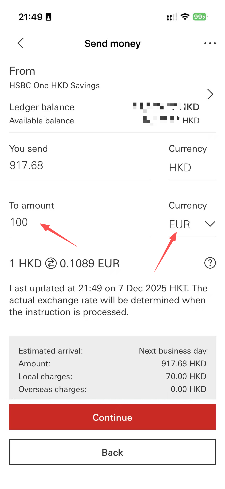
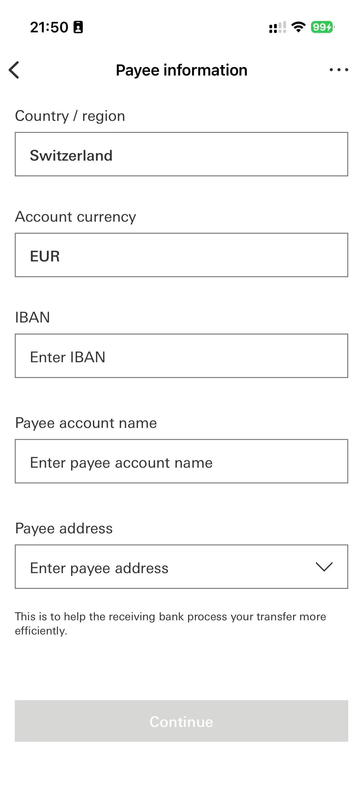

# Apply for a Switzerland Card

To enable unobstructed and fluent global payment, HK credit cards are not sufficient. Therefore, if you are interested, I strongly recommend you to open up an Switzerland Card online. [SafePal](https://safepal.com/zh-cn/bank) began as a non-custodial cryptocurrency wallet (software + hardware + wallet-app) that lets users securely store, send, and receive many kinds of cryptocurrencies and NFTs across multiple blockchains. Through a collaboration with a regulated bank (Fiat24), users can open a compliant bank account (with real account details / IBAN) directly from the SafePal App.

The Fiat24 bank is 100% safe and real. The address of the bank is:


To apply for a SafePal MasterCard, please strictly follow the link below:



### IMPORTANT
  
If you need cryptocurrency (*e.g.*, ETH, BTC, USDT), you can contact me. No need to create a new cryptocurrency account, it's too complex and time-consuming.


## Transfer Money to Your Card Using HSBC (Very Easy!)

After you get your card, you need to transfer money to the card. The following part provides detailed instructions:



### Step 1: Obtain Your SafePal Card Information

* Login your SafePal account on your phone.
* Click "Bank" on the top and click your card number.
  <figure><figcaption></figcaption></figure>

* Login your Fiat24 account.
* Click "IBAN" and your card information will be displayed.
  <figure><figcaption></figcaption></figure>




### Step 2: Transfer to Your SafePal Card in HSBC App

* Login your HSBC account in the App.
* Click "Pay" on the top and click "Anywhere globally".
  <figure><figcaption></figcaption></figure>

* Enter the country information (*i.e.*, Switzerland) and payee account type (*i.e.*, personal account).
  <figure><figcaption></figcaption></figure>

* Select "EUR" and enter the amount you want to transfer.
  <figure><figcaption></figcaption></figure>

* Fill in your SafePal card information and click "continue".
  <figure><figcaption></figcaption></figure>

* Congratulations! After around one business day, the money will be transferred to your SafePal account.


A handling fee of HK$70 will be charged for each transaction, regardless of the amount transferred. Therefore, you may enter a large amount to avoid frequent transfer.



