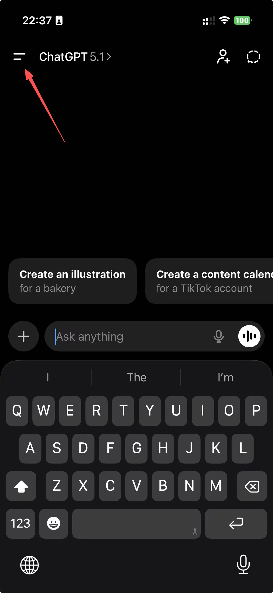

# Upgrade to ChatGPT Plus

Purchasing ChatGPT Plus provides access to more capable models, faster response speeds, and higher availability during peak time, improving productivity and reducing waiting time. For PhD students and researchers, these advantages translate into smoother literature reviews, more reliable drafting and rewriting assistance, and quicker iterations for code or experiment planning. Overall, ChatGPT Plus enhances the research workflow and helps maintain momentum during intensive writing and development tasks.

There are three distinct ways to upgrade to ChatGPT Plus (also works for Gemini and Claude).

## 1. Through ChatGPT Website

* Prerequisites
  * You **MUST** have a non-CN and non-HK Mastercard or VISA credit/debit card (virtual and physical cards are both acceptable).
  * I strongly recommend you guys to apply for the [SafePal](https://www.safepal.com/en/) card. You may follow the instructions in the link below for application:
  
  [apply-for-a-switzerland-card.md](apply-for-a-switzerland-card)
  
* Upgrade your plan
  * Visit ChatGPT website, click on your profile on the bottom left corner, and click "Upgrade plan".
  * Select your plan and input your SafePal card information.
  * Wait for transaction approval and all done! Enjoy ChatGPT Plus!

## 2. Through Apple App Store

* Prerequisites: You **MUST** have a US Apple account. To create a US Apple account, please refer to:

[us-region-apple-account.md](us-region-apple-account.md)


* Upgrade your plan
  * Sign in to the US Apple account in your mobile devices' App store.
  * Search and download "ChatGPT"
  * Start proxy using Shadowrocket.
  * Open "ChatGPT" and sign in your ChatGPT account.
  * Click the upper left icon, which will display your chat history and account profile.
  <figure><figcaption></figcaption></figure>
  
  * Click you profile and click "Upgrade to Plus"
  <figure><figcaption></figcaption></figure>

  * Pay with your Apple account's fund or SafePal card.
  * Congratulations! $19.99 will be automatically charged and you can enjoy ChatGPT Plus!

## 3. Through Google Play Store (non-Huawei device)

* Prerequisites: You **MUST** have a US Google Play Store account. To create a US Google Play Store account, please refer to:

[us-region-google-play-account.md](us-region-google-play-account.md)


* Upgrade your plan
  * Sign in to the US Google Play Store account in your mobile devices' Play Store.
  * Search and download "ChatGPT"
  * Start proxy using Clash for Android.
  * Open "ChatGPT" and sign in your ChatGPT account.
  * Click the upper left icon, which will display your chat history and account profile.
  * Click you profile and click "Upgrade to Plus"
  * Pay with your own credit card (no regional restrictions) bound in your Google Play Store account.
  * Congratulations! $19.99 will be automatically charged and you can enjoy ChatGPT Plus!