# US-Region Apple Account

This page provides step-by-step instructions on how to create a US-region Apple account. Make sure that you strictly following the instructions.



### Step 1: Buy a US Phone Number

* Visit [https://sms-activate.io/](https://sms-activate.io/) and register an account.
* Top up $10 using Alipay
<figure>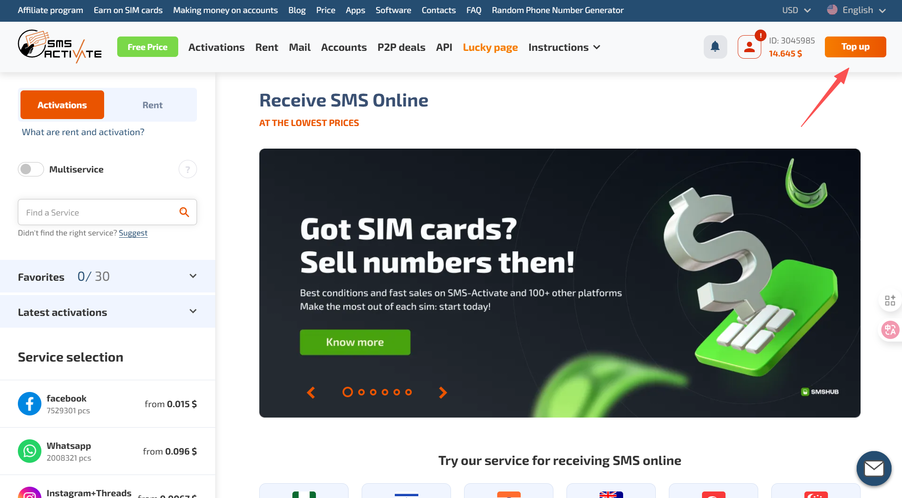<figcaption></figcaption></figure>

* Then select "Activations" on the left panel, enter "apple" in the search box, and click the searched result.
<figure>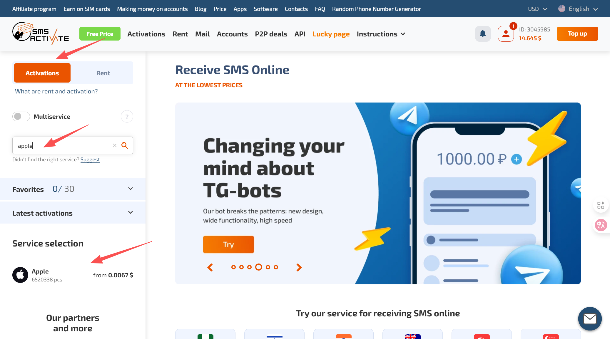<figcaption></figcaption></figure>

* Then, you will see a list of countries shown below. Find "USA" and click the "shopping card" icon to buy one.
<figure>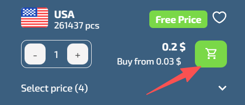<figcaption></figcaption></figure>

* Click "Buy" in the modal window.
<figure>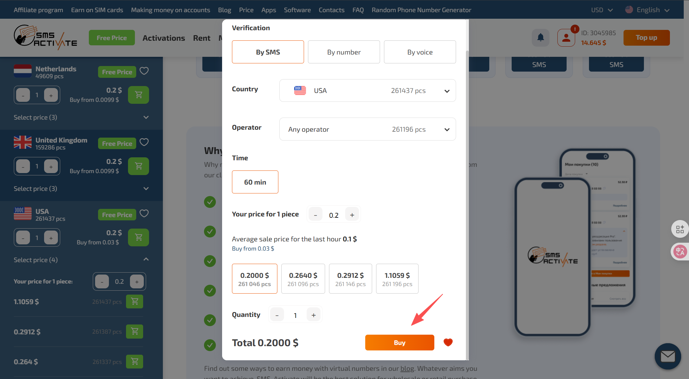<figcaption></figcaption></figure>

* Wait for a while and the page will be redirected to the phone number you bought. You can see your number (effective for 60 minutes).
<figure>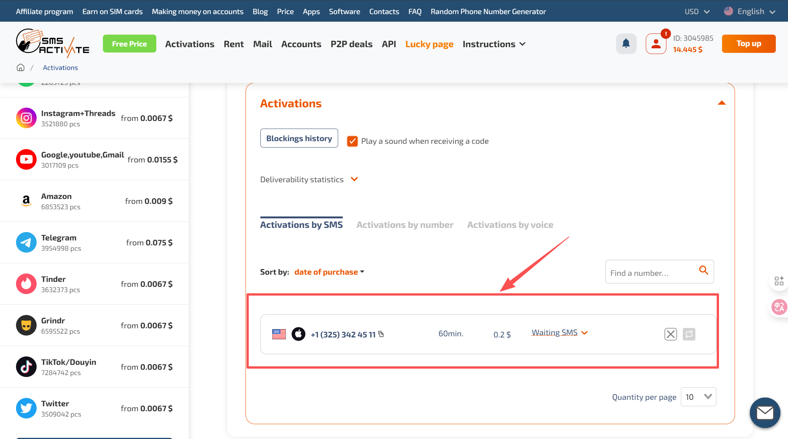<figcaption></figcaption></figure>


Keep the phone number page open.




### Step 2: Create a US Apple account

* Visit [https://account.apple.com/](https://account.apple.com/)
* Click "Create Your Apple Account" on the top right corner.
<figure>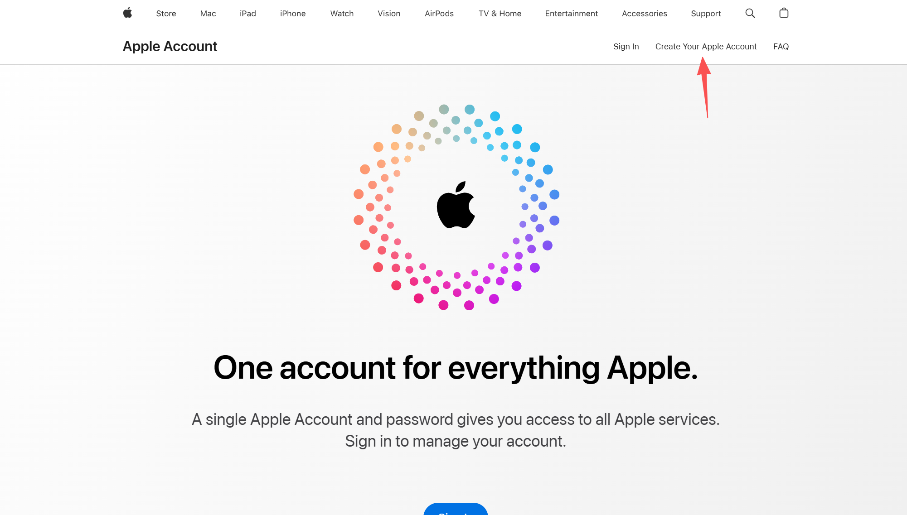<figcaption></figcaption></figure>

* Enter your personal information and make sure that the "Country/Region" section is "United States".
* Enter the phone number into to the Apple account registration page, wait for a couple of seconds, and you will see the one-time password (OTP) on the page. Copy it for phone number verification. After verification, congratulations, you have created a US Apple account!
<figure>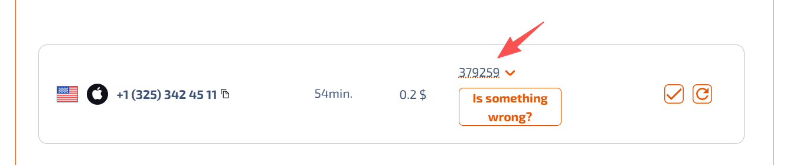<figcaption></figcaption></figure>



### Step 3: Sign in Your Apple Account on Your iOS Device

* Click the button shown below to clear the code, we need another OTP to sign in on your iOS device.
<figure>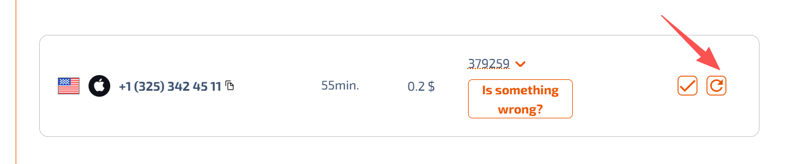<figcaption></figcaption></figure>

* Now sign in your US Apple account in the App store of your **least frequently used device**. The system will send another OTP to your phone number for verification. Wait for a couple of minutes and enter the code you received.


### IMPORTANT

To keep your account valid, you **MUST** keep the US account being signed in on you iOS device. Otherwise, if you sign out and try to sign in the US account again, the system will require OTP again. However, the US phone number is only valid for 60 minutes. Therefore, you **MUST** keep your account be signed in (App Store only). You may use your least frequently used device (**e.g.**, iPad).




### Step 4: Add a Payment Method or Add Money to Your Account


### IMPORTANT

Make sure your billing address or account address is in tax-free states (*e.g.*, Oregon). You can generate a US address [here](https://www.fakexy.com/fake-address-generator-us).


* If you have SafePal, you can directly add the card in your payment method in the account setting in App Store.
<figure>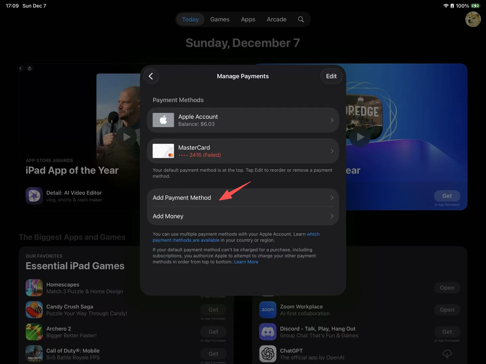<figcaption></figcaption></figure>

* If you don't have SafePal
  * Visit [PockytShop](https://shop.pockyt.io/pc/home) and register an account.
  * Scroll down and select "App Store & iTunes USA".
  <figure>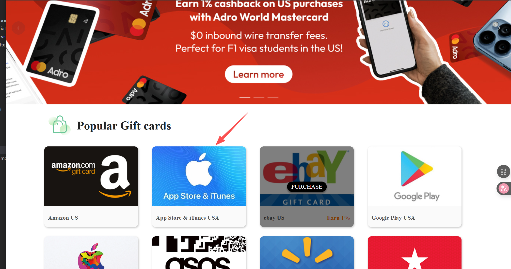<figcaption></figcaption></figure>

  * Enter the amount of US dollars you want to buy, select Alipay, and click "Purchase"
  <figure>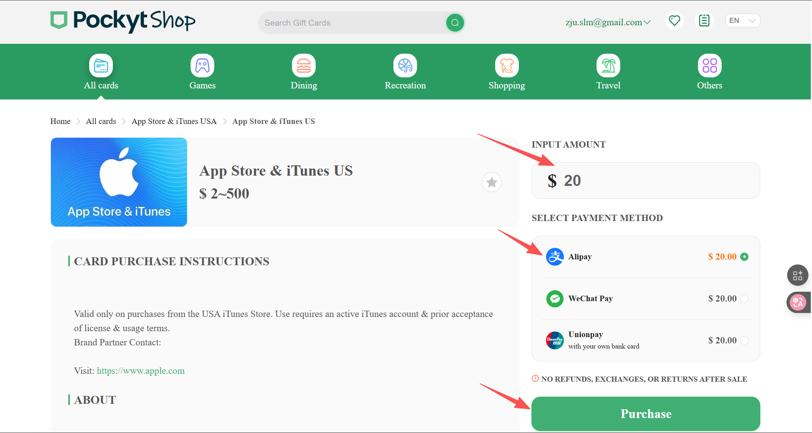<figcaption></figcaption></figure>

  * After payment, you will see the App Store redeem code.
  * Then, open App Store, click your profile, click "Redeem Gift Card or Code", and manually enter the redeem code.
  <figure>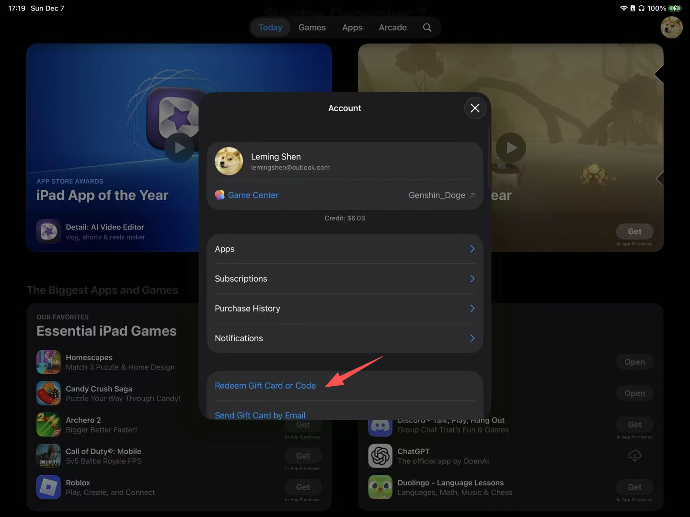<figcaption></figcaption></figure>
  * Congratulations! Your account is charged!




Till now, we have successfully created a US Apple account and add valid payment methods. You can proceed to subscribe ChatGPT Plus (the same for Gemini and Claude):

[upgrade-to-chatgpt-plus.md](upgrade-to-chatgpt-plus.md)
