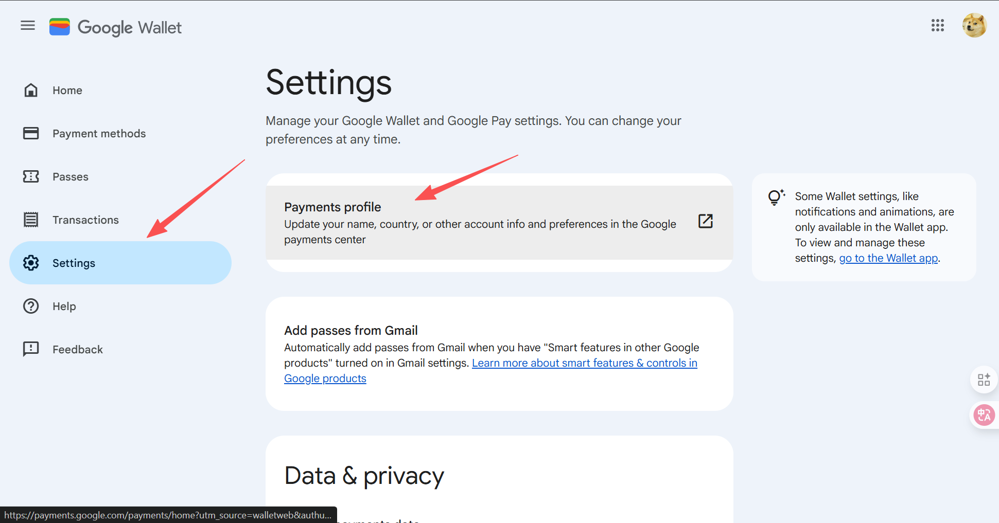
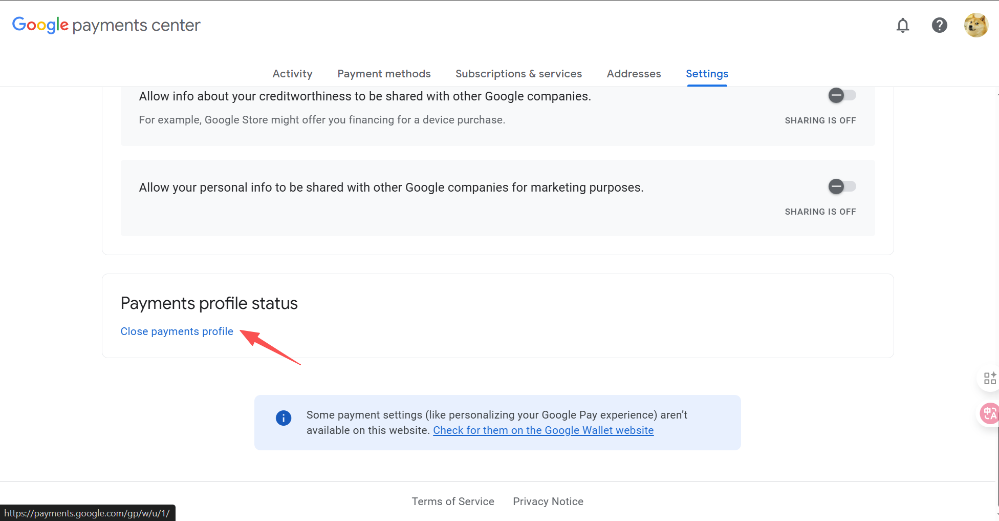
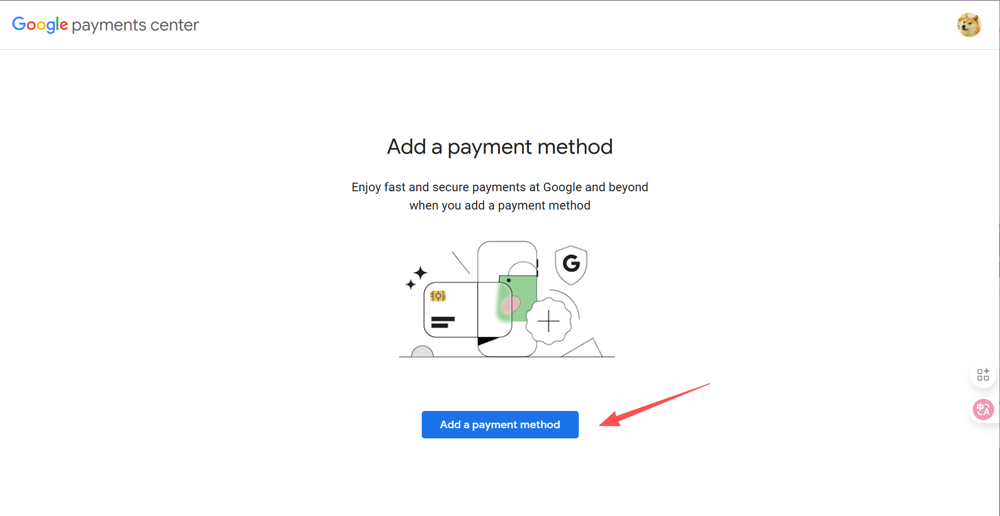
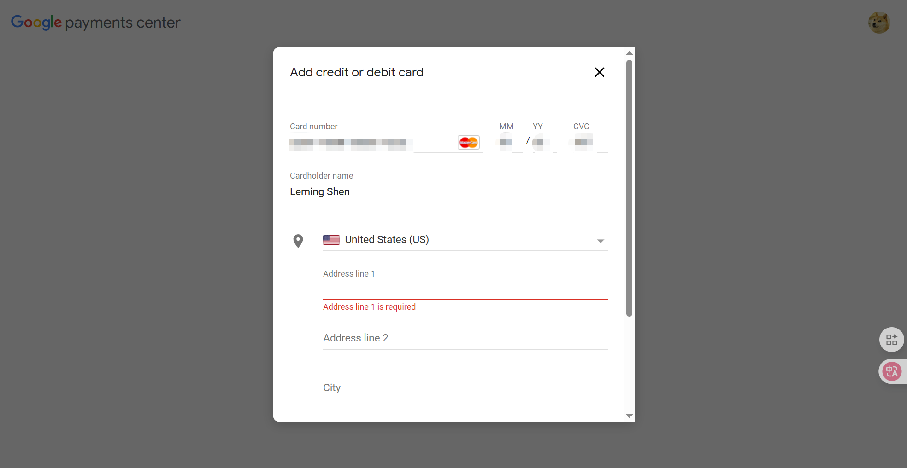
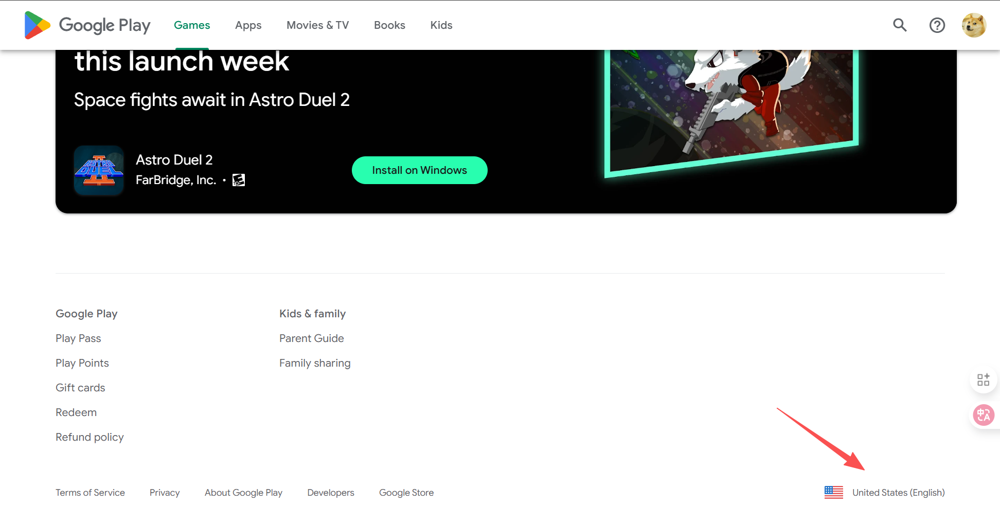

# US-Region Google Play Account

This page provides step-by-step instructions on how to change your Google Play Store account's region to US. Make sure that you strictly following the instructions.



### Step 1: Remove Your Old Payment Profile

* Visit [Google Wallet](https://wallet.google.com/) and sign in with your Google account.
* Click "Settings" on the left panel and click "Payments profile"
  <figure><figcaption></figcaption></figure>

* Then, scroll down to the bottom of the page and click "Close payment profile".
  <figure><figcaption></figcaption></figure>



### Step 2: Create a New US-Region Payment Profile

* Then, visit [Google payments center](https://payments.google.com/) and click "Add a payment method"
  <figure><figcaption></figcaption></figure>

* Enter your credit/debit card (Mastercard & VISA) information **(CN/HK cards are all acceptable)**. The billing address **MUST** be in US.
  
  ### IMPORTANT
  
  Make sure your billing address or account address is in tax-free states (*e.g.*, Oregon). You can generate a US address [here](https://www.fakexy.com/fake-address-generator-us).
  
  <figure><figcaption></figcaption></figure>

* Click "save" and congratulations! Your Google Play Store account is in US! 


### Step 3: Verify Your Account Region

* To verify it, visit [Google Play Store](https://play.google.com/store/) and scroll down to the end of the page. You will see "United States" with the flag on the bottom right corner of the page.
<figure><figcaption></figcaption></figure>




Till now, we have successfully changed the Google Play Store Account Region to US and add valid payment methods. You can proceed to subscribe ChatGPT Plus (the same for Gemini and Claude):

[upgrade-to-chatgpt-plus.md](upgrade-to-chatgpt-plus.md)
