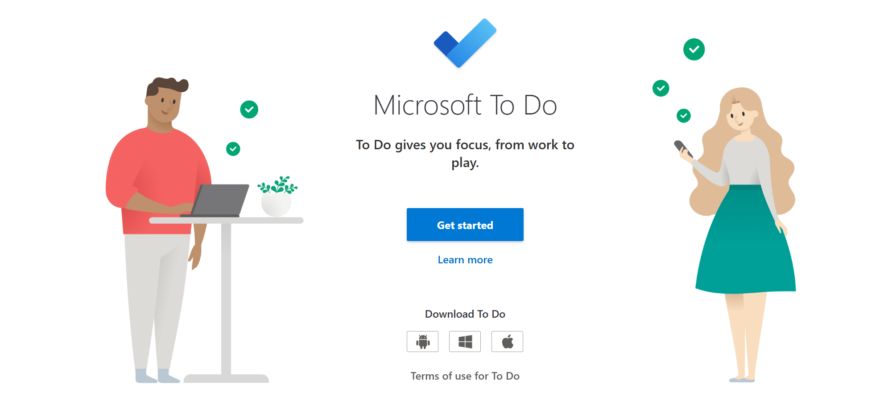
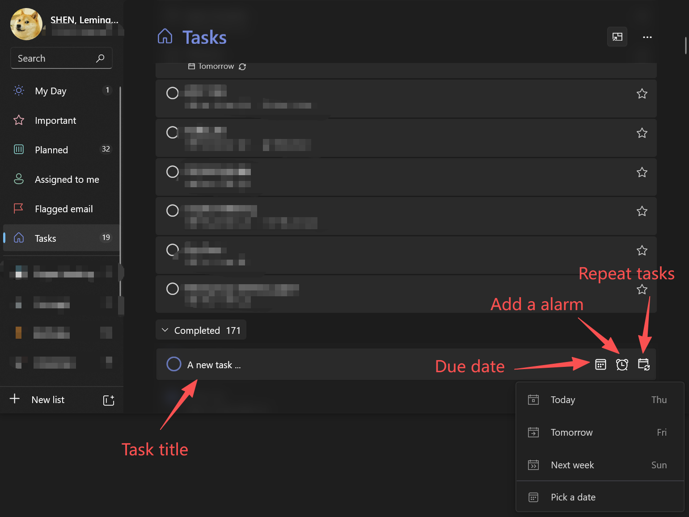
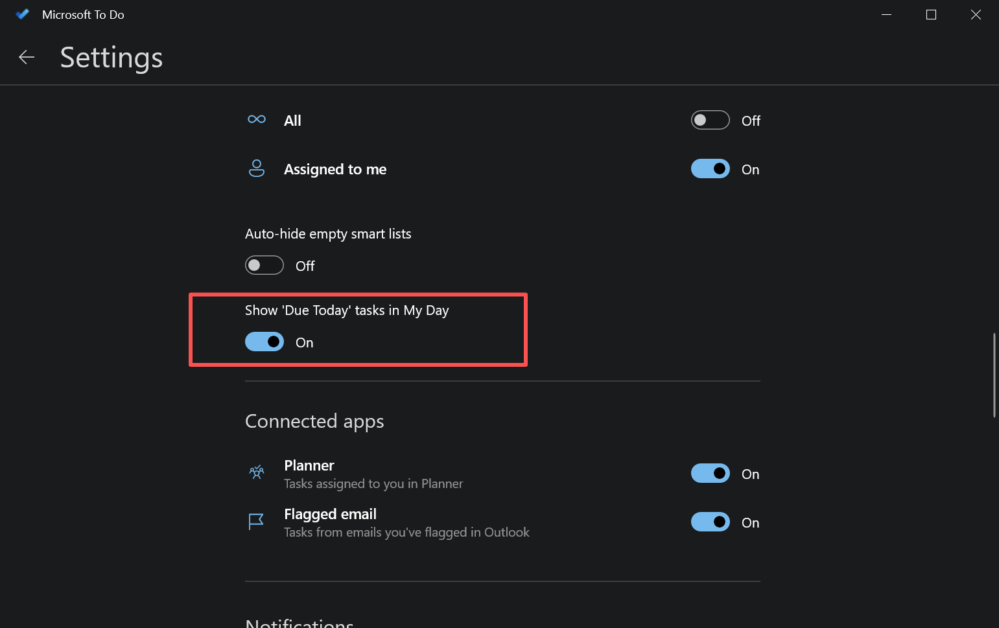
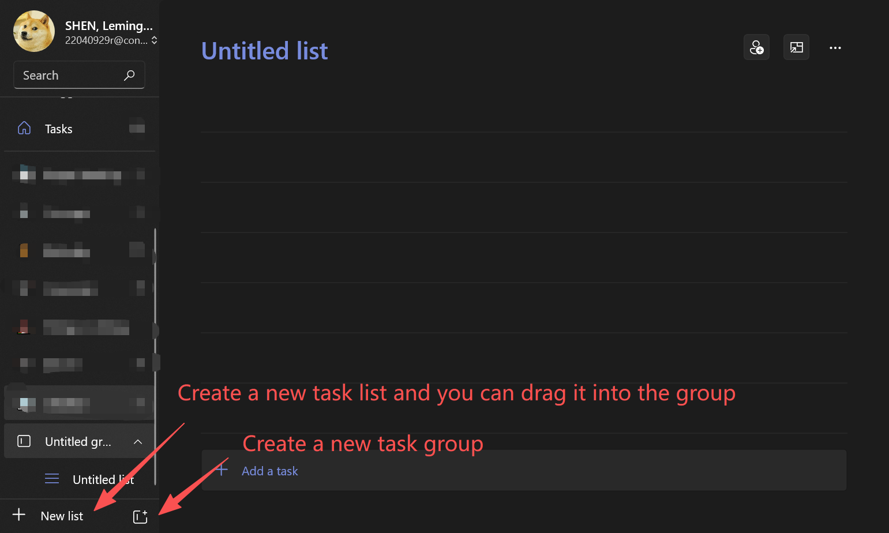
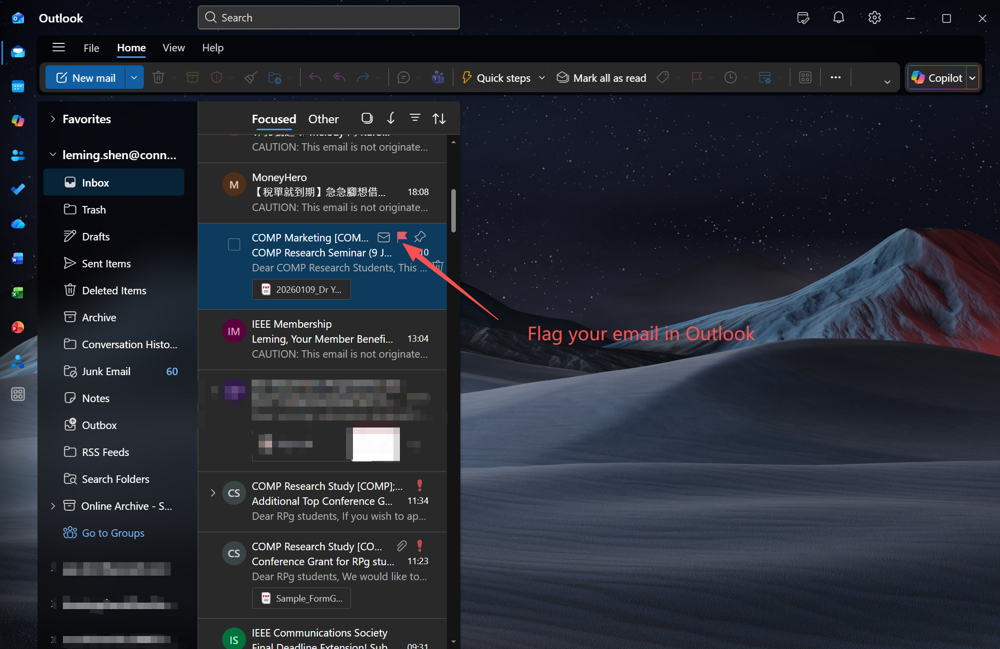
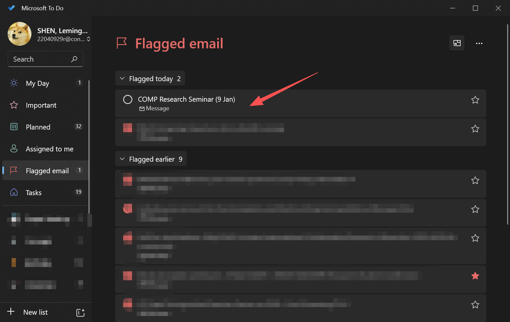

# Microsoft To Do

<figure><figcaption></figcaption></figure>

[Microsoft To Do](https://to-do.office.com/tasks/) is a simple yet powerful task management App that helps you organize your work and personal life in one place. Available on Windows, macOS, iOS, Android, and the web, it syncs seamlessly across devices and integrates tightly with Microsoft 365.


### Important

Sign in using your PolyU email for more advanced experiences.


## 1. Getting Started
Sign in to Microsoft To Do using your Microsoft account. Once logged in, you will see several built-in lists such as My Day, Important, Planned, and Tasks. These provide quick ways to organize tasks by priority and schedule.

## 2. Creating Tasks

To create a task, click Add a task, enter a title, and press Enter. You can then open the task to add details such as:

* Due dates and reminders
* Notes and descriptions
* Subtasks for breaking work into smaller steps
* File attachments (useful for documents or reference materials)

<figure><figcaption></figcaption></figure>

## 3. Using My Day for Daily Focus

My Day is designed to help you focus on what matters today. Each morning, you can manually add tasks from your lists to My Day, creating a realistic daily plan without being overwhelmed by long-term tasks.

You need to click your profile on the top left corner, scroll down, and toggle "Show 'Due Today' tasks in My Day".
<figure><figcaption></figcaption></figure>

## 4. Organizing with Lists and Groups

You can create custom lists for different areas of your life, such as Work, Study, or Personal. Related lists can be grouped together, making it easier to switch contexts and keep everything organized.
<figure><figcaption></figcaption></figure>

## 5. Setting Priorities and Deadlines

Mark important tasks with a star to highlight them in the Important view. Use due dates and reminders to ensure tasks appear in the Planned view and notify you at the right time.

## 6. Sync and Integration

Tasks sync automatically across all your devices. Microsoft To Do also integrates with Outlook, allowing flagged emails and Outlook tasks to appear in your task list—ideal for managing work in a unified system.

This is a very useful functionality. Suppose you received an email about a meeting, a seminar, or something important, you can first flag your email in Outlook:
<figure><figcaption></figcaption></figure>

And then, you will see that the email will be synced in the "Flagged email" list of your Microsoft To Do. You can set a due date or time reminder accordingly.
<figure><figcaption></figcaption></figure>

I would say that this functionality is extremely convenient. And that's why I suggest signing in using PolU email.

## 9. Tips for Effective Use

* Keep task titles short and action-oriented
* Review My Day every morning and evening
* Avoid overloading a single day with too many tasks
* Use notes instead of long task titles for details

## 10. Final Thoughts

Microsoft To Do excels at simplicity and focus. While it may not replace advanced project management tools, it is an excellent choice for personal productivity, daily planning, and lightweight task tracking.