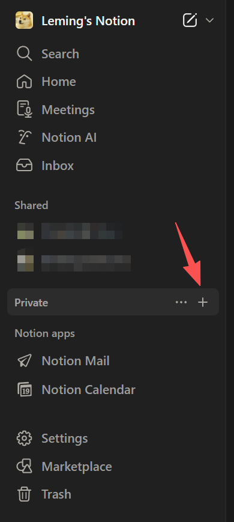
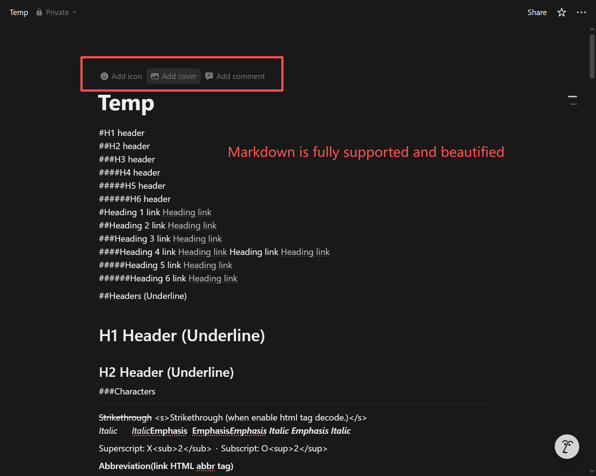
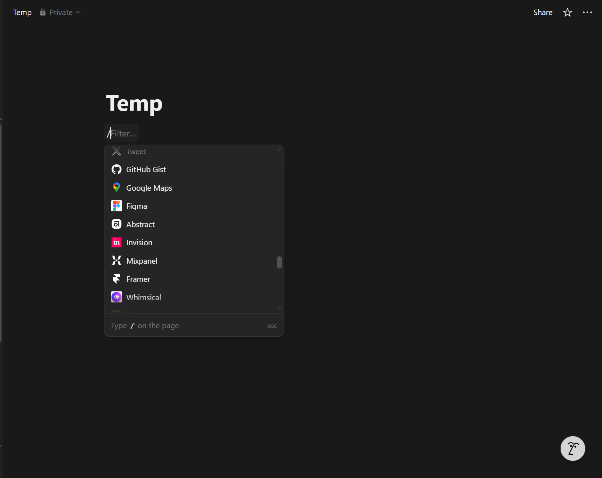
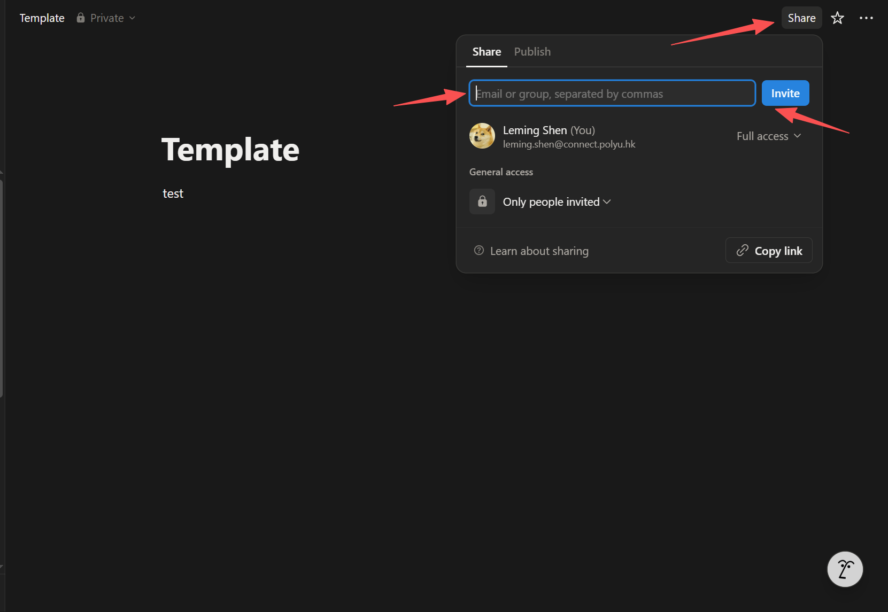

# Notion

[Notion](https://www.notion.com/) is an all-in-one productivity and knowledge-management platform that integrates notes, documents, databases, project tracking, and collaboration into a single workspace. It allows users to create flexible, interconnected pages that can be customized to organize research papers, manage tasks, take structured notes, build wikis, and store data. Its clean interface and powerful linking capabilities make Notion particularly useful for students, researchers, and teams who need a centralized, searchable, and highly adaptable environment to manage their work.

#### Feature 1: Markdown-based note taking
#### Feature 2: Note sharing among users
#### Feature 3: AI supported


### Important

Sign up using your PolyU email and you can enjoy "Education Plus" plan!


Now, I will provide some basic use cases of Notion.

## Basic Note Taking
* On the left panel, find "Private", and click "+" to create a new note page in your private workspace.
<figure><figcaption></figcaption></figure>

* There are two types of note
  * Directly enter Markdown
  <figure><figcaption></figcaption></figure>

  * Enter "/" and select a preferred note block
  <figure><figcaption></figcaption></figure>

* For more details, you may refer to Notion's official documentation to learn advanced note taking methods, such as databases, third-party tool integration, *etc*.


## Note Sharing & Publishing
* Suppose you create a page that you want to share with someone to collaborate, you can share the Notion page in one second.
* Open the page you want to share, click "Share" on the top right corner, enter the email account of the people you want to share with, set his/her accessability (full access, can edit, can comment, can view), and click "Invite". (You can also directly copy the sharing link)
<figure><figcaption></figcaption></figure>

* If you want to make your page published as a website, you can also click "Share" on the top right corner and click "publish" to obtain a URL.
  


Overall, Notion is a very powerful, cross-platform, auto-sync note taking App with numerous interesting usage scenarios and third-party tool integrations. You can turn your Notion as your personal knowledge base that helps you sharpen your mind and shape your personality!
