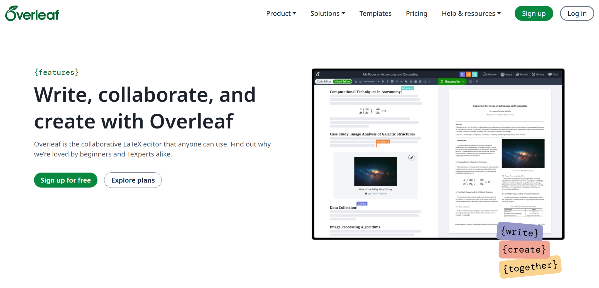
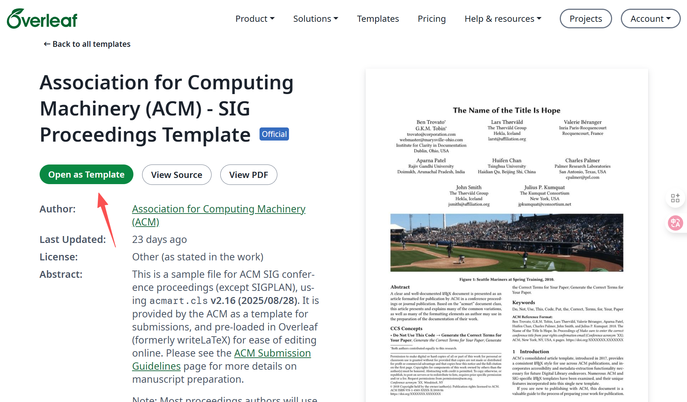
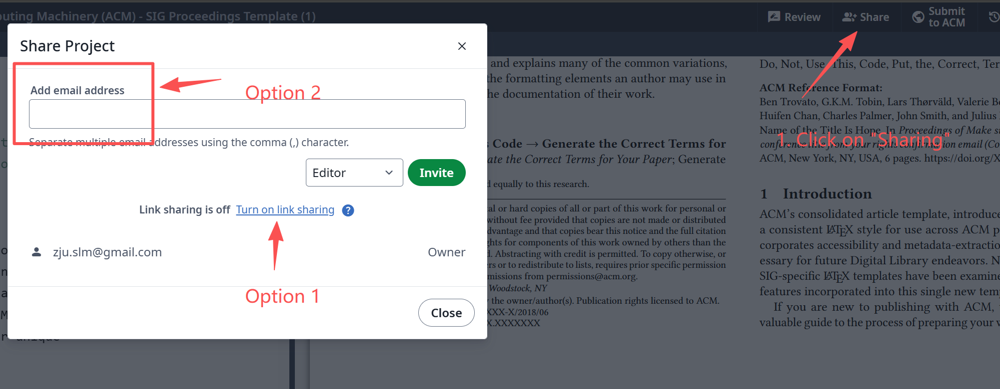
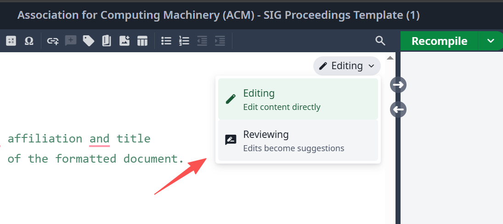
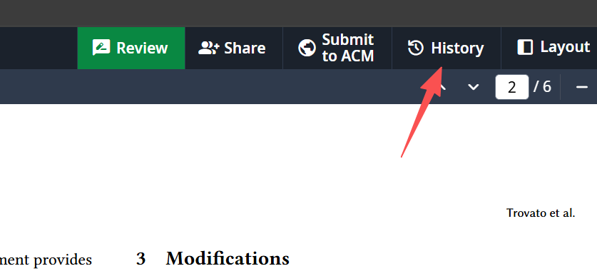
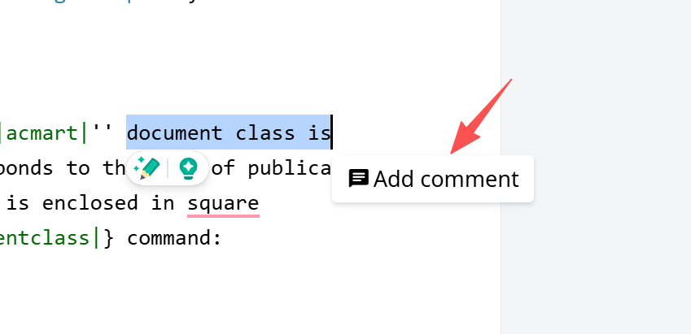

# Overleaf

<figure><figcaption></figcaption></figure>

[Overleaf](https://www.overleaf.com/) is an online LaTeX editor that allows for collaborative writing and editing of LaTeX documents. It provides a user-friendly interface and integrates with various version control systems, making it easier for researchers to manage their documents.

Now, I will introduce some common features of Overleaf that can help you in your research writing.

## 1. Template Gallery & Creating a New Project

* Overleaf offers a wide range of templates for different types of documents, including research papers, theses, presentations, and more. You can explore the [template gallery here](https://www.overleaf.com/latex/templates).
* For SIGMOBILE papers (_i.e._, MobiCom, MobiSys, and SenSys), you should use the [Association for Computing Machinery (ACM) - SIG Proceedings Template](https://www.overleaf.com/latex/templates/association-for-computing-machinery-acm-sig-proceedings-template/bmvfhcdnxfty).
* For IEEE transaction papers (_e.g._, TMC, TON), you should use the [IEEE Journal Paper Template](https://www.overleaf.com/latex/templates/ieee-journal-paper-template/jbbbdkztwxrd).
* For others, you may find the LaTex template from the official website of the conference/journal.
* After selecting a template, click on "Open as Template" to create a new project based on the selected template:

<figure><figcaption></figcaption></figure>

## 2. Basic Operations

* The image below shows the main interface and some basic operations of Overleaf, including editing, compiling, and previewing your document:

<figure><figcaption></figcaption></figure>

* Sharing your project with collaborators:
  * Click on the "Share" button at the top right corner of the interface.
  *   There are two types of sharing options:

      * Option 1: Share via link. You can generate a shareable link that allows anyone with the link to access your project. You can also set the permission level for this link.
      * Option 2: Share with specific people. You can invite collaborators by entering their email addresses. You can also set their permission level (read-only or read-and-edit).

      <figure><figcaption></figcaption></figure>
  * Once shared, collaborators can access the project and make edits in real-time. You can see their changes as they type, and you can also communicate through the built-in chat feature.

## 4. Premium Features

Overleaf offers extraordinary features for premium users, which are really helpful, I think. Some of the key premium features include:

* More collaborators: Free accounts can have up to 1 collaborator, while premium accounts can have up to 10 collaborators (or more with higher-tier plans).
* Higher compiling speed: Premium users get faster compilation times, which is especially useful for large documents.
*   **Track Changes**: This feature allows you to see the changes made by collaborators, making it easier to review and manage edits.

    * As a collaborator, you can enable "Reviewing Mode" by clicking on the "Review" button at the right top corner of the editing interface.

    <figure><figcaption></figcaption></figure>

    \* In "Reviewing Mode", any changes you made will be highlighted. If you are the first author of this paper, you can see your co-authors' changes and decide whether to accept or reject them.

    <figure><figcaption></figcaption></figure>
*   **Version History**: You can access the version history of your document, allowing you to revert to previous versions if needed.

    * Click on the "History" button at the top right corner of the interface to view the version history.

    <figure><figcaption></figcaption></figure>

    \* You can see a timeline of changes, compare different versions, and restore previous versions if necessary.

    <figure><figcaption></figcaption></figure>
*   **Add Comments**: You can add comments to specific parts of your document, facilitating collaboration and feedback.

    * To add a comment, select the text you want to comment on, then click on the "Add Comment" button that appears beside it.

    <figure><figcaption></figcaption></figure>

    \* You can edit, reply to, or resolve comments as needed.

    <figure><figcaption></figcaption></figure>


Leming had purchased a premium plan for Overleaf, and if you need to use the premium features, you can share your project with me and transfer the ownership to me. As such, you can enjoy the magnificent premium features for free.

