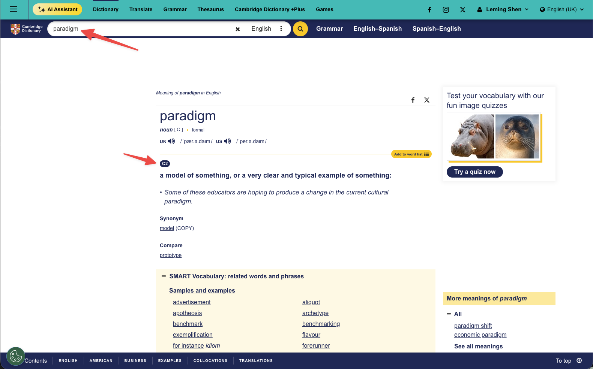
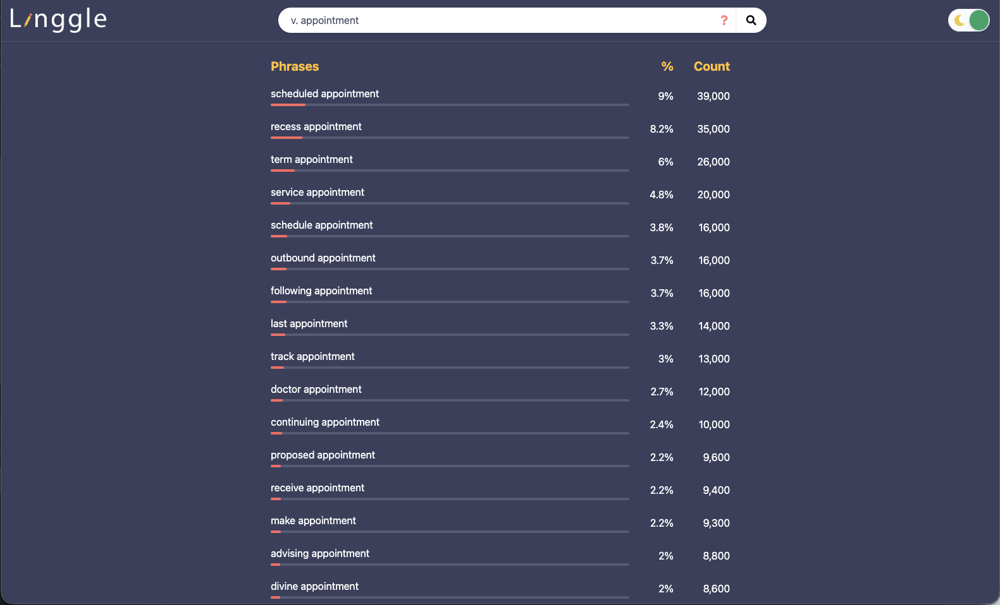
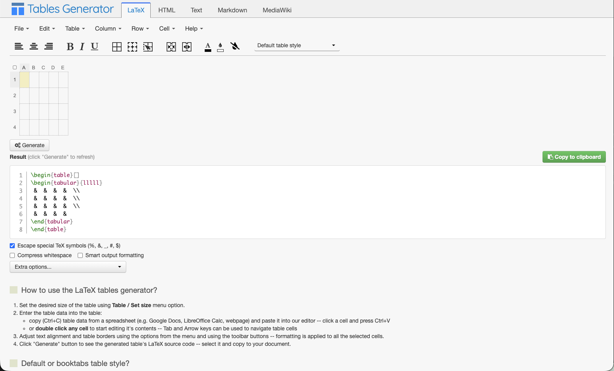
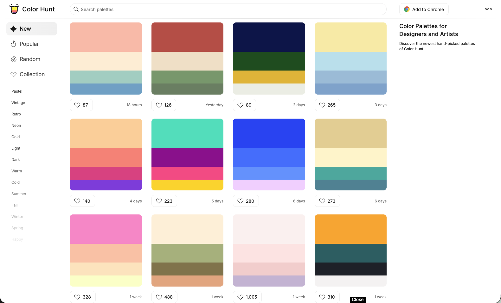
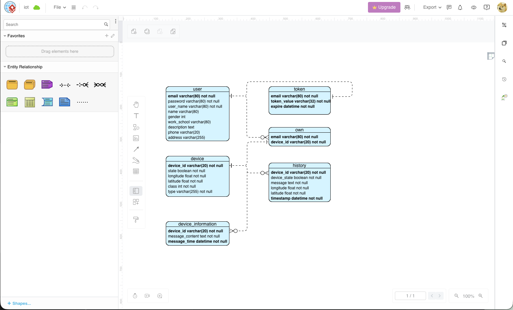
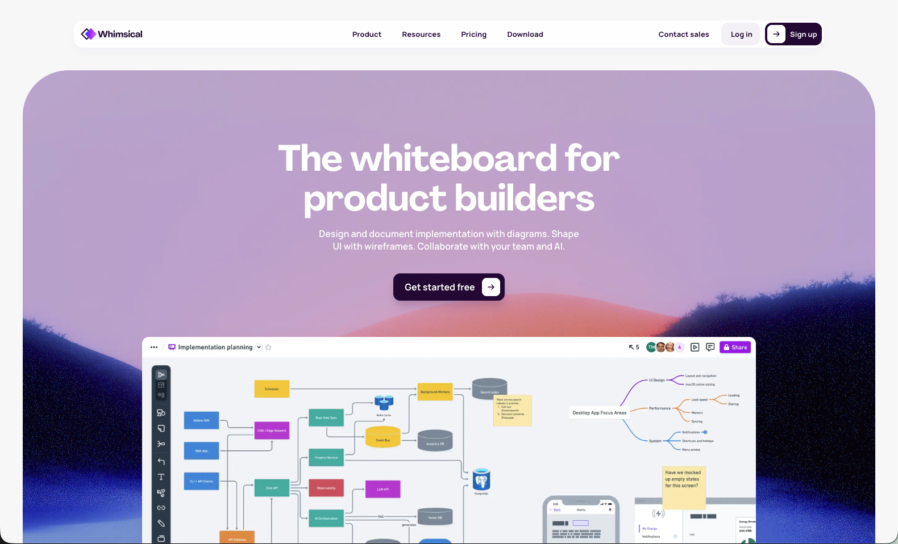
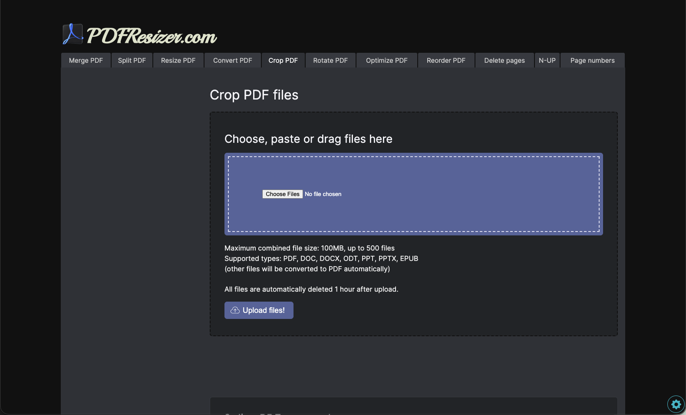
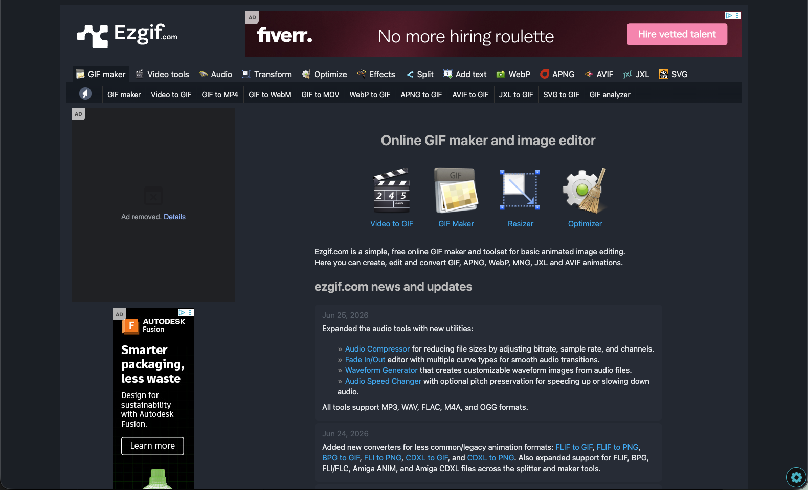
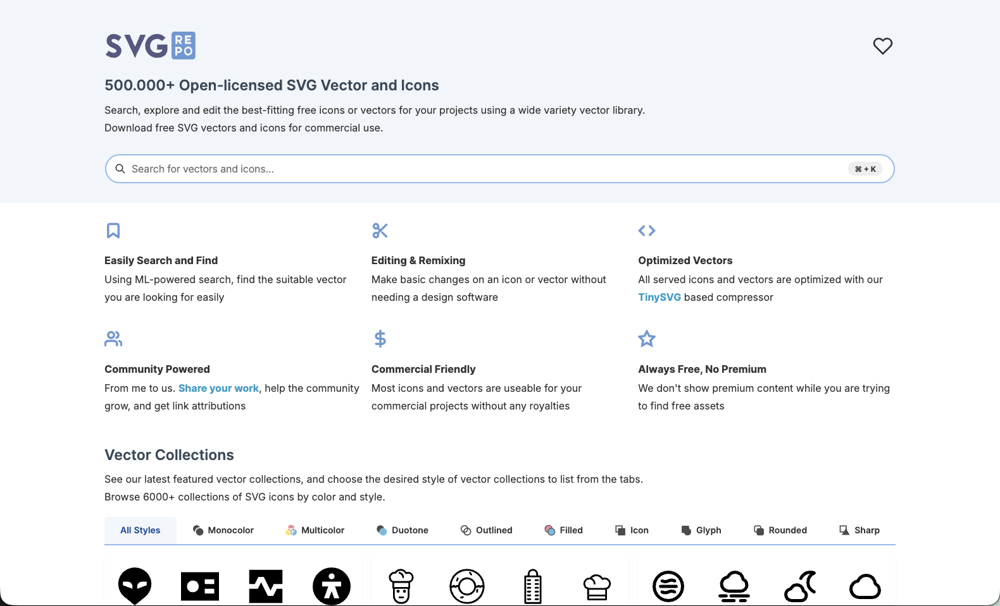
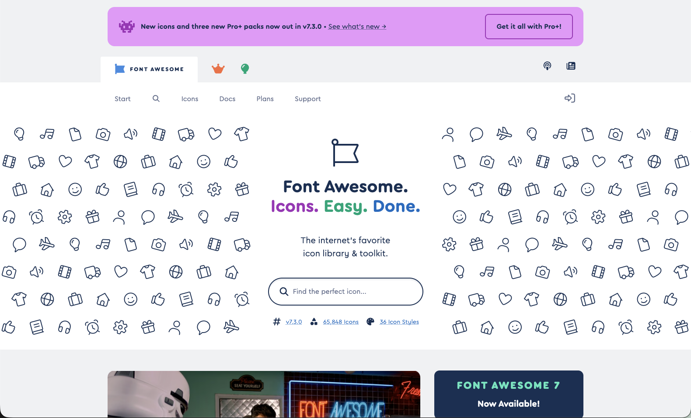

https://dictionary.cambridge.org/
# Useful Productivity Tools

In this section, I will introduce some useful productivity tools that can help you improve your efficiency and effectiveness in your research work. These tools are designed to assist you in managing your tasks, organizing your notes, and enhancing your overall productivity.


This page will be continuously updated with new tools and resources, so make sure to check back regularly for the latest updates. If you have any suggestions or recommendations for useful productivity tools, please feel free to reach out to me. I would love to hear from you and learn about any tools that you find helpful in your research work.


Below is a list of some of the most useful productivity tools that I have found to be helpful:
* For paper writing
  * [Online Cambridge Dictionary](https://dictionary.cambridge.org/) isprovides a comprehensive and reliable resource for checking the definitions, synonyms, and usage of words. It can help you improve your vocabulary and writing skills. In addition, it also provides CERF levels for each word, which can help you determine the appropriate level of language to use in your writing.
  <figure><figcaption></figcaption></figure>

  

  * [Linggle](https://search.linggle.com/) is a powerful online tool that allows you to search for phrases and collocations in English. It can help you find the most common and natural ways to express your ideas, which can improve the clarity and effectiveness of your writing.
  <figure><figcaption></figcaption></figure>

  

  * [Data to Viz](https://www.data-to-viz.com/) is a website that provides a collection of data visualization techniques and examples. It can help you choose the most appropriate visualization method for your data, which can enhance the clarity and impact of your research findings.
  

  * [Tables Generator](https://www.tablesgenerator.com/) is an online tool that allows you to create tables in various formats, including HTML, Markdown, and LaTeX through only UI operations. It can help you save time and effort in formatting your tables for your research papers or presentations.
  <figure><figcaption></figcaption></figure>

  

  * [Color Hunt](https://colorhunt.co/) is a website that provides a collection of color palettes for designers and artists. It can help you choose the most appropriate color scheme for your research presentations or visualizations, which can enhance the visual appeal and effectiveness of your work.
  <figure><figcaption></figcaption></figure>

  

* For format conversion
  * [Convertio](https://convertio.co/) is an online tool that allows you to convert files from one format to another. It supports a wide range of file types, including documents, images, audio, and video. It can help you save time and effort in converting your files for your research work.
  <figure><figcaption></figcaption></figure>

  

  * [cloudconvert](https://cloudconvert.com/) is another online tool that allows you to convert files from one format to another. It supports a wide range of file types, including documents, images, audio, and video. It can help you save time and effort in converting your files for your research work.
  <figure><figcaption></figcaption></figure>

  

  * [Short URL](https://shorturl.at/) is an online tool that allows you to shorten long URLs into more manageable links. It can help you share your research work more easily and effectively, especially on social media platforms or in presentations.
  <figure><figcaption></figcaption></figure>

  

* For document editing
  * [Visual Diagram Online](https://online.visual-paradigm.com/diagrams/) is an online tool that allows you to create diagrams and flowcharts for your research work. It can help you visualize your ideas and concepts more effectively, which can enhance the clarity and impact of your research findings.
  <figure><figcaption></figcaption></figure>

  

  * [Whimsical](https://whimsical.com/) is another online tool that allows you to create diagrams and flowcharts for your research work. It can help you visualize your ideas and concepts more effectively, which can enhance the clarity and impact of your research findings.
  <figure><figcaption></figcaption></figure>

  

  * [PDF Resizer.com](https://www.pdfresizer.com/) is an online tool that allows you to resize, compress, crop, and convert PDF files. It can help you manage your PDF documents more effectively, which can save you time and effort in your research work. **When using the cropping feature, make sure to select the "Autocrop" option to ensure the best results.**
  <figure><figcaption></figcaption></figure>

  

  * [EZgif.com](https://ezgif.com/) is an online tool that allows you to create and edit GIFs for your research work. It can help you create engaging and informative visual content, which can enhance the clarity and impact of your research findings.
  <figure><figcaption></figcaption></figure>

  

* For media-related tasks
  * [SVG Repo](https://www.svgrepo.com/) is a website that provides a collection of free SVG icons and illustrations for designers and developers. It can help you find the most appropriate visual elements for your research presentations or visualizations, which can enhance the visual appeal and effectiveness of your work.
  <figure><figcaption></figcaption></figure>

  

  * [Font Awesome](https://fontawesome.com/) is a website that provides a collection of free icons and fonts for designers and developers. It can help you find the most appropriate visual elements for your research presentations or visualizations, which can enhance the visual appeal and effectiveness of your work.
  <figure><figcaption></figcaption></figure>

  