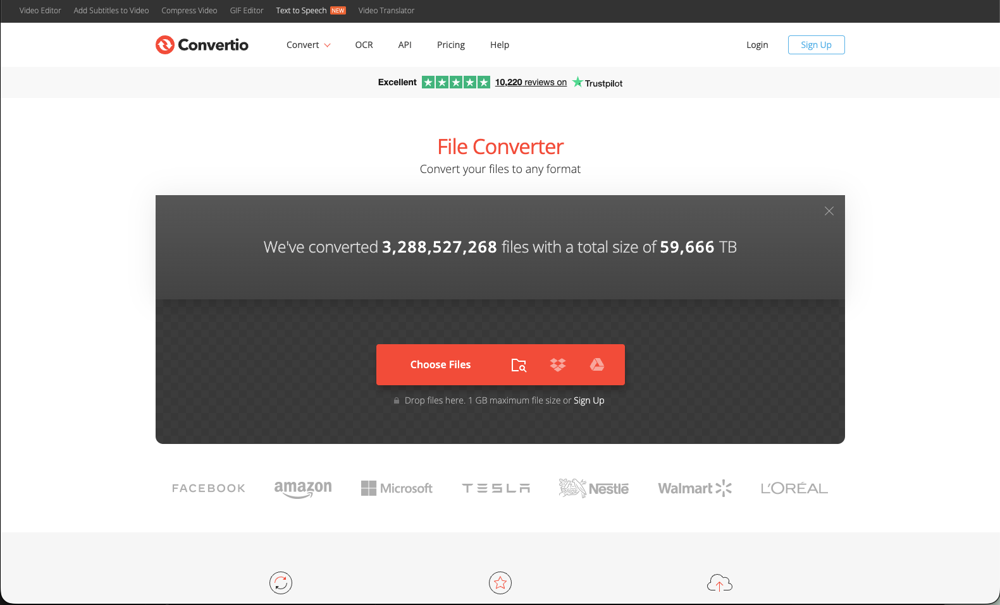
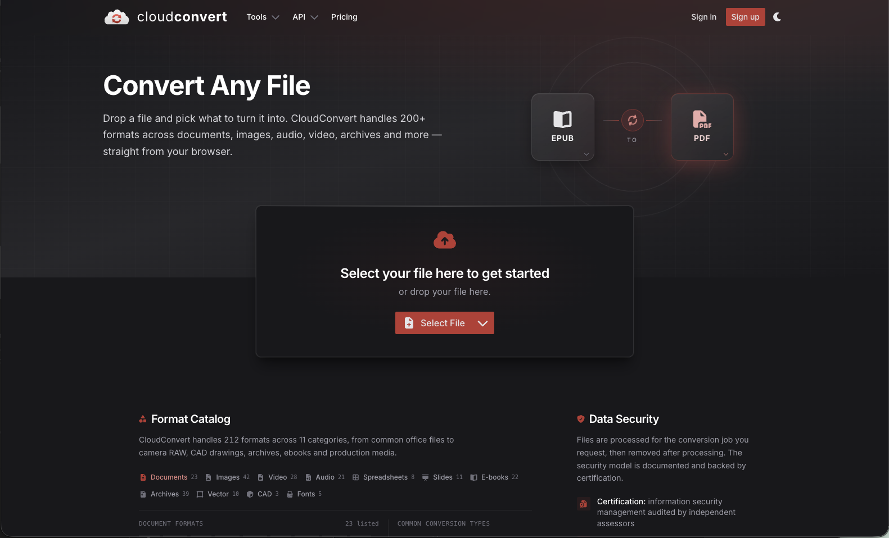
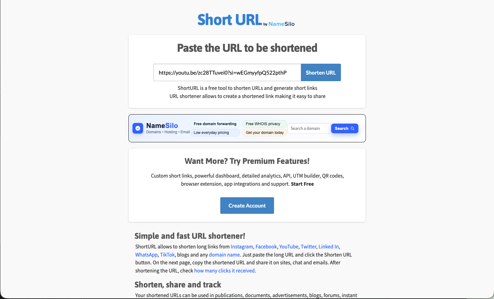

# Useful Productivity Tools for Format Conversion

Below is a list of some of the most useful productivity tools that I have found to be helpful for document editing:
* [Convertio](https://convertio.co/) is an online tool that allows you to convert files from one format to another. It supports a wide range of file types, including documents, images, audio, and video. It can help you save time and effort in converting your files for your research work.
<figure><figcaption></figcaption></figure>



* [cloudconvert](https://cloudconvert.com/) is another online tool that allows you to convert files from one format to another. It supports a wide range of file types, including documents, images, audio, and video. It can help you save time and effort in converting your files for your research work.
<figure><figcaption></figcaption></figure>



* [Short URL](https://shorturl.at/) is an online tool that allows you to shorten long URLs into more manageable links. It can help you share your research work more easily and effectively, especially on social media platforms or in presentations.
<figure><figcaption></figcaption></figure>

