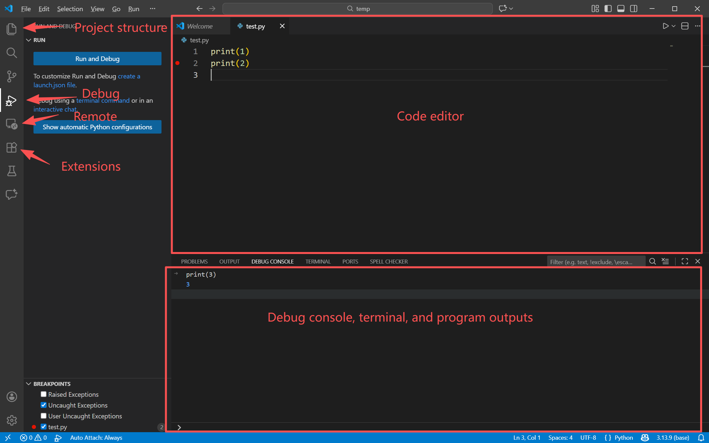
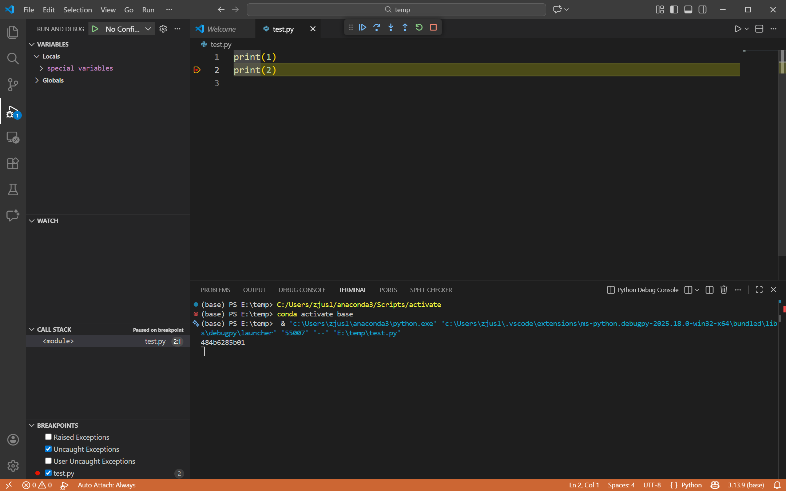
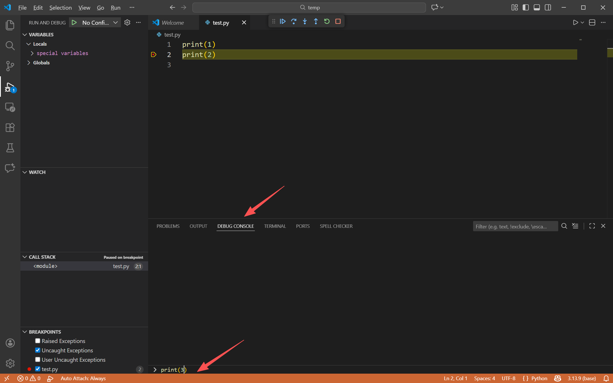
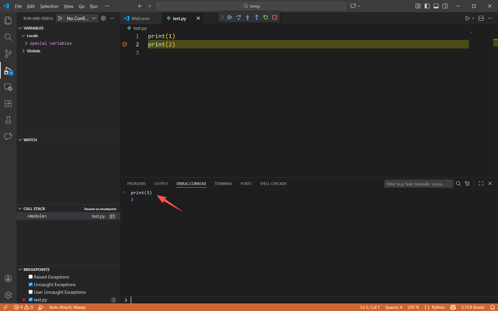
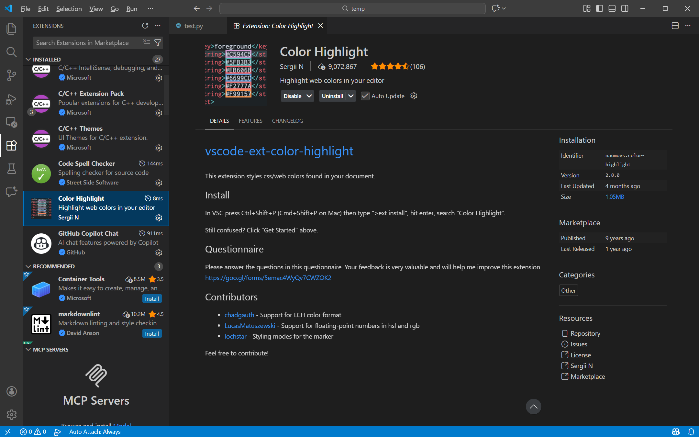
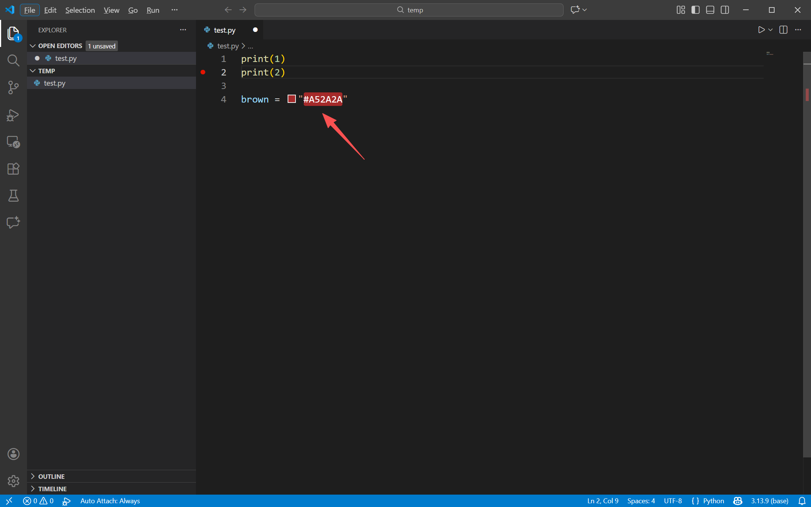
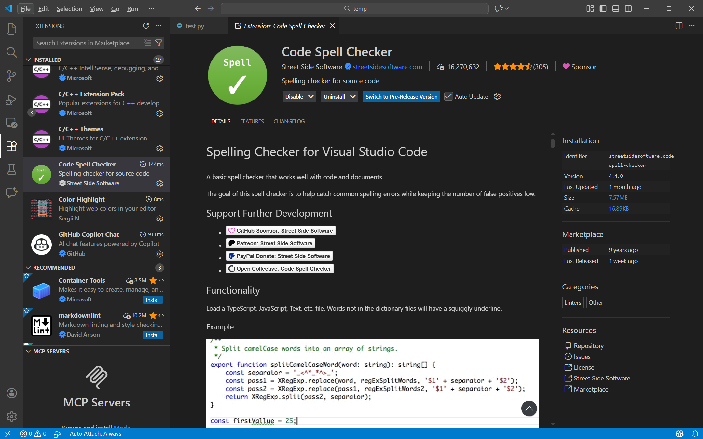

# VS Code

<figure><figcaption></figcaption></figure>

[VS Code](https://code.visualstudio.com/) is a lightweight source code editor built by Microsoft. Unlike massive IDEs (Integrated Development Environments) that can be slow to load, VS Code is snappy. Yet, it has a massive ecosystem of extensions that can turn it into a powerhouse for almost any language, from Python to JavaScript to C++.

## Basic Interface
After installation and open the VS Code, you will see a initial interface:
<figure><figcaption></figcaption></figure>

The left panel contains some quick functions, including project file explorer, search, source control (git), debug, remote, extensions, and even GitHub Copilot.

The right panel is the main code editing section where you can type your code freely. Note that you can even manage multiple code windows simultaneously by dragging the window to different sections.

The bottom panel provides the program outputs, debugging information, as well as the console.

## Debugging
VS Code also supports executing additional code segments during debugging. Let's have a look of the following example:

* Suppose the program pauses at the breakpoint during debugging.
<figure><figcaption></figcaption></figure>

* I can even execute additional code segments by typing the code in the "DEBUG CONSOLE" and press enter.
<figure><figcaption></figcaption></figure>

* We can see that the execution result of the additional code is displayed in the debug console.
<figure><figcaption></figcaption></figure>

* This functionality is extremely useful in debugging when you need to print out or verify some intermediate results.

## Useful Extensions
VS Code is great out of the box, but extensions make it perfect. Click the Extensions icon on the left sidebar.

To install extensions, you can directly search their names and click "install".

Now, I will introduce some useful extensions.
1. "Color Highlight" can display the color in HEX when you typing in the editor. This is extremely useful when you are plotting figures.
<figure><figcaption></figcaption></figure>
<figure><figcaption></figcaption></figure>

2. "Code Spell Checker" can check the typo of your code.
<figure><figcaption></figcaption></figure>

## GitHub Copilot
[GitHub Copilot](https://github.com/features/copilot) is an AI-powered coding assistant that integrates directly into VS Code as an extension, acting like a "pair programmer" that helps you write code faster and with fewer errors. Powered by OpenAI's models, it analyzes the context of your current file and project to suggest whole lines, entire functions, or complex algorithms in real-time as you type. Beyond simple autocompletion, Copilot can generate unit tests, explain complex code blocks via a chat interface, and even help translate code between languages, significantly boosting productivity by handling repetitive boilerplate so you can focus on logic and design.

In the following part, I will focus on how to apply for GitHub Copilot Pro freely via PolyU education verification.

### Apply for Free GitHub Copilot Pro via Education Verification
1. Sign in to your GitHub account on your phone.

### Important

You must use your phone to verify your edu status because camera is needed to capture your student ID.


2. Visit [https://github.com/settings/education/benefits](https://github.com/settings/education/benefits) and start your edu application.
3. Your phone camera is needed to capture your PolyU student ID.
4. Wait for 1~2 work days and you will see that your application has been approved.
5. Now, we need to redeem the edu benefit. Visit [https://github.com/settings/copilot/features](https://github.com/settings/copilot/features) to redeem.
6. Congratulations! You can freely enjoy GitHub Copilot Pro now.
7. You can install the GitHub Copilot extension in VS Code and login with your GutHub account to use.