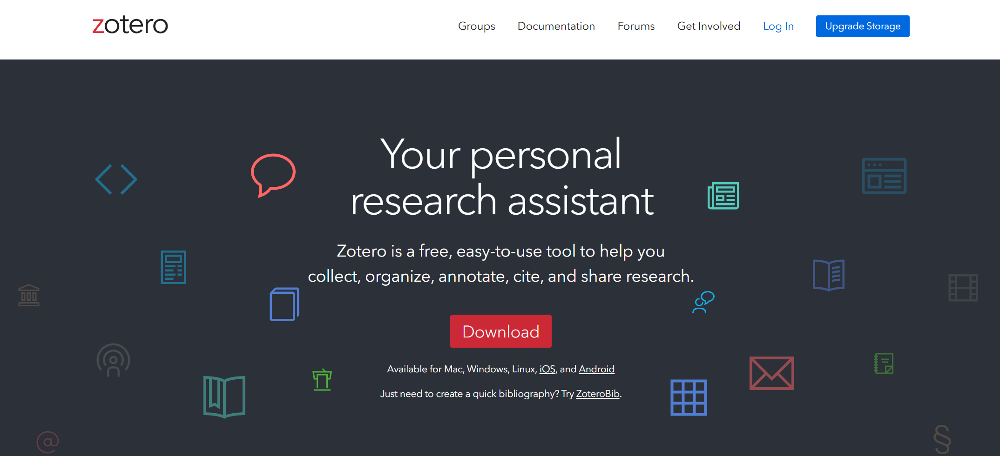
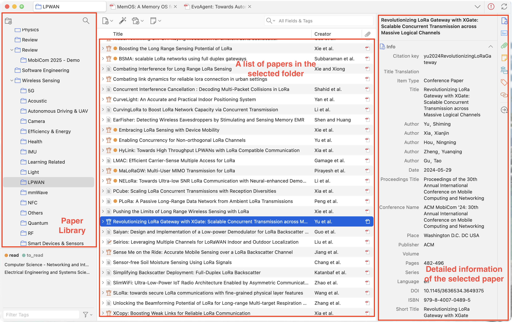
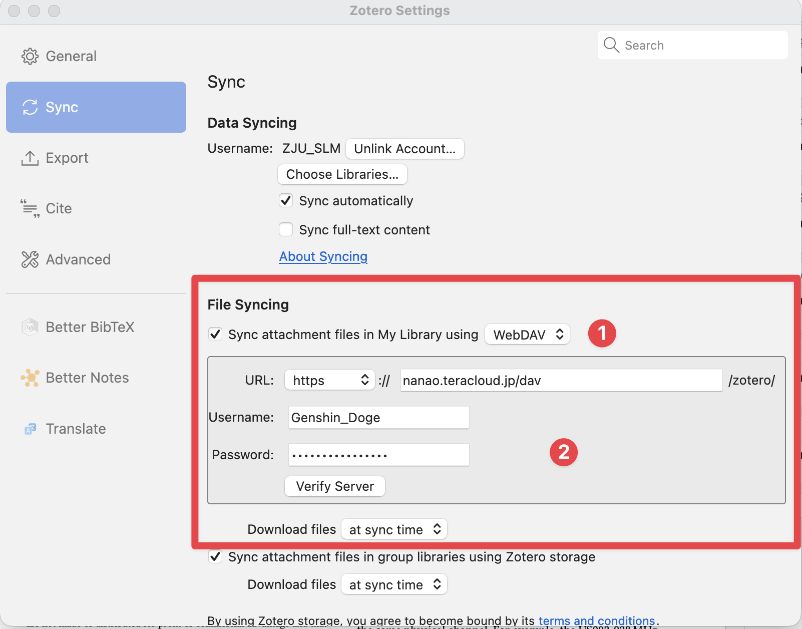

# Zotero

<figure><figcaption></figcaption></figure>

[Zotero](https://www.zotero.org/) is a free and open-source reference management software designed to help researchers efficiently collect, organize, annotate, and cite literature. It integrates with web browsers and word processors, enabling seamless import of papers and automatic generation of properly formatted bibliographies in a wide range of citation styles.

## 1. Basic GUI & Functionality

The figure shown below is the main interface of Zotero, *i.e.*, the library view.

<figure><figcaption></figcaption></figure>

* The left panel displays a set of paper folders. You can freely classify your papers into different collections by creating new folders and dragging the papers into the corresponding folders. You can also use tags to label your papers for better organization.
* The center panel shows the list of papers in the selected folder.
* The right panel provides detailed information about the selected paper.

The following figure shows the detailed GUI when you double-click to read a paper.

<figure><figcaption></figcaption></figure>

* The left panel displays the outline of the paper. In addition, it can also display the annotations you made on the paper.
* The center panel shows the content of the paper. On top of the center panel, there are several useful tools for reading and annotating the paper.
    * The first tool is to highlight the selected text with different colors.
    * The second tool is to underline the selected text with different colors.
    * The third tool is to add sticky notes to any part of the paper.
    * The fourth tool is to add text boxes to any part of the paper.
    * The fifth tool is to add rectangles to any part of the paper.
    * The sixth tool is to add drawings to any part of the paper. It would be better if you use a tablet with a stylus pen to draw.
* The right panel provides detailed information about the paper as well as some third-party plugins you installed.

## 2. Synchronization

Synchronization allows you to access your Zotero library from multiple devices. Before we get started, remember to create a free account on the [Zotero Website](https://www.zotero.org/). Zotero offers two types of synchronization: through Zotero server and through webdrives that support WebDAV protocol. Zotero server only proides 300 MB free storage, which is not enough for most users. Therefore, I recommend using WebDAV protocol to synchronize your Zotero library.

Here is a step-by-step guide on how to set up synchronization through WebDAV protocol using [InfiniCLOUD](<https://infini-cloud.net/en/), which provides 20 GB free storage.

* Create an account on [InfiniCLOUD](https://infini-cloud.net/en/).
* After logging in, click "My Page" on the top bar.
  <figure><figcaption></figcaption></figure>
* Scroll down and find the "Referral Bonus" section and apply my referral code ``NVQF4`` to get an additional 5 GB free storage.
* Then, find the "Apps Connection" section and turn on app connection. You will see the WebDAV URL, username, and password. Please keep them safe as we will use them later.
<figure><figcaption></figcaption></figure>
* Now, open Zotero settings, find "File Syncing", select "WebDAV" for "Sync attachment files in My Library using", and fill in the WebDAV URL, username, and password you obtained from InfiniCLOUD. Finally, click "Verify Server" to check if everything is correct. If so, click "OK" to finish the setup.
<figure><figcaption></figcaption></figure>
* As long as your new device login the same Zotero account and set up the WebDAV synchronization, your Zotero library will be synchronized across all your devices.

## 3. Third-Party Plugins



[Zotero 中文社区](https://zotero-chinese.com/) (in Chinese) provides a list of useful third-party plugins for Zotero. Here, I recommend two plugins that I frequently use.

* [Translate for Zotero](https://github.com/windingwind/zotero-pdf-translate#readme) allows you to translate the selected text in real-time. It supports multiple translation engines, including Google Translate, DeepL, and Youdao. You can choose the one that suits you best in the plugin settings.
* [Better Notes for Zotero](https://github.com/windingwind/zotero-better-notes#readme) enhances the note-taking functionality of Zotero. It provides a markdown editor with syntax highlighting, which makes it easier to take and organize notes.